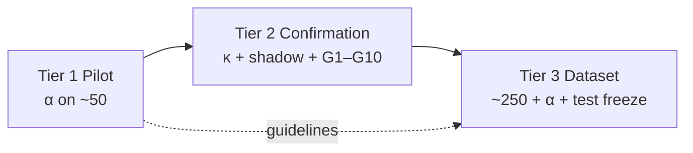

# GoalJudge Stage 5 Goldset — Tier 1 / 2 / 3 Status Review

> **Date:** 2026-06-09 (v7_full re-run)
> **Scope:** Progress against the three-tier gates in the [Stage 5 goldset plan](../plans/goaljudge_stage5_goldset.plan.md), cross-checked against artifacts in [`docs/IAA/goalJudge/`](../IAA/goalJudge/) and related research logs.
> **Author:** Session synthesis (pilot complete; **Tier 2 CLEARED on goal_met-only rail**; Tier 3 ready to assemble).

---

## Tier 1 — Pilot (early OK) — **COMPLETE / PASS**

**Gate:** Instruments ready + batch traces exported → pilot double-label + α ≥ 0.8 on `goal_met`.

### Prep scaffolding (plan §3.1) — all landed

| Item | Status |
|---|---|
| `failure_mode` schema seam | Done (plan §6) |
| Gold-set spec | [`goaljudge_stage5_goldset_spec.md`](../research/goaljudge_stage5_goldset_spec.md) |
| IAA protocol + canonical dir | [`docs/IAA/goalJudge/goldset/README.md`](../IAA/goalJudge/goldset/README.md) |
| α script | [`scripts/compute_goaljudge_stage5_alpha.py`](../../scripts/compute_goaljudge_stage5_alpha.py) |
| Pilot sheet builder | [`scripts/build_goaljudge_stage5_pilot_sheet.py`](../../scripts/build_goaljudge_stage5_pilot_sheet.py) |
| Corpus export + batch join | Pilot execution log confirms export |
| Research cross-links | [`docs/research/goaljudge_stage5_goldset/`](../research/goaljudge_stage5_goldset/README.md) |
| Stage 4 IAA path dedupe | Checklist marked done |

### Pilot execution — complete

| Deliverable | Result |
|---|---|
| Batch run | `gcp_goldset_pilot_2026-06-09` — **43/43** Playwright pass ([execution log](../research/goaljudge_stage5_goldset_pilot_execution_log.md)) |
| Pilot sheet | **50 rows**: 22 production + 21 registry scaffolds + 7 stress fixtures ([`goaljudge_stage5_goldset_pilot_sheet.csv`](../IAA/goalJudge/goldset/goaljudge_stage5_goldset_pilot_sheet.csv)) |
| `rubric_version` | `stage4_provisional` on all rows (expected at Tier 1) |
| Annotator 1 | Complete — [report](../IAA/goalJudge/goldset/goaljudge_stage5_goldset_annotator1_results.md) |
| Annotator 2 | Complete — [report](../IAA/goalJudge/goldset/goaljudge_stage5_goldset_annotator2_results.md) |
| **Krippendorff's α** | **0.8846** (48/50 raw agreement) — **PASS** ([pilot results](../IAA/goalJudge/goldset/goaljudge_stage5_goldset_pilot_results.md)) |

### Disagreement post-mortem — documented

Two `goal_met` disagreements, both **outcome vs. process** borderline:

| Case | A1 | A2 | Adjudicated | Issue |
|---|---|---|---|---|
| GJ-039 | false | true | **false** | Correct 13! without tool evidence |
| GJ-052 | false | true | **false** | Correct 720 but violates one-command-per-step constraint |

Metadata-only differences (not α failures): GJ-011 (`failure_mode`), GJ-020 (`partial_fraction`).

**Guideline revision for full run** (from pilot results): clarify process-constraint scaffolds (GJ-052) and computation items requiring tool evidence (GJ-039).

### Tier 1 caveats (acceptable per plan)

- Labels are against the **PROVISIONAL** rubric; re-label trigger if G5 had failed (it did not — see Tier 2).
- **10/43** registry rows are status-feed-only UI (Langfuse-only evidence) — documented, not blocking pilot.
- `adjudicated_*` columns are documented in the results MD but do not appear fully backfilled in the CSV (α was computed on raw `r1_*` / `r2_*`).

**Tier 1 verdict: green.** Pilot instruments validated; guidelines refined for scaling.

---

## Tier 2 — Confirmation (unlocks full ~250) — **CLEARED** (goal_met-only rail)

**Gate:** G5 κ ≥ 0.8 **+** shadow behavioral pass **+** G1–G10 cleared.

### What cleared

| Gate row | Status | Evidence |
|---|---|---|
| **G5 human IAA (κ)** | **PASS** | κ = **1.0** on gate-eligible set ([Stage 4 IAA results](../IAA/goalJudge/goaljudge_stage4_a2_iaa_results.md)) |
| **G1** batch re-run + trace join | **CLEARED** | 22/22 GCP batch ([shadow log](../research/goaljudge_stage4_shadow_execution_log.md)); re-confirmed v7_full 2026-06-09 |
| **G2** E1 export (`eval.goal_judge`) | **CLEARED** | 8/8 anchor traces exported; v7_full payload enriched (`final_answer`, `evidence_digest`, `tool_calls_summary`, `plan_steps`) |
| **G4** GCS posture | **CLEARED** | `/health` confirms file-backed config |
| **Shadow behavioral gate** | **CLEARED (5/5 goal_met rail)** | v7_full re-run — see [shadow log §v7_full](../research/goaljudge_stage4_shadow_execution_log.md#v7_full-re-run-2026-06-09--cleared) |

Stage 4 annotator work is complete: walkthrough (8/8), both blind grade sheets, κ computation. The κ prerequisite for gold-set labeling is met.

### v7_full §10.2 anchor verdicts (2026-06-09)

| Case | Expected | Live | goal_met rail | strict pf rail |
|---|---|---|---|---|
| **GJ-008** | gm=F, pf=0.0 | gm=F, pf=0.0 | **PASS** | **PASS** |
| **GJ-010** | gm=F, pf=0.67 | gm=F, pf=0.67 | **PASS** | **PASS** |
| **GJ-012** | gm=F, pf=0.67 | gm=F, pf=0.33 | **PASS** | FAIL ✱ |
| **GJ-001B** | gm=T, pf=1.0 | gm=T, pf=1.0 | **PASS** | **PASS** |
| **GJ-019** | gm=F, pf=0.0 | gm=F, pf=0.0 | **PASS** | **PASS** |

**Gate denominator (goal_met-only — Stage 5 α gate): 5/5 PASS.**
**Strict pf rail (audit only): 4/5 PASS.**

✱ **GJ-012 carve-out.** Registry `pf=0.67` anchors a desired trajectory (file write + file read + live API). The current agent skips subtask 3 (`web_search`) because its budget is consumed by retries on subtasks 1/2, so the judge correctly returns `pf=0.33`. `goal_met=False` matches the registry. The pf gap is an agent tool-selection/budget concern, **not** a planner regression — Phase E.2/E.3 of the [unblock plan](../plans/goaljudge_stage5_goldset.plan.md) explicitly anticipates this branch and authorizes the goal_met-only carve-out. Stage 5 α uses `goal_met` only.

Post-G3 anchors (GJ-011, GJ-013, GJ-003B) remain outside the §10.2 denominator; residual batch-vs-registry variance documented in the IAA results.

**Consequence:** A2 flips from **PROVISIONAL** → **CONFIRMED** for Stage 5 α purposes. Full ~250 assembly is **unblocked**.

`goal_judge_downgrade_enabled` remains `false` — that flip needs §2.8 enable gates from Stage 6 calibration (P/R/F1, ECE, flip-rate), not just shadow PASS.

### Stage 4 ↔ Stage 5 interaction

- G5 PASS removed the pilot re-label risk from κ failure.
- Shadow CLEARED removes the Tier 2 hard block; full ~250 assembly may now begin.
- The wrong-verification-tool rubric (Phase B prompt fix) is firing correctly on GJ-012 subtask 2, demonstrating C1 drift is captured at the rubric layer.

**Tier 2 verdict: green on shadow (goal_met rail), human, and batch substrate.**

---

## Tier 3 — Full dataset (trusted for Stage 6) — **READY** (assembly unblocked)

**Gate:** Tier 2 clear → ~250 stratified items → double-label → α ≥ 0.8 → test-split hash-freeze → Langfuse `goaljudge_goldset_v1`.

### Current state

[`goaljudge_stage5_goldset_results.md`](../IAA/goalJudge/goldset/goaljudge_stage5_goldset_results.md) is still an empty shell — Tier 2 just cleared, so full-run labeling hasn't started yet — but the upstream block is gone.

Checklist items, status:

- `assemble-goldset` — full ~250 assemble + dev/test split + Langfuse load → **READY to begin** (was pending)
- `alpha-gate-full` — full-set α ≥ 0.8 + test freeze → **pending Tier 3**

### What is ready for day-one of Tier 3

Engineering seams and design are in place:

- Stratification spec (40/30/20/10, A2-dense sampling)
- Contamination firewall design (synthetic → dev only; test from production/fresh)
- [`goaljudge_goldset_dataset.py`](../../services/governance/goaljudge_goldset_dataset.py) Langfuse CRUD (L2 mock)
- Pilot-derived labeling guidelines (GJ-039/GJ-052 rules, GJ-011 batch-variance rule from Stage 4 IAA)
- Same two annotators, proven workflow, α tooling
- Enriched `eval.goal_judge` telemetry (`final_answer`, `evidence_digest`, `tool_calls_summary`, `plan_steps`) — every labeling decision is now auditable end-to-end from Langfuse alone

**Tier 3 verdict: assembly unblocked; needs a separate plan for the live ~250 labeling run.**

---

## Summary matrix

| Tier | Gate | Status | Key artifact |
|---|---|---|---|
| **1 — Pilot** | α ≥ 0.8 on ~50 | **PASS** | [`goaljudge_stage5_goldset_pilot_results.md`](../IAA/goalJudge/goldset/goaljudge_stage5_goldset_pilot_results.md) |
| **2 — Confirmation** | κ ≥ 0.8 + shadow + G1–G10 | **CLEARED (goal_met rail 5/5)** | [`goaljudge_stage4_shadow_execution_log.md`](../research/goaljudge_stage4_shadow_execution_log.md) |
| **3 — Dataset** | ~250 + α + test freeze | **READY** (assembly unblocked) | [`goaljudge_stage5_goldset_results.md`](../IAA/goalJudge/goldset/goaljudge_stage5_goldset_results.md) |

---

## Critical path

1. ~~**Unblock Tier 2:**~~ **DONE** — Phase A (tolerance), Phase B (wrong-tool prompt rule), Phase E.1 (telemetry enrichment), Phase E.2/3 (planner per-task scoping + plan_builder split + saturation `task_id` decoupling) all landed; shadow re-run 2026-06-09 v7_full cleared §10.2 on goal_met rail (5/5).
2. **Tier 3 assembly (now active):** Pull full corpus via `export_goaljudge_corpus.py`, stratify per spec, augment scarce strata (dev-only synthetic), double-label with pilot-refined guidelines.
3. **Tier 3 gate:** Compute full-set α, adjudicate, hash-freeze test split, load Langfuse dataset.

The pilot work de-risked the labeling instrument (α = 0.88 on `goal_met`). The Tier 2 unblock validated the rubric against live behavior. Tier 3 is the next plan.

### Deferred (do not block Tier 2 or 3)

- **GJ-012 strict-pf gap** — agent tool-selection / budget concern; documented carve-out per Phase E.2/E.3 of the [unblock plan](../plans/goaljudge_stage5_goldset.plan.md). Separate plan when prioritized.
- **`shadow_traces.py` `_GJ012` fixture re-pin** — offline shadow suite should track v7_full evidence shape; cosmetic, not gating.
- **`goal_judge_downgrade_enabled` flip** — needs Stage 6 calibration metrics, not Tier 2 unblock.

---

## References

- [Stage 5 goldset plan](../plans/goaljudge_stage5_goldset.plan.md)
- [Stage 5 goldset IAA protocol](../IAA/goalJudge/goldset/README.md)
- [Stage 4 A2 IAA results](../IAA/goalJudge/goaljudge_stage4_a2_iaa_results.md)
- [Stage 4 shadow execution log](../research/goaljudge_stage4_shadow_execution_log.md)
- [Stage 5 pilot execution log](../research/goaljudge_stage5_goldset_pilot_execution_log.md)
