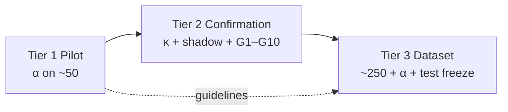

# GoalJudge Stage 5 Goldset — Tier 1 / 2 / 3 Status Review

> **Date:** 2026-06-11 (Tier 3 v0.9 PROVISIONAL FROZEN)
> **Scope:** Progress against the three-tier gates in the [Stage 5 goldset plan](../plans/goaljudge_stage5_goldset.plan.md), cross-checked against artifacts in [`docs/IAA/goalJudge/`](../IAA/goalJudge/) and related research logs.
> **Author:** Session synthesis (pilot complete; **Tier 2 CLEARED on goal_met-only rail**; **Tier 3 v0.9 PROVISIONAL frozen** — 101/250 rows, Stage 6 dev unblocked; v1 gated on wave 2 sourcing).

---

## Tier 1 — Pilot (early OK) — **COMPLETE / PASS**

**Gate:** Instruments ready + batch traces exported → pilot double-label + α ≥ 0.8 on `goal_met`.

### Prep scaffolding (plan §3.1) — all landed

| Item | Status |
|---|---|
| `failure_mode` schema seam | Done (plan §6) |
| Gold-set spec | [`goaljudge_stage5_goldset_spec.md`](../research/goaljudge_stage5_goldset_spec.md) |
| IAA protocol + canonical dir | [`docs/IAA/goalJudge/goldset/README.md`](../IAA/goalJudge/goldset/README.md) |
| α script | [`scripts/compute_goaljudge_stage5_alpha.py`](../../scripts/compute_goaljudge_stage5_alpha.py) |
| Pilot sheet builder | [`scripts/build_goaljudge_stage5_pilot_sheet.py`](../../scripts/build_goaljudge_stage5_pilot_sheet.py) |
| Corpus export + batch join | Pilot execution log confirms export |
| Research cross-links | [`docs/research/goaljudge_stage5_goldset/`](../research/goaljudge_stage5_goldset/README.md) |
| Stage 4 IAA path dedupe | Checklist marked done |

### Pilot execution — complete

| Deliverable | Result |
|---|---|
| Batch run | `gcp_goldset_pilot_2026-06-09` — **43/43** Playwright pass ([execution log](../research/goaljudge_stage5_goldset_pilot_execution_log.md)) |
| Pilot sheet | **50 rows**: 22 production + 21 registry scaffolds + 7 stress fixtures ([`goaljudge_stage5_goldset_pilot_sheet.csv`](../IAA/goalJudge/goldset/goaljudge_stage5_goldset_pilot_sheet.csv)) |
| `rubric_version` | `stage4_provisional` on all rows (expected at Tier 1) |
| Annotator 1 | Complete — [report](../IAA/goalJudge/goldset/goaljudge_stage5_goldset_annotator1_results.md) |
| Annotator 2 | Complete — [report](../IAA/goalJudge/goldset/goaljudge_stage5_goldset_annotator2_results.md) |
| **Krippendorff's α** | **0.8846** (48/50 raw agreement) — **PASS** ([pilot results](../IAA/goalJudge/goldset/goaljudge_stage5_goldset_pilot_results.md)) |

### Disagreement post-mortem — documented

Two `goal_met` disagreements, both **outcome vs. process** borderline:

| Case | A1 | A2 | Adjudicated | Issue |
|---|---|---|---|---|
| GJ-039 | false | true | **false** | Correct 13! without tool evidence |
| GJ-052 | false | true | **false** | Correct 720 but violates one-command-per-step constraint |

Metadata-only differences (not α failures): GJ-011 (`failure_mode`), GJ-020 (`partial_fraction`).

**Guideline revision for full run** (from pilot results): clarify process-constraint scaffolds (GJ-052) and computation items requiring tool evidence (GJ-039).

### Tier 1 caveats (acceptable per plan)

- Labels are against the **PROVISIONAL** rubric; re-label trigger if G5 had failed (it did not — see Tier 2).
- **10/43** registry rows are status-feed-only UI (Langfuse-only evidence) — documented, not blocking pilot.
- `adjudicated_*` columns are documented in the results MD but do not appear fully backfilled in the CSV (α was computed on raw `r1_*` / `r2_*`).

**Tier 1 verdict: green.** Pilot instruments validated; guidelines refined for scaling.

---

## Tier 2 — Confirmation (unlocks full ~250) — **CLEARED** (goal_met-only rail)

**Gate:** G5 κ ≥ 0.8 **+** shadow behavioral pass **+** G1–G10 cleared.

### What cleared

| Gate row | Status | Evidence |
|---|---|---|
| **G5 human IAA (κ)** | **PASS** | κ = **1.0** on gate-eligible set ([Stage 4 IAA results](../IAA/goalJudge/goaljudge_stage4_a2_iaa_results.md)) |
| **G1** batch re-run + trace join | **CLEARED** | 22/22 GCP batch ([shadow log](../research/goaljudge_stage4_shadow_execution_log.md)); re-confirmed v7_full 2026-06-09 |
| **G2** E1 export (`eval.goal_judge`) | **CLEARED** | 8/8 anchor traces exported; v7_full payload enriched (`final_answer`, `evidence_digest`, `tool_calls_summary`, `plan_steps`) |
| **G4** GCS posture | **CLEARED** | `/health` confirms file-backed config |
| **Shadow behavioral gate** | **CLEARED (5/5 goal_met rail)** | v7_full re-run — see [shadow log §v7_full](../research/goaljudge_stage4_shadow_execution_log.md#v7_full-re-run-2026-06-09--cleared) |

Stage 4 annotator work is complete: walkthrough (8/8), both blind grade sheets, κ computation. The κ prerequisite for gold-set labeling is met.

### v7_full §10.2 anchor verdicts (2026-06-09)

| Case | Expected | Live | goal_met rail | strict pf rail |
|---|---|---|---|---|
| **GJ-008** | gm=F, pf=0.0 | gm=F, pf=0.0 | **PASS** | **PASS** |
| **GJ-010** | gm=F, pf=0.67 | gm=F, pf=0.67 | **PASS** | **PASS** |
| **GJ-012** | gm=F, pf=0.67 | gm=F, pf=0.33 | **PASS** | FAIL ✱ |
| **GJ-001B** | gm=T, pf=1.0 | gm=T, pf=1.0 | **PASS** | **PASS** |
| **GJ-019** | gm=F, pf=0.0 | gm=F, pf=0.0 | **PASS** | **PASS** |

**Gate denominator (goal_met-only — Stage 5 α gate): 5/5 PASS.**
**Strict pf rail (audit only): 4/5 PASS.**

✱ **GJ-012 carve-out.** Registry `pf=0.67` anchors a desired trajectory (file write + file read + live API). The current agent skips subtask 3 (`web_search`) because its budget is consumed by retries on subtasks 1/2, so the judge correctly returns `pf=0.33`. `goal_met=False` matches the registry. The pf gap is an agent tool-selection/budget concern, **not** a planner regression — Phase E.2/E.3 of the [unblock plan](../plans/goaljudge_stage5_goldset.plan.md) explicitly anticipates this branch and authorizes the goal_met-only carve-out. Stage 5 α uses `goal_met` only.

Post-G3 anchors (GJ-011, GJ-013, GJ-003B) remain outside the §10.2 denominator; residual batch-vs-registry variance documented in the IAA results.

**Consequence:** A2 flips from **PROVISIONAL** → **CONFIRMED** for Stage 5 α purposes. Full ~250 assembly is **unblocked**.

`goal_judge_downgrade_enabled` remains `false` — that flip needs §2.8 enable gates from Stage 6 calibration (P/R/F1, ECE, flip-rate), not just shadow PASS.

### Stage 4 ↔ Stage 5 interaction

- G5 PASS removed the pilot re-label risk from κ failure.
- Shadow CLEARED removes the Tier 2 hard block; full ~250 assembly may now begin.
- The wrong-verification-tool rubric (Phase B prompt fix) is firing correctly on GJ-012 subtask 2, demonstrating C1 drift is captured at the rubric layer.

**Tier 2 verdict: green on shadow (goal_met rail), human, and batch substrate.**

---

## Tier 3 — Full dataset (trusted for Stage 6) — **v0.9 PROVISIONAL FROZEN** (101/250 rows; v1 gated on wave 2)

**Gate:** Tier 2 clear → ~250 stratified items → double-label → α ≥ 0.8 → test-split hash-freeze → Langfuse `goaljudge_goldset_v1`.

### Current state

The **entire assembly pipeline is implemented, tested, and the live freeze has been executed end-to-end as v0.9 (provisional).** Phase 4 wave 1 sourced 80 fresh-authored prompts; Phase 5 ran the live double-label on the 79-row fresh corpus (α = 0.27 round-1, dominated by a known grader-bug residue; adjudicated to 79/79 frozen labels with A2-vs-gold = 96.2 %). Phase 6 produced the v0.9 manifest at [`cache/goaljudge_eval/goldset_v0_9_manifest.json`](../../cache/goaljudge_eval/goldset_v0_9_manifest.json) (101 items = 79 fresh + 22 pilot-production; hash `ad5eccc0…dbc453cd`; `provisional=true`; 11-cell `floor_gap_summary`). v1 production-floor freeze is blocked only on **Phase 4 wave 2 sourcing** (~150 additional prompts targeting the under-floor cells).

Checklist items, status (per [Tier 3 assembly plan](../plans/goaljudge_stage5_tier3_assembly.plan.md)):

| Phase | Status | Evidence |
|---|---|---|
| **Phase 1** — `RealLangfuseDatasetClient` wrapper | **done ✓** | `scripts/langfuse_dataset_client.py` |
| **Phase 2** — `compute_test_split_hash` helper | **done ✓** | `services/governance/goaljudge_goldset_dataset.py:786` |
| **Phase 2.5** — D6 cost telemetry seam | **done ✓** | `gj_ai_input` payload extended |
| **Phase 3** — Full ~250 corpus join + cell-aware stratifier + corpus sidecar (`--corpus`) | **done ✓** | `scripts/build_goaljudge_stage5_full_sheet.py`, `project_trajectory_tools`, `classify_tool_cluster`, `compute_cell_coverage` |
| **Phase 4** — Cell-targeted fresh-task plumbing + drift-guards + authoring guide | **done ✓** | `FreshTask` schema, `jaccard_similarity`, `validate_fresh_task_set`, `tests/fixtures/goaljudge/fresh_test_tasks.py` (5-row seed), [`fresh_task_authoring_guide.md`](../research/goaljudge_stage5_goldset/fresh_task_authoring_guide.md) |
| **Phase 5** — α gate plumbing + adjudication + post-α coverage | **done ✓** | `services/governance/iaa.py` (Krippendorff α, disagreement diff, adjudication apply), `evaluate_goldset_post_alpha_coverage`, [`full_set_labeling_protocol.md`](../research/goaljudge_stage5_goldset/full_set_labeling_protocol.md), `scripts/compute_goaljudge_stage5_alpha.py --diff` |
| **Phase 6** — `assemble_goaljudge_goldset.py` + manifest + invariant suite | **done ✓** | `scripts/assemble_goaljudge_goldset.py`, `row_to_goldset_item`, `assert_assembly_invariants`, `build_goldset_manifest` |
| **Phase 6-C** — `--provisional` flag + `gate_goldset_v1_floors()` + v0.9/v1 cutover | **done ✓** | `--provisional` writes `provisional` + `floor_gap_summary` keys; `gate_goldset_v1_floors()` fails-closed on v0.9; [`scripts/verify_goldset_v1_cutover.py`](../../scripts/verify_goldset_v1_cutover.py); [`v0.9 contract`](../IAA/goalJudge/goldset/goaljudge_stage5_goldset_v0_9_contract.md) |
| **Phase 7** — Documentation flip | **done ✓** | README banner v0.9, master plan §3 mermaid + §13 checklist, this doc |
| **Phase 4-authoring (wave 1)** — 5 → 80 fresh-authored prompts | **done ✓** | 80-row `tests/fixtures/goaljudge/fresh_test_tasks.py`; 79/79 GCP traces joined; [`phase4_authoring_walkthrough.md`](../research/goaljudge_stage5_goldset/phase4_authoring_walkthrough.md) |
| **Phase 5 live double-label** (on the 79-row fresh corpus) | **done ✓** | A1+A2 cold-blind label complete; round-1 α = 0.2682 (grader-bug residue diagnostic); 22 disagreements adjudicated; 79/79 frozen; [`round1_alpha_report.md`](../IAA/goalJudge/goldset/goaljudge_stage5_round1_alpha_report.md), [`round1_adjudication.md`](../IAA/goalJudge/goldset/goaljudge_stage5_round1_adjudication.md) |
| **Phase 6 execute — v0.9 provisional manifest** | **done ✓** | 101-item manifest at `cache/goaljudge_eval/goldset_v0_9_manifest.json`, hash `ad5eccc0…dbc453cd`, reproducible via the `--provisional` flag |
| ⏸ **Phase 4-authoring (wave 2)** — ~150 fresh-authored prompts targeting under-floor cells | **pending** — gap-driven brief in [`v0.9 contract`](../IAA/goalJudge/goldset/goaljudge_stage5_goldset_v0_9_contract.md); needs +28 L0, +56 L1, +35 L2, +16 web-bound, +14 wrong-tool, +11 blocked-tool, +9 file-only, +11 compose, +7 no-tool, +6 request_approval, +5 shell-bound |
| ⏸ **Phase 5 wave-2 double-label + α ≥ 0.8 on wave 2** | **pending** — gated on wave 2 authoring + GCP run |
| ⏸ **Phase 6 v1 freeze** — assembler **without** `--provisional` | **pending** — gated on wave 2 labels; `verify_goldset_v1_cutover.py` confirms the v0.9 → v1 transition is clean |

### What is ready for day-one of Tier 3

Engineering seams, design, **and the end-to-end CLI pipeline** are in place:

- Stratification spec (40/30/20/10, A2-dense sampling) — [`goaljudge_stage5_goldset_spec.md`](../research/goaljudge_stage5_goldset_spec.md)
- Contamination firewall design (synthetic → dev only; test from production/fresh)
- Phase 3 builder produces the full sheet with D1/D5 dimension columns + cell-coverage gap report
- Phase 4 fresh-task schema + drift-guards (router-agreement, Jaccard < 0.5, vocabulary)
- Phase 5 α gate + disagreement diff + adjudication apply, all reusing one L1 module ([`services/governance/iaa.py`](../../services/governance/iaa.py))
- Phase 6 single-shot assembler: CSV → invariants → SHA-256 hash → Langfuse load → manifest JSON
- Pilot-derived labeling guidelines codified into [`full_set_labeling_protocol.md`](../research/goaljudge_stage5_goldset/full_set_labeling_protocol.md) (5 rules + decision tree)
- Same two annotators, proven workflow, α tooling
- Enriched `eval.goal_judge` telemetry (`final_answer`, `evidence_digest`, `tool_calls_summary`, `plan_steps`) — every labeling decision is now auditable end-to-end from Langfuse alone

**Tier 3 verdict: wave 1 CLEARED, v0.9 manifest shipped, Stage 6 development unblocked.** Wave 2 (~150 gap-targeted prompts → v1 freeze) is the remaining human-paced critical path.

---

## Summary matrix

| Tier | Gate | Status | Key artifact |
|---|---|---|---|
| **1 — Pilot** | α ≥ 0.8 on ~50 | **PASS** | [`goaljudge_stage5_goldset_pilot_results.md`](../IAA/goalJudge/goldset/goaljudge_stage5_goldset_pilot_results.md) |
| **2 — Confirmation** | κ ≥ 0.8 + shadow + G1–G10 | **CLEARED (goal_met rail 5/5)** | [`goaljudge_stage4_shadow_execution_log.md`](../research/goaljudge_stage4_shadow_execution_log.md) |
| **3 — Dataset** | ~250 + α + test freeze | **v0.9 PROVISIONAL FROZEN** (101 of ~250 rows; v1 gated on wave 2 sourcing) | [`v0.9 contract`](../IAA/goalJudge/goldset/goaljudge_stage5_goldset_v0_9_contract.md) + [`Phase 6-B measurement`](../IAA/goalJudge/goldset/goaljudge_stage5_phase6b_combined_measurement.md) |

---

## Critical path

1. ~~**Unblock Tier 2:**~~ **DONE** — Phase A (tolerance), Phase B (wrong-tool prompt rule), Phase E.1 (telemetry enrichment), Phase E.2/3 (planner per-task scoping + plan_builder split + saturation `task_id` decoupling) all landed; shadow re-run 2026-06-09 v7_full cleared §10.2 on goal_met rail (5/5).
2. ~~**Tier 3 plumbing:**~~ **DONE** — Phases 1–6 of the [Tier 3 assembly plan](../plans/goaljudge_stage5_tier3_assembly.plan.md) all landed under TDD discipline (Protocol A/B, 7 anti-patterns, 8 self-validation checks). End-to-end pipeline: stratified builder → cell-aware fresh-task seed + drift-guards → α gate + adjudication + post-α coverage → single-shot assembler with SHA-256 freeze and manifest JSON.
3. ~~**Tier 3 live run wave 1:**~~ **DONE** — Phase 4-authoring (80 fresh prompts), GCP playwright batch (79/79 traces joined), Phase 5 double-label (A1+A2 cold-blind), round-1 α = 0.2682 + decomposed cause analysis (12/22 disagreements from known grader-bug residue), 22 adjudicated, 79/79 frozen, Phase 6 `--provisional` assemble → 101-row v0.9 manifest at `cache/goaljudge_eval/goldset_v0_9_manifest.json`. **Stage 6 development is unblocked against v0.9.**
4. **Tier 3 live run wave 2 (now active, human-paced):**
   1. **Phase 4 wave 2 authoring** — ~150 fresh-authored prompts gap-targeted at the 11 under-floor cells (see [`v0.9 contract` floor-gap table](../IAA/goalJudge/goldset/goaljudge_stage5_goldset_v0_9_contract.md#floor-gap-summary-whats-still-under-floor)); same `FreshTask` schema + drift-guards as wave 1.
   2. **Phase 5 wave-2 labeling** — same annotators, same protocol (with the post-wave-1 Rule 7 + `request_approval` reconciliation clauses already merged into the [labeling protocol](../research/goaljudge_stage5_goldset/full_set_labeling_protocol.md)). α ≥ 0.8 expected on wave-2 rows alone since the round-1 grader bug is fixed.
   3. **Phase 6 v1 freeze** — run `assemble_goaljudge_goldset.py` **without** `--provisional` against the combined sheet (wave 1 + wave 2 ≈ 250 rows); `verify_goldset_v1_cutover.py` confirms the v0.9 → v1 transition is clean; manifest renamed `goldset_v1_manifest.json`; `gate_goldset_v1_floors()` flips from raise → pass; Tier 3 CLEARED → Stage 6 calibration fully unblocked.

The pilot work de-risked the labeling instrument (α = 0.88 on `goal_met`). The Tier 2 unblock validated the rubric against live behavior. Tier 3 plumbing + v0.9 freeze are complete; the next bottleneck is wave-2 sourcing.

### Deferred (do not block Tier 2 or 3)

- **GJ-012 strict-pf gap** — agent tool-selection / budget concern; documented carve-out per Phase E.2/E.3 of the [unblock plan](../plans/goaljudge_stage5_goldset.plan.md). Separate plan when prioritized.
- **`shadow_traces.py` `_GJ012` fixture re-pin** — offline shadow suite should track v7_full evidence shape; cosmetic, not gating.
- **`goal_judge_downgrade_enabled` flip** — needs Stage 6 calibration metrics, not Tier 2 unblock.

---

## References

- [Stage 5 goldset master plan](../plans/goaljudge_stage5_goldset.plan.md)
- [Stage 5 Tier 3 assembly plan](../plans/goaljudge_stage5_tier3_assembly.plan.md) — the 7-phase pipeline this report tracks
- [Stage 5 goldset IAA protocol](../IAA/goalJudge/goldset/README.md)
- [Fresh-task authoring guide (Phase 4)](../research/goaljudge_stage5_goldset/fresh_task_authoring_guide.md)
- [Full-set labeling protocol (Phase 5)](../research/goaljudge_stage5_goldset/full_set_labeling_protocol.md)
- [Stage 4 A2 IAA results](../IAA/goalJudge/goaljudge_stage4_a2_iaa_results.md)
- [Stage 4 shadow execution log](../research/goaljudge_stage4_shadow_execution_log.md)
- [Stage 5 pilot execution log](../research/goaljudge_stage5_goldset_pilot_execution_log.md)
- Tier 3 plumbing modules: [`services/governance/iaa.py`](../../services/governance/iaa.py), [`services/governance/goaljudge_goldset_dataset.py`](../../services/governance/goaljudge_goldset_dataset.py)
- Tier 3 CLI: [`scripts/assemble_goaljudge_goldset.py`](../../scripts/assemble_goaljudge_goldset.py), [`scripts/compute_goaljudge_stage5_alpha.py`](../../scripts/compute_goaljudge_stage5_alpha.py), [`scripts/build_goaljudge_stage5_full_sheet.py`](../../scripts/build_goaljudge_stage5_full_sheet.py)
