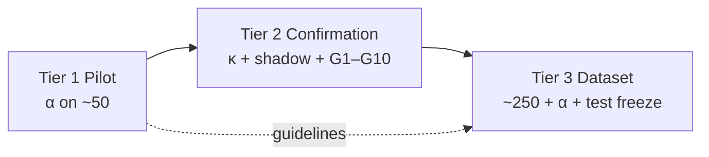

# GoalJudge Stage 5 Goldset — Tier 1 / 2 / 3 Status Review

> **Date:** 2026-06-09  
> **Scope:** Progress against the three-tier gates in the [Stage 5 goldset plan](../plans/goaljudge_stage5_goldset.plan.md), cross-checked against artifacts in [`docs/IAA/goalJudge/`](../IAA/goalJudge/) and related research logs.  
> **Author:** Session synthesis (pilot complete; Tier 2 blocked on shadow; Tier 3 not started).

---

## Tier 1 — Pilot (early OK) — **COMPLETE / PASS**

**Gate:** Instruments ready + batch traces exported → pilot double-label + α ≥ 0.8 on `goal_met`.

### Prep scaffolding (plan §3.1) — all landed

| Item | Status |
|---|---|
| `failure_mode` schema seam | Done (plan §6) |
| Gold-set spec | [`goaljudge_stage5_goldset_spec.md`](../research/goaljudge_stage5_goldset_spec.md) |
| IAA protocol + canonical dir | [`docs/IAA/goalJudge/goldset/README.md`](../IAA/goalJudge/goldset/README.md) |
| α script | [`scripts/compute_goaljudge_stage5_alpha.py`](../../scripts/compute_goaljudge_stage5_alpha.py) |
| Pilot sheet builder | [`scripts/build_goaljudge_stage5_pilot_sheet.py`](../../scripts/build_goaljudge_stage5_pilot_sheet.py) |
| Corpus export + batch join | Pilot execution log confirms export |
| Research cross-links | [`docs/research/goaljudge_stage5_goldset/`](../research/goaljudge_stage5_goldset/README.md) |
| Stage 4 IAA path dedupe | Checklist marked done |

### Pilot execution — complete

| Deliverable | Result |
|---|---|
| Batch run | `gcp_goldset_pilot_2026-06-09` — **43/43** Playwright pass ([execution log](../research/goaljudge_stage5_goldset_pilot_execution_log.md)) |
| Pilot sheet | **50 rows**: 22 production + 21 registry scaffolds + 7 stress fixtures ([`goaljudge_stage5_goldset_pilot_sheet.csv`](../IAA/goalJudge/goldset/goaljudge_stage5_goldset_pilot_sheet.csv)) |
| `rubric_version` | `stage4_provisional` on all rows (expected at Tier 1) |
| Annotator 1 | Complete — [report](../IAA/goalJudge/goldset/goaljudge_stage5_goldset_annotator1_results.md) |
| Annotator 2 | Complete — [report](../IAA/goalJudge/goldset/goaljudge_stage5_goldset_annotator2_results.md) |
| **Krippendorff's α** | **0.8846** (48/50 raw agreement) — **PASS** ([pilot results](../IAA/goalJudge/goldset/goaljudge_stage5_goldset_pilot_results.md)) |

### Disagreement post-mortem — documented

Two `goal_met` disagreements, both **outcome vs. process** borderline:

| Case | A1 | A2 | Adjudicated | Issue |
|---|---|---|---|---|
| GJ-039 | false | true | **false** | Correct 13! without tool evidence |
| GJ-052 | false | true | **false** | Correct 720 but violates one-command-per-step constraint |

Metadata-only differences (not α failures): GJ-011 (`failure_mode`), GJ-020 (`partial_fraction`).

**Guideline revision for full run** (from pilot results): clarify process-constraint scaffolds (GJ-052) and computation items requiring tool evidence (GJ-039).

### Tier 1 caveats (acceptable per plan)

- Labels are against the **PROVISIONAL** rubric; re-label trigger if G5 had failed (it did not — see Tier 2).
- **10/43** registry rows are status-feed-only UI (Langfuse-only evidence) — documented, not blocking pilot.
- `adjudicated_*` columns are documented in the results MD but do not appear fully backfilled in the CSV (α was computed on raw `r1_*` / `r2_*`).

**Tier 1 verdict: green.** Pilot instruments validated; guidelines refined for scaling.

---

## Tier 2 — Confirmation (unlocks full ~250) — **BLOCKED**

**Gate:** G5 κ ≥ 0.8 **+** shadow behavioral pass **+** G1–G10 cleared.

### What cleared

| Gate row | Status | Evidence |
|---|---|---|
| **G5 human IAA (κ)** | **PASS** | κ = **1.0** on gate-eligible set ([Stage 4 IAA results](../IAA/goalJudge/goaljudge_stage4_a2_iaa_results.md)) |
| **G1** batch re-run + trace join | **CLEARED** | 22/22 GCP batch ([shadow log](../research/goaljudge_stage4_shadow_execution_log.md)) |
| **G2** E1 export (`eval.goal_judge`) | **CLEARED** | 8/8 anchor traces exported |
| **G4** GCS posture | **CLEARED** | `/health` confirms file-backed config |

Stage 4 annotator work is complete: walkthrough (8/8), both blind grade sheets, κ computation. The κ prerequisite for gold-set labeling is met — pilot rows are **not** subject to a G5-failure re-label trigger.

### What blocks Tier 2

| Gate row | Status | Detail |
|---|---|---|
| **Shadow behavioral gate** | **FAIL (3/5)** | [Shadow execution log](../research/goaljudge_stage4_shadow_execution_log.md) |

Failures on §10.2 gate-eligible anchors:

| Case | Issue | Type |
|---|---|---|
| **GJ-010** | Live `partial_fraction` = 0.6667… vs registry `0.67` | Representation mismatch (strict `pytest.approx`) |
| **GJ-012** | Live `goal_met=true` vs registry `false` | **C1 judge drift** — filenames listed, not file contents read |

GJ-008, GJ-001B, GJ-019 pass. Post-G3 anchors (GJ-011, GJ-013, GJ-003B) show additional batch-vs-registry variance documented in the IAA results.

**Consequence:** A2 stays **PROVISIONAL**; `goal_judge_downgrade_enabled` remains `false`. Full ~250 assembly is **hard-blocked** per plan §3.

### Stage 4 ↔ Stage 5 interaction

- G5 PASS removes the pilot re-label risk from κ failure.
- Shadow FAIL still blocks Tier 2 and Tier 3 — the rubric is not *confirmed* even though humans agree on the A2 boundary.
- Documented next steps: tune prompt for GJ-012 C1 drift; relax or normalize `partial_fraction` for GJ-010; re-export and re-run shadow gate.

**Tier 2 verdict: red on shadow; partial green on human + batch substrate.**

---

## Tier 3 — Full dataset (trusted for Stage 6) — **NOT STARTED / BLOCKED**

**Gate:** Tier 2 clear → ~250 stratified items → double-label → α ≥ 0.8 → test-split hash-freeze → Langfuse `goaljudge_goldset_v1`.

### Current state

[`goaljudge_stage5_goldset_results.md`](../IAA/goalJudge/goldset/goaljudge_stage5_goldset_results.md) is an empty shell:

> **BLOCKED** — requires Stage 4 Confirmation (Tier 2) before full ~250 assembly.

Checklist items still **pending** (plan §13):

- `assemble-goldset` — full ~250 assemble + dev/test split + Langfuse load
- `alpha-gate-full` — full-set α ≥ 0.8 + test freeze

### What is ready for day-one of Tier 2 unlock

Engineering seams and design are in place:

- Stratification spec (40/30/20/10, A2-dense sampling)
- Contamination firewall design (synthetic → dev only; test from production/fresh)
- [`goaljudge_goldset_dataset.py`](../../services/governance/goaljudge_goldset_dataset.py) Langfuse CRUD (L2 mock)
- Pilot-derived labeling guidelines (GJ-039/GJ-052 rules, GJ-011 batch-variance rule from Stage 4 IAA)
- Same two annotators, proven workflow, α tooling

**Tier 3 verdict: blocked upstream; no full-run labeling or test-split freeze yet.**

---

## Summary matrix

| Tier | Gate | Status | Key artifact |
|---|---|---|---|
| **1 — Pilot** | α ≥ 0.8 on ~50 | **PASS** | [`goaljudge_stage5_goldset_pilot_results.md`](../IAA/goalJudge/goldset/goaljudge_stage5_goldset_pilot_results.md) |
| **2 — Confirmation** | κ ≥ 0.8 + shadow + G1–G10 | **BLOCKED** (shadow 3/5) | [`goaljudge_stage4_shadow_execution_log.md`](../research/goaljudge_stage4_shadow_execution_log.md) |
| **3 — Dataset** | ~250 + α + test freeze | **NOT STARTED** | [`goaljudge_stage5_goldset_results.md`](../IAA/goalJudge/goldset/goaljudge_stage5_goldset_results.md) |

---

## Critical path

1. **Unblock Tier 2:** Fix GJ-012 prompt drift + GJ-010 `partial_fraction` tolerance → re-run shadow gate to 5/5.
2. **Tier 3 assembly:** Pull full corpus via `export_goaljudge_corpus.py`, stratify per spec, augment scarce strata (dev-only synthetic), double-label with pilot-refined guidelines.
3. **Tier 3 gate:** Compute full-set α, adjudicate, hash-freeze test split, load Langfuse dataset.

The pilot work de-risked the labeling instrument (α = 0.88 on `goal_met`); the remaining blocker is **Stage 4 Confirmation via shadow**, not human agreement on either κ or pilot α.

---

## References

- [Stage 5 goldset plan](../plans/goaljudge_stage5_goldset.plan.md)
- [Stage 5 goldset IAA protocol](../IAA/goalJudge/goldset/README.md)
- [Stage 4 A2 IAA results](../IAA/goalJudge/goaljudge_stage4_a2_iaa_results.md)
- [Stage 4 shadow execution log](../research/goaljudge_stage4_shadow_execution_log.md)
- [Stage 5 pilot execution log](../research/goaljudge_stage5_goldset_pilot_execution_log.md)
