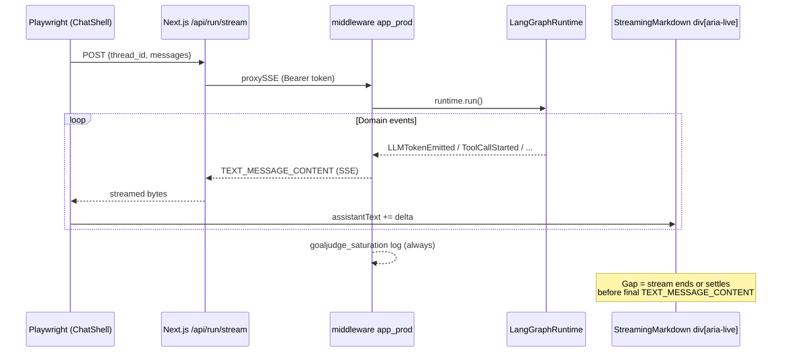

# GoalJudge UI Rendering Gap — Investigation Report

**Prepared:** 2026-06-09
**Scope:** Non-deterministic failure of the Cloud Run chat UI to render final assistant answers during GoalJudge registry batch runs (GJ-001–GJ-022)
**Status:** Product defect — confirmed across multiple runs; not a test-harness artifact
**Companion docs:** [Session synthesis](./goaljudge_session_observations_synthesis.md) · [Playwright batch report (Run 1)](./goaljudge_gcp_playwright_batch_session_report.md) · [GCP execution log (2026-06-09)](../research/goaljudge_stage4_gcp_batch_execution_log.md)

---

## 1. Executive summary

During GoalJudge Playwright batches against live GCP (`agent-frontend-w65nrxwkiq-uc.a.run.app`), the **backend completes every case** (22/22 `goaljudge_saturation` bridge lines, 22/22 deterministic `trace_id` joins), but the **browser DOM often never receives the final answer**. Instead, the UI freezes on a status feed:

```text
Using tools: file_io, web_search, shell…
```

This is the **UI rendering gap**: a divergence between server-side run completion and user-visible streamed content in `article div[aria-live='polite']`.

| Run | Date | DOM full answer | Status-feed only | Playwright pass |
|-----|------|-----------------|------------------|-----------------|
| Run 1 | 2026-06-08 ~13:45 UTC | **11/22** | 11/22 | 22/22 |
| Run 2 | 2026-06-08 ~16:43–21:17 UTC | **17/22** | 5/22 (+ GJ-003B not re-run) | 21/22 executed |
| Run 3 | 2026-06-09 | **16/22** | **6/22** | 22/22 |

**Key conclusions:**

1. The gap is **non-deterministic** — the same case can render fully in one run and status-only in the next (e.g. GJ-001: full in Run 1, gap in Runs 2 & 3; GJ-007: full in Run 1, gap in Runs 2 & 3; GJ-010: gap in Run 1, full in Runs 2 & 3).
2. It is **not a harness false negative** — selector and settle logic were fixed and validated; `verify_run.py` strips the status prefix before measuring; backend integrity gates pass on every run.
3. Three cases are **persistently affected** across all Playwright runs: **GJ-011, GJ-014, GJ-015**.
4. Manual UI walkthroughs sometimes show full answers for the same cases Playwright captures as status-only (e.g. GJ-011, GJ-015), suggesting timing, session, or stream-handling sensitivity — not purely "agent never answered."

---

## 2. Phenomenon definition

### 2.1 What "rendered" means

A case is **DOM-rendered** when, after stripping leading status-feed segments, `response_text` contains substantive assistant prose:

```python
# verify_run.py logic
strip_status_prefix(text, "Using tools:")  # removes repeated "Using tools: …" prefixes
# if remainder non-empty → rendered; else → status-feed only
```

Artifact: `docs/skills/playwright-agentic-e2e/scripts/verify_run.py`

### 2.2 What users and tests actually see

**Status-feed only (gap):**

| Case | `response_text` (Run 3) | Chars |
|------|-------------------------|-------|
| GJ-001 | `Using tools: file_io, file_io…` | ~35 |
| GJ-003 | `Using tools: shell…` ×5 | ~125 |
| GJ-007 | `Using tools: shell…` | ~21 |
| GJ-011 | `Using tools: file_io, web_search, shell…` | ~45 |
| GJ-014 | `Using tools: think…Using tools: shell, shell…` | ~50 |
| GJ-015 | `Using tools: shell, web_search…Using tools: web_search…` | ~60 |

**Fully rendered (contrast):**

| Case | Pattern |
|------|---------|
| GJ-001B | Status prefixes **then** `FINAL ANSWER: active` |
| GJ-010 | Status prefix **then** multi-paragraph completion |
| GJ-006 | Status prefix **then** ~3KB of search listings |

Screenshots: `cache/goaljudge_eval/ui_batch_screenshots_gcp_2026-06-09/GJ-*.png`

### 2.3 What is *not* broken

| Layer | Evidence |
|-------|----------|
| Backend completion | 22/22 `goaljudge_saturation case=… trace=…` in Cloud Logging |
| Trace integrity | 22/22 `trace_id == uuid5(NAMESPACE_DNS, case_id)` |
| Playwright harness | Correct selector `article div[aria-live='polite']`; text-stability settle |
| Auth / deploy | Pre-flight green on 2026-06-09; `goal_judge.enabled=true` from GCS |

---

## 3. Architecture and data flow



### 3.1 Status feed origin (backend)

When the LLM returns **tool calls only** (no text), `LangGraphRuntime` synthesizes a preview delta:

```323:323:agent_ui_adapter/adapters/runtime/langgraph_runtime.py
        return "Using tools: " + ", ".join(names) + "…"
```

This is emitted as `LLMTokenEmitted` → `TEXT_MESSAGE_CONTENT` on `on_chat_model_end` when the model output has no text content.

### 3.2 Status feed accumulation (frontend)

`ChatShell` appends every delta into one string — status lines are **not replaced**, they accumulate:

```115:120:frontend/app/chat-shell.tsx
          if (eventName === "TEXT_MESSAGE_CONTENT" && typeof payload.delta === "string") {
            assistantText += payload.delta;
            const snapshot = assistantText;
            setMessages((prev) =>
              prev.map((m) => (m.id === assistantId ? { ...m, text: snapshot } : m)),
            );
```

Successful runs therefore look like:
`Using tools: X…Using tools: Y…<final answer prose>`

Gap runs stop after one or more status segments with **no final prose delta ever arriving**.

### 3.3 Settle detection (test harness)

`waitForResponse` polls until text is non-empty and **stable for 3 consecutive samples at 700ms** (~2.1s). It deliberately does **not** gate on composer `busy` or SSE `finished()` — both were found unreliable on Cloud Run.

```117:145:frontend/e2e/fixtures/helpers.ts
export async function waitForResponse(
  page: Page,
  opts?: { timeoutMs?: number; stableSamples?: number; sampleGapMs?: number },
): Promise<Locator> {
  // ...
  // text-stability poll is the source of truth, not composer state
```

Timeout per case: **150s** (`goaljudge-batch.spec.ts`).

### 3.4 Production UI surface

GCP tests hit **`ChatShell`** (placeholder integration), not the full CopilotKit/AG-UI stack:

```6:8:frontend/app/chat-shell.tsx
 * sent to the BFF `/api/run/stream` endpoint. The full AG-UI / CopilotKit
 * integration lands in later sprints.
```

`ChatShell` handles only `TEXT_MESSAGE_CONTENT` and `RUN_ERROR` — it ignores `RUN_FINISHED`, `STEP_*`, tool card events, and `TEXT_MESSAGE_START`/`END`.

---

## 4. Cross-run case matrix

| Case | Run 1 | Run 2 | Run 3 (2026-06-09) | Persistent gap? | Tool-heavy? |
|------|-------|-------|---------------------|-----------------|-------------|
| GJ-001 | Full | Gap | **Gap** | Flip-flop | file_io ×2 |
| GJ-001B | Full | Full | Full | No | file_io |
| GJ-002 | Full | Full | Full | No | think, shell |
| GJ-003 | Gap | Full | **Gap** | Flip-flop | shell ×5 |
| GJ-003B | Gap | — | Full | No | shell, file_io |
| GJ-004 | Full | Full | Full | No | shell, file_io |
| GJ-005 | Full | Full | Full | No | shell ×4 |
| GJ-006 | Gap | Full | Full | Flip-flop | web_search ×2 |
| GJ-007 | Full | Gap | **Gap** | Flip-flop | shell |
| GJ-008 | Full | Full | Full | No | (no status prefix) |
| GJ-009 | Full | Full | Full | No | file_io |
| GJ-010 | Gap | Full | Full | Flip-flop | file_io ×2, web_search |
| GJ-011 | Gap | Gap (×2) | **Gap** | **Yes** | file_io, web_search, shell |
| GJ-012 | Gap | Full | Full | Flip-flop | file_io, shell, web_search |
| GJ-013 | Gap | Full | Full | Flip-flop | file_io ×2 |
| GJ-014 | Gap | Gap | **Gap** | **Yes** | think, shell ×2 |
| GJ-015 | Gap | Gap | **Gap** | **Yes** | shell, web_search ×2 |
| GJ-016 | Partial | Full | Full | No | shell ×3 |
| GJ-019 | Full | Full | Full | No | shell |
| GJ-020 | Gap | Full | Full | Flip-flop | file_io |
| GJ-021 | Gap | Full | Full | Flip-flop | file_io, shell |
| GJ-022 | Full | Full | Full | No | file_io |

**Legend:** Full = substantive answer after status strip · Gap = status-feed only · Partial = incomplete but non-status content

### 4.1 Correlates (not strict causation)

Cases with **persistent** gaps share:

- **Multi-tool orchestration** (3+ tool types or many round-trips)
- **Shell retry loops** (GJ-003, GJ-011, GJ-014)
- **Mixed modalities** (file_io + web_search + shell in one turn)

Cases that **rarely gap** tend to have:

- Single-tool or direct LLM-only responses (GJ-008 — no tool preview at all)
- Shorter tool chains (GJ-001B, GJ-022)

---

## 5. Root cause hypotheses

Ranked by likelihood based on evidence. All may contribute; the non-determinism suggests **timing/race** rather than a single deterministic code path.

### H1 — Final LLM turn tokens never reach SSE (backend adapter) ⭐ Most likely

**Mechanism:** The ReAct graph completes (GoalJudge bridge fires, Langfuse has a final message), but the last `call_llm` turn's tokens are not translated to `TEXT_MESSAGE_CONTENT`.

**Supporting evidence:**

- Backend always logs saturation at run start/context setup — completion is real.
- Manual walkthroughs and Run 2 recoveries show the agent *can* produce answers for gap cases.
- `_suppress_llm_event_for_node` drops LLM events from non-`call_llm` nodes; mis-tagged metadata could drop the final turn intermittently.
- `on_chat_model_end` with `already_streamed=True` skips re-emitting content; if streaming chunks were lost but `run_id` was marked streamed, final text might not be sent.
- Terminal graph exits (`classify_outcome` → terminal on `Error:` payloads) may end the run without a user-facing synthesis turn — backend "done" but no prose event.

**Where to look:** `agent_ui_adapter/adapters/runtime/langgraph_runtime.py` (`_translate_event`, `_streamed_run_ids`, `_suppress_llm_event_for_node`); compare Langfuse `llm.finished` output_text vs SSE event log per `trace_id`.

---

### H2 — SSE stream closes before final deltas flush (middleware / proxy) ⭐ Likely

**Mechanism:** `app_prod._generate()` yields events until `runtime.run()` exhausts, then sends `SENTINEL_LINE`. If the async generator completes before the last LLM tokens are produced (or buffered in LangGraph's event stream), the HTTP connection closes while the UI still shows the last tool preview.

**Supporting evidence:**

- Non-deterministic recovery across runs with same deployment.
- Cloud Run + BFF `proxySSE` adds two hop points where buffering or early client disconnect could truncate tail events.
- `page.route` thread-bridge rewrites POST body only (does not mock SSE) — 16/22 successes argue against route intercept as primary cause, but tail-loss could still be timing-sensitive.

**Where to look:** `middleware/app_prod.py` stream generator; `frontend/lib/transport/edge_proxy.ts` (`proxySSE`); log event counts per run (`TEXT_MESSAGE_CONTENT` count at middleware vs browser).

---

### H3 — Test settle fires during inter-turn silence (harness timing) ⚠️ Partial contributor

**Mechanism:** After the last visible `Using tools: …` delta, the server runs tools for seconds with **no new SSE events**. Text stabilizes for 2.1s; `waitForResponse` returns. If the final answer delta arrives *after* settle, the test captures status-only — but the screenshot is taken immediately, so this only explains gaps if the stream truly ended before the answer.

**Supporting evidence:**

- 150s timeout is generous; most gap cases finish in <30s wall clock (Run 3 total batch: 2.6 min / 22 cases).
- If the stream were still open and later tokens arrived, a longer post-settle wait would show growth — not observed in re-reads of the same session.

**Mitigation:** Gate on `RUN_FINISHED` via CDP network log or inject a `data-run-complete` attribute when `ChatShell` sees stream end — not currently implemented.

**Verdict:** Unlikely as *sole* cause (stream appears closed), but worth ruling out with SSE timestamp logging.

---

### H4 — ChatShell event handling gap (frontend) ⚠️ Architectural

**Mechanism:** Placeholder `ChatShell` ignores most AG-UI event types. If the final answer is encoded differently (new `message_id`, `RUN_ERROR`, structured tool result routed outside `TEXT_MESSAGE_CONTENT`), it never lands in `assistantText`.

**Supporting evidence:**

- `tool_card_count: 0` on all 22 Run 3 rows — tool UI not wired; all tool visibility is via status text only.
- Full CopilotKit path (`agUiToUiRuntime`, `CopilotKitUIRuntime`) exists but is **not** what GCP chat uses today.

**Verdict:** Contributes to poor UX and limits observability; may not explain backend-verified answers in Langfuse unless those answers never hit `TEXT_MESSAGE_CONTENT`.

---

### H5 — Status feed conflated with answer body (UX / design) — Confirmed design issue

**Mechanism:** Tool previews and final answers share one accumulated string. Users see stale status lines even on success; on failure it is impossible to distinguish "still running" vs "finished without answer."

**Evidence:** Successful captures include multiple `Using tools: …` prefixes before prose. Docs in `gotchas.md` say status lines are "progressively replaced" — implementation actually **appends**.

**Impact:** Amplifies gap severity in screenshots and IAA; does not alone cause missing backend tokens.

---

### H6 — Environment / agent behavior confounds — Orthogonal but overlapping

Some gap cases (GJ-014, GJ-015) also hit **shell allowlist blocks**, **workspace path mismatches**, and **terminal escalation** (Axis B confounds in synthesis doc). These affect *what* the agent would say, but manual runs prove answers *can* render — so environment blocks do not fully explain the UI gap.

---

## 6. Ruled-out causes

| Hypothesis | Why ruled out |
|------------|---------------|
| Wrong Playwright selector | Fixed 2026-06-08: `article div[aria-live='polite']`; FE-AP-5 |
| Bad WorkOS auth | Pre-flight passes; 22/22 cases execute |
| Backend GoalJudge disabled | `/health` shows `enabled: true`, `source: gcs:…` |
| Harness timeout too short | 150s/case; gaps settle in <40s with short text |
| Client-generated trace_id | Thread bridge throws if present; 22/22 integrity pass |
| "Playwright pass = DOM pass" | `outcome=pass` only means non-empty settled text; status-only still passes |

---

## 7. Recommended fixes

### 7.1 Immediate diagnostics (P0 — do first)

| # | Action | Owner | Effort |
|---|--------|-------|--------|
| D1 | **Per-trace SSE audit:** For GJ-011, GJ-014, GJ-015, log all `TEXT_MESSAGE_CONTENT` deltas at middleware (`stream_ended` + delta count + last delta timestamp). Compare to Langfuse final assistant message for same `trace_id`. | Backend | 0.5d |
| D2 | **Browser-side event tap:** Temporary `ChatShell` debug mode counting SSE events by type until stream reader completes. Confirm whether final deltas arrive after last status line. | Frontend | 0.5d |
| D3 | **Re-run persistent trio** with extended settle (`stableSamples: 10`, `sampleGapMs: 1000`) and CDP `Network` recording of `/api/run/stream` — isolate tail-loss vs early settle. | QA/E2E | 2h |

### 7.2 Product fixes (P1)

| # | Fix | Rationale |
|---|-----|-----------|
| F1 | **Separate status from answer in UI** — render tool/step status in `step-meter` or ephemeral banner; bind `StreamingMarkdown` text to answer tokens only. | Stops conflating previews with final content; clearer UX |
| F2 | **Handle `RUN_FINISHED` in ChatShell** — set `busy=false` only on stream end; optionally show "Run complete" when finished with empty answer (surfaces gap visibly) | Aligns client lifecycle with server |
| F3 | **Emit final answer guarantee in adapter** — on `RunFinishedDomain`, if last user-visible text is only `_tool_calls_preview`, flush `output_text` from final `LLMMessageEnded` as one delta | Closes H1 backend path |
| F4 | **Audit `_streamed_run_ids` logic** — on `on_chat_model_end`, if `already_streamed` but content exists and differs from accumulated preview, re-emit | Fixes skipped final tokens |
| F5 | **Review `_suppress_llm_event_for_node`** — log when events are dropped; fail-safe: if dropping would leave run with no user text, pass through | Catches mis-tagged nodes |

### 7.3 Test / eval mitigations (P1 — parallel track)

| # | Fix | Rationale |
|---|-----|-----------|
| T1 | **`verify_run.py` + Langfuse join** — flag `dom_gap=true` rows and pull `final_answer` from Langfuse for IAA | Already specified in `goaljudge_stage4_a2_rubric_spec.md` |
| T2 | **Add `dom_rendered: bool` to JSONL schema** | Explicit gate field vs inferring from `response_text` |
| T3 | **Optional `waitForRunFinished` helper** — listen for SSE `[DONE]` / sentinel in network layer | Stronger completion signal than text stability |
| T4 | **Persistent-gap regression spec** — dedicated test for GJ-011/014/015 with strict assert on stripped answer length > 100 | Prevents regression once fixed |

### 7.4 Strategic (P2)

| # | Fix | Rationale |
|---|-----|-----------|
| S1 | **Complete CopilotKit/AG-UI migration** — retire placeholder `ChatShell` SSE parser | Proper event routing, tool cards, run lifecycle |
| S2 | **Structured telemetry (G3)** — emit `ui_render_complete`, `last_delta_kind`, `delta_count` in `jsonPayload` | Cloud Logging divergence checks without Langfuse |
| S3 | **Fix B4 terminal escalation** (`classify_outcome`) | Reduces graph exits without synthesis (GJ-020/021 class) |

---

## 8. Investigation playbook

```bash
# 1. Measure DOM split (Run 3 artifact)
python docs/skills/playwright-agentic-e2e/scripts/verify_run.py \
  --jsonl cache/goaljudge_eval/ui_batch_gcp_2026-06-09.jsonl \
  --status-prefix "Using tools:" --id-namespace dns --dedupe --expect-cases 22

# 2. Cloud Logging — confirm backend saw all cases
gcloud logging read \
  'resource.labels.service_name="agent-backend-combined" AND jsonPayload.message=~"goaljudge_saturation"' \
  --freshness=24h --project=agent-prod-gcp-dev \
  --format='value(jsonPayload.message)'

# 3. Langfuse — compare final message vs DOM for gap cases
#    Filter: user_id=synthetic-saturation-user, trace_id in {GJ-011, GJ-014, GJ-015 hex ids}

# 4. Re-run persistent gap with debug settle
cd frontend
GJ_CASE_FILTER=GJ-011 CI=1 pnpm exec playwright test \
  e2e/full-stack/goaljudge-batch.spec.ts --project=chromium-desktop
```

**Trace IDs for persistent gap cases:**

| Case | `trace_id` |
|------|------------|
| GJ-011 | `13bd732b9c14568586a6bdc1b52e3397` |
| GJ-014 | `1b8d2482819655e79782722dd6839757` |
| GJ-015 | `921cfde6faf156149188f047f036610c` |

---

## 9. Impact assessment

| Stakeholder | Impact |
|-------------|--------|
| **GoalJudge IAA / rubric scoring** | DOM captures for gap cases are **inadmissible** for behavioral scoring; use Langfuse `final_answer` |
| **Saturation sign-off** | UI layer cannot be used as sole evidence of user-visible behavior |
| **Product UX** | Users on Cloud Run may see "Using tools: …" with no follow-up — same defect as tests |
| **E2E CI** | Current batch passes 22/22 Playwright while 6/22 have silent DOM gaps — pass criteria are intentionally loose |

---

## 10. Success criteria for "gap closed"

1. **Persistent trio** (GJ-011, GJ-014, GJ-015): 3 consecutive batch runs with `dom_rendered=true` and stripped answer length ≥ 100 chars.
2. **Full registry:** ≥ 20/22 DOM rendered per run (allowing 2 flip-flop cases) across 3 runs.
3. **Telemetry:** Middleware logs `text_message_content_count` ≥ 1 with non-preview final delta for every completed run.
4. **No regression:** Backend bridge + trace integrity remain 22/22.

---

## 11. References

| Resource | Path |
|----------|------|
| Cross-run synthesis | `docs/reports/goaljudge_session_observations_synthesis.md` |
| Run 1 batch report | `docs/reports/goaljudge_gcp_playwright_batch_session_report.md` |
| Run 3 execution log | `docs/research/goaljudge_stage4_gcp_batch_execution_log.md` |
| JSONL (Run 3) | `cache/goaljudge_eval/ui_batch_gcp_2026-06-09.jsonl` |
| Screenshots (Run 3) | `cache/goaljudge_eval/ui_batch_screenshots_gcp_2026-06-09/` |
| Status feed generator | `agent_ui_adapter/adapters/runtime/langgraph_runtime.py` |
| Chat SSE consumer | `frontend/app/chat-shell.tsx` |
| Settle helper | `frontend/e2e/fixtures/helpers.ts` |
| DOM verification | `docs/skills/playwright-agentic-e2e/scripts/verify_run.py` |
| IAA admissibility rule | `docs/research/goaljudge_stage4_a2_rubric_spec.md` |
| Gotchas catalog | `docs/skills/agentsframework-playwright/references/gotchas.md` |
