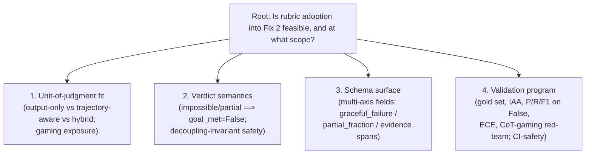
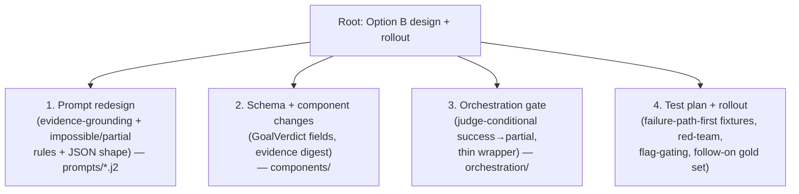

# Pyramid Analysis — Fix 2 GoalJudge Rubric/Gold-Set Adoption Feasibility

> **Purpose of this file.** This is a **planning / feasibility artifact** — it proposes **no code changes**. It evaluates whether and how to refine "Fix 2" of the revised fix plan by adopting the recommendations in the in-repo rubric/gold-set research into the **current** main ReAct agent pipeline.
>
> **Inputs analysed:**
> - Plan & current Fix 2 design: [`docs/plans/fix_session_observations_revised.plan.md`](../plans/fix_session_observations_revised.plan.md) — section "Fix 2 — Scorer coherence (rescoped: deterministic-safe + judge-conditional)".
> - Rubric research to adopt: [`docs/research/rubricgoldsetreseachforgoaljudge.md`](rubricgoldsetreseachforgoaljudge.md).
> - Format template mirrored here: [`docs/PYRAMID_ANALYSIS.md`](../PYRAMID_ANALYSIS.md).
> - Codebase grounding (verified file:line, June 2026): `components/goal_judge.py`, `prompts/goal_judge_system_prompt.j2`, `components/evaluator.py`, `components/schemas.py`, `orchestration/react_loop.py`, `services/base_config.py`, `tests/components/test_evaluator.py`, `tests/components/test_goal_judge.py`.
> - External 2025–2026 best-practice sources (arXiv IDs cited inline and in the References appendix).
>
> **Anchored in:** [`AGENTS.md`](../../AGENTS.md) (four-layer architecture, anti-patterns TAP-3 / TAP-4, testing rules), [`docs/STYLE_GUIDE_LAYERING.md`](../STYLE_GUIDE_LAYERING.md).
>
> This document runs the four-phase pyramid loop (Decompose → Hypothesize → Act → Synthesize) once per pyramid and records the eight self-validation checks explicitly. It contains **two pyramids**:
> - **Pyramid #1** — *Is adopting the rubric research into Fix 2 feasible, and at what scope?* (feasibility / decision)
> - **Pyramid #2** — *What is the concrete refined Fix 2 design + rollout for the recommended option?* (implementation design — design only, no code)

---

## Table of contents

- [Executive recommendation](#executive-recommendation)
- [Pyramid #1 — Feasibility and scope decision](#pyramid-1--feasibility-and-scope-decision)
- [Pyramid #2 — Refined Fix 2 design and rollout](#pyramid-2--refined-fix-2-design-and-rollout)
- [Cross-pyramid interactions](#cross-pyramid-interactions)
- [References (external sources)](#references-external-sources)

---

## Executive recommendation

**Recommended option: Option B — Code + multi-axis verdict schema, with a *hybrid outcome-grounded, trajectory-aware* unit-of-judgment.** Confidence: **0.78**.

Ship the current Fix 2 code path (evidence-grounded judge prompt, impossible/partial ⟹ `goal_met=False` semantics, and the judge-conditional `success → partial` downgrade gate) **and** widen `GoalVerdict` with three pure metadata fields — `graceful_failure`, `partial_fraction`, and per-criterion `evidence` spans (the last already exists). The downgrade **gate still reads only `goal_met`**, so the heuristic-path decoupling invariant ("`goal_met` NEVER changes `outcome`", `components/schemas.py:82-84`) is preserved verbatim. **Defer Option C's full ~250-item double-labeled gold set + IAA gate + standing CoT-gaming red-team** to a tracked follow-on, while shipping a *small offline calibration fixture stratum* (incl. a CoT-gaming red-team fixture) now so the new behaviour is regression-pinned without live LLM calls in CI.

The three trade-offs that drove this (expanded in [§1.7](#17-synthesis)):

1. **Agreement vs. gaming.** Trajectory-aware judging buys ~+20 points of human agreement (Agent-as-a-Judge: 90% vs. 70% output-only — arXiv 2410.10934) but opens up to **+90% false-positive-rate inflation** from chain-of-thought manipulation (Gaming the Judge — arXiv 2601.14691). The documented mitigation is to *ground verdicts in observable evidence and record the evidence span* — which **requires** the schema field Option A lacks. → B over A; hybrid over output-only.
2. **Invariant preservation.** Adopting "impossible/partial ⟹ `goal_met=False`" is safe **only** because the downgrade fires from judge-sourced `goal_met` inside `orchestration/react_loop.py` and only does `success → partial`; the heuristic path stays decoupled. The `graceful_failure` axis keeps "behaved correctly" distinct from "achieved the goal" so a graceful impossibility report is not conflated with a failure — exactly the research's separate-axes prescription.
3. **CI-safety / effort.** Option B is entirely CI-safe and low effort (one `.j2` rewrite + pure Pydantic fields + one orchestration conditional + mocked tests), aligning with AGENTS.md "no live LLM in CI", TAP-3, and TAP-4. Option C's α≥0.8 double-labeled gold set is real human-annotation effort and is not shippable inside this fix.

**Decisions locked into this revision (was: open questions 1–4).** (1) **Gold set (Option C): deferred** to a tracked follow-on; ship Option B now with a CI-safe CoT-gaming red-team fixture as the bridge. (2) **Impossibility: model-only** — the judge infers impossibility from the trajectory/evidence with **no** external is-possible hint; impossible ⟹ `goal_met=False` + `graceful_failure=True`. (3) **Evidence digest: enriched** — include tool *inputs* and intermediate state (not just `tool_output`) to strengthen evidence-grounding against CoT gaming, redacted through the existing guardrail rules (see [§2.4](#24-evidence)). (4) **Gate transition: strictly `success → partial` only** — enforced as an explicit invariant + assertion + test (see [§2.8](#28-false-downgrade-enable-policy-decided)).

**Decision 5 (decided here by external-research-backed trade-off): the false-downgrade enable-policy.** Gate enabling of the judge-conditional `success → partial` flag in production on a **precision-floor-first** profile: **precision ≥ 0.90 on the `goal_met=False` class** (≤10% of downgrades are undeserved) and **≤ 2% false-downgrade rate over clean successful runs**, with a **recall ≥ 0.70 on `goal_met=False`** floor (so the gate is worth enabling), a **red-team verdict-flip ceiling ≤ 5%** (soft 10%), **κ ≥ 0.6 vs. humans** as a measurement prerequisite, **ECE diagnostic-only**, and **default-off until met** (telemetry/shadow first). Confidence: **0.74**. Full options, reasoning, and "threshold to change" in [§2.8](#28-false-downgrade-enable-policy-decided).

---

## Pyramid #1 — Feasibility and scope decision

### 1.1 Problem definition

| Field | Value |
|---|---|
| `original_statement` | "Refine Fix 2 by adopting the rubric/gold-set research into the current ReAct agent pipeline." |
| `restated_question` | "Is it feasible to adopt the rubric research's recommendations (hybrid outcome-grounded trajectory-aware judging; impossible/partial ⟹ `goal_met=False`; multi-axis metadata; ~250-item double-labeled gold set with IAA/precision-recall/red-team) into the current flag-gated L3 `GoalJudge` + judge-conditional gate **without** violating AGENTS.md layering or the `goal_met`-decoupling invariant — and at what scope (A / B / C)?" |
| `problem_type` | `decision` (scope selection under effort/risk/benefit and architectural constraints) |
| `scope_boundaries` | **In scope:** the unit-of-judgment choice (output-only vs trajectory-aware vs hybrid two-stage); the verdict-schema surface (`GoalVerdict` in `components/schemas.py`); the judge prompt (`prompts/goal_judge_system_prompt.j2`); the orchestration downgrade gate (`orchestration/react_loop.py`); calibration/validation machinery (gold set, IAA, P/R/F1, ECE, red-team) and its CI-safety. **Out of scope:** changing the heuristic `evaluate_task_outcome` outcome mapping; any `trust/` change; new graph nodes or new horizontal services; the other fixes (1, 3, 4) in the plan; OTel/`pass^k` harness items the plan already lists as out of scope. |
| `success_criteria` | A scope (A/B/C) is selected with explicit effort/risk/benefit and an evidence-backed confidence; the choice (a) preserves `test_goal_met_does_not_change_outcome` (`tests/components/test_evaluator.py:621-636`), (b) keeps judge logic in `components/` and the gate a thin wrapper in `orchestration/`, (c) keeps CI L2-pure (no live LLM), (d) names the quantitative thresholds that would change the decision, and (e) specifies a concrete **false-downgrade enable-policy** (the error profile that gates flipping the flag on in production). |
| `decisions_locked` | Baked into this revision: **(1)** Option C gold set deferred (ship Option B + CI-safe red-team fixture); **(2)** impossibility judged model-only (no external is-possible hint); **(3)** evidence digest enriched with tool inputs + intermediate state (redacted); **(4)** gate transition strictly `success → partial`; **(5)** false-downgrade enable-policy decided in [§2.8](#28-false-downgrade-enable-policy-decided). |

### 1.2 Issue tree

`root_question`: "Is adopting the rubric research into Fix 2 feasible, and at what scope?"
`ordering_type`: **structural** (decomposes the adoption surface from the judging *input*, to the *semantics* of the verdict, to the *schema* that records it, to the *validation* that earns trust in it — each a separable scope dimension).

| Branch | Label (plural noun) | Sub-question | Hypothesis | Status |
|---|---|---|---|---|
| `branch_1` | Units of judgment | "Does the current judge's input support the research's hybrid outcome-grounded trajectory-aware design, and how exposed is it to CoT gaming?" | The judge already receives the final answer **and** a trajectory digest (`components/goal_judge.py:90-103`, `_summarize_evidence` `:143-156`), so it is *already* trajectory-aware — but the digest uses only `tool_output` text and the prompt does not instruct the judge to distrust narration, leaving it on the gameable side of the literature. **Decided:** adopt evidence-grounding via a prompt edit **and** an enriched digest that adds tool *inputs* + intermediate state (redacted), strengthening the observable-evidence anchor against CoT gaming — a prompt+digest change, not an architectural one. | **confirmed (digest enrichment decided)** |
| `branch_2` | Verdict semantics | "Can we adopt 'impossible/partial ⟹ `goal_met=False`' and a `success → partial` downgrade without breaking the `goal_met`-decoupling invariant?" | Yes — only because the downgrade is judge-sourced and lives in orchestration; the heuristic `evaluate_task_outcome` path stays unchanged. The invariant is about the *heuristic* `goal_met`, not about a trustworthy judge verdict gating in orchestration. | **confirmed** |
| `branch_3` | Schema surfaces | "Does adopting the research require widening `GoalVerdict`, and at what cost?" | The research's multi-axis schema (`graceful_failure`, `partial_fraction`, evidence spans) needs two new pure Pydantic fields plus the already-present per-criterion `evidence`. This is a pure, framework-agnostic, CI-safe addition in `components/schemas.py` with zero gate-behaviour change (the gate reads only `goal_met`). | **confirmed** |
| `branch_4` | Validation programs | "Is the ~250-item double-labeled gold set + IAA + P/R/F1 + red-team feasible under AGENTS.md testing rules, is it required to ship, and what error profile gates enabling the flag?" | **Decided:** defer the 250-item α≥0.8 program to a tracked follow-on; ship a CI-safe offline CoT-gaming red-team fixture as the bridge. The flag is gated on a **precision-floor-first** enable-policy (precision ≥0.90 / recall ≥0.70 on `goal_met=False`, ≤2% false-downgrade rate, red-team flip ≤5%, κ≥0.6, ECE diagnostic-only, default-off until met) — see [§2.8](#28-false-downgrade-enable-policy-decided). | **confirmed (enable-policy decided)** |

### 1.3 Hypotheses, with confirm/kill thresholds

| Branch | Confirm if | Kill if | Priority |
|---|---|---|---|
| `branch_1` | The judge `evaluate(...)` signature already accepts trajectory `evidence` and renders it into the prompt; making it outcome-grounded is a prompt + digest edit inside `components/`. | Outcome-grounding would require importing framework types into `components/` or restructuring the graph. | **High** — the gaming risk is the decisive technical caveat in the research. |
| `branch_2` | `test_goal_met_does_not_change_outcome` still passes after the gate is added, because the gate is judge-sourced and orchestration-local. | Any design needs to mutate `evaluate_task_outcome`'s outcome mapping or delete the invariant test. | **High** — this is the architectural redline. |
| `branch_3` | New verdict fields are pure Pydantic in `components/schemas.py`, default-valued (backward-compatible), and unused by the gate. | New fields force the gate to read more than `goal_met`, or require a `trust/` type. | **Medium** — value is in error analysis, not gating. |
| `branch_4` | A CoT-gaming red-team and goal_met=False P/R/F1 can be computed offline over fixtures with no live LLM in the default suite, and a precision-floor-first enable-policy ([§2.8](#28-false-downgrade-enable-policy-decided)) is specifiable with named thresholds. | Calibration requires live LLM calls in CI, or the 250-item set is a blocking dependency to ship, or no error profile can bound false downgrades. | **Medium** — determines whether C is a prerequisite or a follow-on, and how the flag is gated on. |

### 1.4 Evidence

| ID | Fact | Source | Branch | Confidence |
|---|---|---|---|---|
| `ev_1_1` | The judge's `evaluate(...)` already takes `final_answer` **and** `evidence` (tool trajectory) and renders both into the rubric prompt — it is structurally trajectory-aware today. | `components/goal_judge.py:75-103` | `branch_1` | 1.0 |
| `ev_1_2` | The evidence digest summarises only `tool_output` text (last 8 items, truncated to 400 chars); it does **not** pass tool *inputs* or structured state, and presents the agent's outputs without an explicit "distrust narration" instruction. | `components/goal_judge.py:143-156` | `branch_1` | 1.0 |
| `ev_1_3` | The current rubric prompt says "Think step by step", "Be skeptical of answers that are fluent but evasive", and "Set goal_met = true ONLY if the answer would satisfy a knowledgeable user" — but contains **no** instruction to ground each True on observable tool-output evidence, **no** impossible-task handling, and **no** partial-completion rule. | `prompts/goal_judge_system_prompt.j2:27-47` | `branch_1` | 1.0 |
| `ev_1_4` | Trajectory-aware judging agrees with human consensus at **90%** vs **70%** for output-only on DevAI (55 tasks / 365 requirements), at ~97% lower cost/time than 3 human experts. | Agent-as-a-Judge, Zhuge et al., arXiv 2410.10934 (ICML 2025) | `branch_1` | 0.9 |
| `ev_1_5` | Manipulating only the agent's chain-of-thought (holding actions/observations fixed) inflates state-of-the-art VLM-judge **false-positive rates by up to 90%** across 800 web-task trajectories; content-based (progress-fabricating) manipulation is worst; prompting/judge-time-compute mitigations *reduce but do not eliminate* it; the paper's prescription is "judging mechanisms that verify reasoning claims against observable evidence." | Gaming the Judge, Khalifa et al., arXiv 2601.14691 (Jan 2026) | `branch_1` | 0.9 |
| `ev_1_6` | Style-only, semantics-preserving edits achieve **>65%** attack success against LLM judges (bandit-guided), stealthy against style-control defenses — independent corroboration that presentation, not just content, gates LLM-judge scores. | BITE, arXiv 2605.26156 | `branch_1` | 0.8 |
| `ev_1_7` | The heuristic `goal_met` is keyword overlap (`criteria_met >= 0.5`), explicitly commented as "Deliberately decoupled from `outcome`" and labelled TAP-3 fragile. | `components/evaluator.py:277-291` | `branch_2` | 1.0 |
| `ev_1_8` | The `TaskOutcome` docstring states `goal_met` "NEVER changes `outcome` — semantic goal satisfaction belongs in a future L3 LLM-as-judge." | `components/schemas.py:82-84` | `branch_2` | 1.0 |
| `ev_1_9` | The invariant is pinned by a passing test: a clean, substantive run stays `outcome == "success"` even when `goal_met is False`. | `tests/components/test_evaluator.py:621-636` | `branch_2` | 1.0 |
| `ev_1_10` | The judge overlay in orchestration already does `task_outcome.model_copy(update={goal_met, criteria_met, unmet_conditions})` and explicitly "NEVER changes `outcome`"; the `success → partial` downgrade would slot in right after this `model_copy` (≈ line 1266) and before `effective_outcome = task_outcome.outcome` (line 1293). | `orchestration/react_loop.py:1253-1293` | `branch_2` | 1.0 |
| `ev_1_11` | The judge is flag-gated off by default (`goal_judge_enabled: bool = False`) so the heuristic remains the CI/offline fallback; the gate init is at the graph-build boundary. | `services/base_config.py:37-40`; `orchestration/react_loop.py:446-459` | `branch_2`, `branch_4` | 1.0 |
| `ev_1_12` | `GoalVerdict` currently carries `goal_met`, `criteria_met`, `per_criterion[CriterionVerdict{criterion, met, evidence}]`, `rationale`, and an `unmet_conditions` property — but **no** `graceful_failure` and **no** `partial_fraction`. Per-criterion `evidence` spans already exist. | `components/schemas.py:96-131` | `branch_3` | 1.0 |
| `ev_1_13` | `GoalJudge` imports only `components.schemas` + (TYPE_CHECKING) injected service types; no `langgraph`/`langchain` — so schema additions stay framework-agnostic (AGENTS.md invariant #3). | `components/goal_judge.py:1-43` | `branch_3` | 1.0 |
| `ev_1_14` | The research prescribes a multi-axis label schema collapsed to binary for the gate: `goal_met`, `graceful_failure/correct_impossible_report`, `partial_fraction∈[0,1]`, `failure_mode`, and `evidence spans`; "the gate uses only `goal_met`; the rest supports calibration and error analysis." | `docs/research/rubricgoldsetreseachforgoaljudge.md:70` | `branch_3` | 1.0 |
| `ev_1_15` | Correctly-reported-impossible ⟹ `goal_met=False` + `graceful_failure=True`; hallucinated completion of an impossible task ⟹ `goal_met=False` + `graceful_failure=False`; partial completion thresholds to `goal_met=False` with `partial_fraction` recorded as metadata. | `docs/research/rubricgoldsetreseachforgoaljudge.md:35-36,71` | `branch_2`, `branch_3` | 1.0 |
| `ev_1_16` | Rule-based agent evaluation has recall ≈ **55.9%** and "severely underestimates" agent success vs experts; "no single LLM excels across all benchmarks" (1,302 expert-labeled trajectories). Corroborates that the keyword heuristic alone is an unreliable goal signal and that judge choice matters. | AgentRewardBench, Lù et al., arXiv 2504.08942 | `branch_1`, `branch_4` | 0.85 |
| `ev_1_17` | Where goals map to inspectable state, deterministic end-state matching (`r = r_action × r_output ∈ {0,1}`) is the lowest-noise, ungameable signal — the model for the "deterministic state checks first" stage of a hybrid judge. | τ-bench, Yao et al., arXiv 2406.12045 | `branch_1` | 0.9 |
| `ev_1_18` | Practitioner-consensus calibration: 200–500 hand-labeled gold traces per workload/rubric; 2–3 annotators; Cohen's κ (two raters) / Krippendorff's α (multi); alert if κ < 0.6; refresh quarterly. ~246–250 samples validate 80% agreement at 95% confidence. | FutureAGI "LLM-as-Judge Best Practices 2026"; `rubricgoldsetreseachforgoaljudge.md:6,37-39` | `branch_4` | 0.85 |
| `ev_1_19` | ECE is bin-sensitive and LLM-judge confidence is systematically overconfident — so use ECE diagnostically and prefer κ/α and class-specific precision/recall over reported confidence. | "Overconfidence in LLM-as-a-Judge", arXiv 2508.06225; "How to Correctly Report LLM-as-a-Judge", arXiv 2511.21140 | `branch_4` | 0.8 |
| `ev_1_20` | AGENTS.md testing rules: never run live LLM in CI (use mocks/fixtures for L1/L2); L3 judge tests are `@pytest.mark.slow`; write rejection tests before acceptance tests (TAP-4 gap blindness). So calibration must be an offline asset, and the gate's failure path must be tested first. | `AGENTS.md` (Testing Rules, pytest Markers, TAP-4) | `branch_4` | 1.0 |
| `ev_1_21` | A judge-parse unit test already exists and is mock-driven (no live LLM), proving the judge is mockable for CI-safe gate tests. | `tests/components/test_goal_judge.py:104` | `branch_4` | 0.95 |
| `ev_1_22` | A consequential trigger-class gate should be tuned by **cost-aware threshold policy** — select the operating point that minimises `C(τ) = c_mis·FN + c_fd·FP`, choosing the model/threshold on **F1 of the minority (error) class**, not global accuracy; the threshold shifts toward catching the costlier error type. | "Uncertainty-Aware LLM gating", arXiv 2601.07006; scikit-learn cost-sensitive threshold tuning (`TunedThresholdClassifierCV`) | `branch_4` | 0.85 |
| `ev_1_23` | Production LLM-judge practice: gate on **acceptable fail rates per failure category, not a single binary threshold** (hard thresholds "get disabled"); measure **precision/recall per class** (overall agreement misleads on imbalanced data — a "always-pass" judge scores 90% on a 10%-fail set); validate against human labels before using a judge for gates; tune the judge to the action it drives (auto-block → FPs slow teams, FNs ship regressions). | Galtea "LLM evaluations 2026"; Arize "LLM-as-a-Judge in production" (2025) | `branch_4` | 0.85 |
| `ev_1_24` | Practical operating-point framing for asymmetric costs: "catch X% of the trigger class while holding precision ≥ Y%" beats "maximize F1"; when FP is the bounded harm → set a **precision floor**; when FN is the bounded harm → set a **recall floor**; F-β encodes the cost ratio. Jury-of-3 majority + a `needs_review` abstain reduce judge variance/bias at ~3× cost (a later lever, not needed for a flag-gated overlay). | classification-threshold practitioner guides (Evidently AI; cost-sensitive threshold optimization); Galtea jury-of-judges | `branch_4` | 0.8 |
| `ev_1_25` | Enriching the evidence digest with tool *inputs* + intermediate state (not just `tool_output`) raises grounding fidelity but adds prompt tokens/cost and must be redacted: the repo already ships `pii_rules()` + `api_key_rules()` used by `GuardRailValidator` for exactly this redaction, so the enrichment reuses existing guardrails rather than adding new machinery. | `orchestration/react_loop.py:444` (`GuardRailValidator(pii_rules() + api_key_rules())`); AGENTS.md (Security Model: output guardrail PII/API-key scanning) | `branch_1` | 0.9 |

### 1.5 Gaps

| Type | Item | Branch | Impact on confidence |
|---|---|---|---|
| `missing_data` | The agent has **no inspectable end-state** analogous to τ-bench's database; goals are open-ended text. The "deterministic state checks first" stage of a true hybrid is therefore mostly inapplicable here — the achievable hybrid is "tool-output-grounded trajectory-aware", not "DB-state-matching." The doc must not over-promise τ-bench-grade determinism. | `branch_1` | Medium — bounds how much gaming can be eliminated; evidence-grounding mitigates but cannot fully close the gap (`ev_1_5`). |
| `missing_data` | `_summarize_evidence` currently drops tool *inputs* and any structured intermediate state (`ev_1_2`); evidence-grounding strength depends on whether inputs/state are added to the digest. Open design question, not a blocker. | `branch_1` | Low–Medium. |
| `missing_data` | No gold set or IAA baseline exists in-repo today; the 90/70 trajectory-vs-output gap (`ev_1_4`) rests largely on one benchmark (DevAI) whose output-only baseline the authors call possibly simplistic — treat as indicative, not definitive. | `branch_4` | Medium — argues for measuring on *our own* tasks before trusting the judge in production. |
| `known_weakness` | The downgrade gate changes a production outcome (`success → partial`). A false downgrade (false `goal_met=False`) is a new failure mode the heuristic path never had. Its rate is unknown until calibrated — **now bounded by the decided enable-policy** ([§2.8](#28-false-downgrade-enable-policy-decided)): precision ≥0.90 / ≤2% false-downgrade rate, default-off until met. | `branch_2`, `branch_4` | Medium → Low once the enable-policy gate is met; until then the flag stays off (telemetry/shadow only). |
| `missing_data` | The enriched digest (decided) increases prompt tokens/cost and surfaces tool inputs that may contain secrets/PII; mitigated by routing the digest through the existing `pii_rules()` + `api_key_rules()` redaction (`ev_1_25`), but the exact token-budget cap is an implementation choice (current digest caps at last 8 items / 400 chars each, `components/goal_judge.py:143-156`). | `branch_1` | Low — bounded by reusing existing guardrails and the existing truncation caps. |
| `untested_hypotheses` | None — each branch has ≥3 evidence items. | — | None. |

### 1.6 Cross-branch interactions

| Branches | Interaction |
|---|---|
| `branch_1` ↔ `branch_3` | Evidence-grounding (the gaming mitigation in `branch_1`) is only *auditable* if the verdict records per-criterion evidence spans (`branch_3`). The schema field and the prompt instruction are two halves of one mitigation — adopting one without the other is half-measures. |
| `branch_2` ↔ `branch_3` | The `graceful_failure` axis (`branch_3`) is what keeps the new `success → partial` downgrade (`branch_2`) from conflating a *correct* impossibility report with a *failed* run; without it, "behaved correctly" and "achieved goal" collapse and the gate becomes unfair to graceful failures. |
| `branch_2` ↔ `branch_4` | The gate (`branch_2`) introduces false-downgrade risk; the validation program (`branch_4`) — specifically precision/recall on the `goal_met=False` class — is the only way to bound that risk. The gate's default-off flag (`ev_1_11`) is the safety valve until `branch_4` supplies a number. |
| `branch_1` ↔ `branch_4` | The CoT-gaming vulnerability (`ev_1_5`) is precisely what the red-team stratum in `branch_4` measures; the research's "threshold to change" (flip rate > 5–10%) ties the two together: if the red-team flips too many verdicts, tighten `branch_1`'s grounding or fall back toward output+state-only. |

### 1.7 Synthesis

**Governing thought.** "Adopting the rubric research into Fix 2 is **feasible and architecturally safe at Option B scope** — a hybrid *outcome-grounded, trajectory-aware* judge whose prompt and **enriched** evidence digest (tool inputs + intermediate state, redacted) force grounding in observable evidence, a `GoalVerdict` widened with pure `graceful_failure`/`partial_fraction` metadata, and a judge-conditional **strictly `success → partial`** gate that reads only `goal_met` — because the judge is already trajectory-aware (`ev_1_1`), the decoupling invariant is preserved by keeping the gate judge-sourced and orchestration-local (`ev_1_8`–`ev_1_10`), and the schema/digest additions are pure, CI-safe, and reuse existing redaction (`ev_1_12`–`ev_1_13`, `ev_1_25`); the full ~250-item gold set + IAA gate (Option C) is the *trust-earning* layer and is deferred to a tracked follow-on, with a CI-safe offline red-team fixture as the bridge (`ev_1_20`–`ev_1_21`) and a **precision-floor-first enable-policy** (precision ≥0.90 / recall ≥0.70 on `goal_met=False`, ≤2% false-downgrade rate, red-team flip ≤5%, default-off until met — `ev_1_22`–`ev_1_24`, [§2.8](#28-false-downgrade-enable-policy-decided)) bounding the one new production failure mode." Confidence: **0.78**.

**Key arguments.**

| ID | Statement | Dimension | Reasoning mode | Evidence |
|---|---|---|---|---|
| `arg_1_1` | The technical lift to make the judge *outcome-grounded trajectory-aware* is small and stays inside `components/` + a `.j2` edit, because the judge already ingests the trajectory; the binding caveat is gaming, whose documented fix is exactly evidence-grounding + recorded spans. | **Feasibility / risk** | inductive (atop the deductive premise: gameable input → ground in observable evidence → fewer false positives) | `ev_1_1`, `ev_1_2`, `ev_1_3`, `ev_1_4`, `ev_1_5`, `ev_1_6` |
| `arg_1_2` | The decoupling invariant survives adoption: because the downgrade is judge-sourced and orchestration-local, `evaluate_task_outcome` is untouched and `test_goal_met_does_not_change_outcome` still passes — the invariant was always about the *fragile heuristic*, not a trustworthy verdict. | **Correctness / architecture** | deductive | `ev_1_7`, `ev_1_8`, `ev_1_9`, `ev_1_10`, `ev_1_11` |
| `arg_1_3` | Multi-axis metadata (`graceful_failure`, `partial_fraction`, evidence spans) is the cheapest high-value increment: pure Pydantic, backward-compatible, framework-agnostic, gate-neutral — and it is the *only* way to implement the research's "separate axes" and "audit the grounding" prescriptions. | **Cost / value** | inductive | `ev_1_12`, `ev_1_13`, `ev_1_14`, `ev_1_15` |
| `arg_1_4` | The full gold-set / IAA / P-R-F1 / ECE / red-team program is feasible only as an *offline* asset under AGENTS.md (no live LLM in CI); it is the layer that earns trust in the gate but is high-effort human annotation, so it is deferred to a follow-on with a CI-safe red-team fixture shipped now — and the flag is gated on a **precision-floor-first** enable-policy that tunes the consequential `goal_met=False` trigger class by class-specific precision/recall and a red-team FP-inflation ceiling rather than by global accuracy. | **Effort / governance** | inductive | `ev_1_16`, `ev_1_17`, `ev_1_18`, `ev_1_19`, `ev_1_20`, `ev_1_21`, `ev_1_22`, `ev_1_23`, `ev_1_24` |

**Option comparison (the core decision).**

| Option | What it adds beyond status quo | Effort | Risk | Benefit | AGENTS.md alignment | Decoupling-invariant effect |
|---|---|---|---|---|---|---|
| **A — Code-level only** | Evidence-grounded prompt rewrite; impossible/partial ⟹ `goal_met=False` semantics in the rubric; judge-conditional `success → partial` gate. (= current Fix 2 scope) | **Low** | Medium — gaming mitigation is *instructed* but **not auditable** (no evidence-span field to record), and graceful failures are indistinguishable from real failures. | Catches corrupt-success on the trustworthy path; minimal change. | TAP-3 ✓ (no keyword gating), TAP-4 partial (gate failure path testable), layering ✓. | Preserved (gate judge-sourced, heuristic path untouched). |
| **B — A + multi-axis verdict schema** *(recommended)* | A, plus `graceful_failure` + `partial_fraction` fields on `GoalVerdict` and recorded per-criterion `evidence` spans; gate still reads only `goal_met`. | **Low–Medium** | Lower than A — grounding becomes auditable; graceful failures kept distinct. Residual: false-downgrade rate still uncalibrated (mitigated by flag-default-off). | A's benefit + rich error analysis + the data substrate every future calibration needs. | TAP-3 ✓, TAP-4 ✓ (fields enable failure-mode telemetry), layering ✓ (pure `components/` additions). | Preserved. |
| **C — B + full gold-set program** | B, plus ~250-item stratified double-labeled gold set, IAA gate (α≥0.8 / κ≥0.6–0.8), precision/recall/F1 on `goal_met=False`, ECE diagnostic, standing CoT-gaming red-team. | **High** (human annotation, ongoing curation) | Lowest *once built*; but high schedule/effort risk and a real ownership question. | Earns deployment trust; bounds false-downgrade rate; detects judge drift. | Strong — but the gold set is an offline asset, must not enter CI as live LLM (`ev_1_20`). | Preserved. |

**Unit-of-judgment sub-decision.**

| Unit | Fit to this pipeline | Gaming exposure | Verdict |
|---|---|---|---|
| Output-only | Cheap, reproducible, least gameable via CoT, but blind to invalid-process / fabricated success. | Low (no CoT to game) but high *miss* rate. | Rejected as primary — misses the corrupt-success case Fix 2 targets. |
| Trajectory-aware (status quo) | Already implemented (`ev_1_1`); best human agreement (`ev_1_4`). | **High** without grounding (`ev_1_5`). | Keep, but harden. |
| **Hybrid outcome-grounded trajectory-aware** *(recommended)* | Judge sees trajectory + answer but must ground each `goal_met=True` in observable tool-output evidence and distrust narration; deterministic state-checks-first stage is largely N/A here (no DB end-state, `ev_1_17` gap) but tool-output grounding is the achievable analogue. | Mitigated (not eliminated) — matches the research's "verify claims against observable evidence" north star. | **Selected.** |

**So-what chain (worked example, `arg_1_1`).**

- *Fact:* `GoalJudge.evaluate(...)` already passes `final_answer` + a tool-trajectory digest into the rubric (`components/goal_judge.py:90-103`), but the digest is narration-shaped (`tool_output` text only) and the prompt never tells the judge to ground its verdict in that evidence (`prompts/goal_judge_system_prompt.j2:27-47`).
- *Impact:* Per Gaming the Judge (arXiv 2601.14691), an agent that *narrates* success can inflate a trajectory-aware judge's false-positive rate by up to 90% — so the very signal Fix 2 wants to trust (`goal_met` from the judge) is the signal most exposed to fabrication.
- *Implication:* The fix is not architectural; it is a prompt instruction ("base `goal_met=True` only on observable tool-output evidence; treat self-narrated progress as unproven") plus a recorded evidence span per criterion — both of which live inside `components/` and `prompts/`.
- *Connection (governing thought):* This is why the recommended scope is **B, not A** — A *instructs* grounding but cannot *record* the evidence span, so the mitigation is unauditable; B's schema field closes that loop.

**So-what chain (worked example, `arg_1_2`).**

- *Fact:* The orchestration overlay already rewrites `goal_met`/`criteria_met`/`unmet_conditions` via `model_copy` and is documented to never touch `outcome` (`orchestration/react_loop.py:1253-1293`); the heuristic invariant test asserts `outcome == "success"` with `goal_met is False` (`tests/components/test_evaluator.py:621-636`).
- *Impact:* Inserting `if goal_judge is not None and verdict.goal_met is False and task_outcome.outcome == "success": downgrade to partial` right after the `model_copy` changes outcomes **only** on the judge path and **only** in the `success → partial` direction.
- *Implication:* `evaluate_task_outcome` is never edited, so `test_goal_met_does_not_change_outcome` keeps passing — the invariant was always scoped to the *keyword heuristic*, which AGENTS.md flags as TAP-3 determinism theater (`ev_1_7`).
- *Connection (governing thought):* Adoption is "architecturally safe" precisely because the trustworthy signal (judge) and the fragile signal (keyword) are gated at different layers; the invariant is preserved by construction, not by luck.

### 1.8 Validation log

| Check | Result | Details |
|---|---|---|
| `completeness` | **pass** | The four branches cover the full adoption surface: the judging *input* (`branch_1`), the verdict *semantics* (`branch_2`), the *schema* that records it (`branch_3`), and the *validation* that earns trust (`branch_4`). A fifth concern — the gate's *placement* — is not a separate scope dimension; it is the mechanism of `branch_2` (`ev_1_10`). |
| `non_overlap` | **pass** | Each evidence item sits in one branch; spot-check: `ev_1_5` (CoT-gaming FPR) is in `branch_1` (it scopes the input choice), not `branch_4` — the *red-team that measures it* is `branch_4`, a different fact (`ev_1_20`). `ev_1_15` is cross-listed deliberately because impossible-task semantics span both verdict meaning (`branch_2`) and the field that stores it (`branch_3`); it is noted, not double-counted in a single argument. |
| `item_placement` | **pass** | Three random items: (a) `ev_1_9` (invariant test) → `branch_2` only; (b) `ev_1_12` (verdict fields) → `branch_3` only; (c) `ev_1_18` (gold-set sizing) → `branch_4` only. None fits two. |
| `so_what` | **pass** | Two chains worked above (`arg_1_1`, `arg_1_2`); `arg_1_3` and `arg_1_4` chains are constructible by the same fact → impact → implication → governing-thought template. |
| `vertical_logic` | **pass** | Asking "Is adoption feasible, and at what scope?" of the governing thought yields exactly the four arguments: the input lift is small but gameable (`arg_1_1`), the invariant survives (`arg_1_2`), the schema increment is cheap and necessary (`arg_1_3`), and the trust layer is an offline follow-on (`arg_1_4`). No fifth answer; none addresses a different question. |
| `remove_one` | **pass with note** | Remove `arg_1_1` → the recommendation loses its risk justification (why hybrid, why B over A). Remove `arg_1_2` → the whole adoption is unsafe (invariant unproven). Remove `arg_1_3` → the recommendation collapses to A and the gaming mitigation becomes unauditable. Remove `arg_1_4` → safest removal: B still ships; only the trust-earning roadmap is lost. **Verdict:** `arg_1_2` is load-bearing for *safety*; `arg_1_1`+`arg_1_3` jointly select *scope B*; `arg_1_4` is the weakest and is correctly deferred (Option C). |
| `never_one` | **pass** | Root has four branches; each branch has 3–8 evidence items; the option table has three options + a sub-decision with three units. No single-child node. |
| `mathematical` | **pass** | Quantitative claims are sourced and internally consistent: 90% vs 70% agreement (`ev_1_4`), ≤90% FPR inflation (`ev_1_5`), ~55.9% rule-based recall (`ev_1_16`), τ-bench reward ∈ {0,1} (`ev_1_17`), ~250 items for 80%@95% CI and κ<0.6 alert (`ev_1_18`). The decided enable-policy numbers (precision ≥0.90, recall ≥0.70 on `goal_met=False`, ≤2% false-downgrade rate, red-team flip ≤5% / soft 10%) are mutually consistent — precision ≥0.90 ⟺ ≤10% of downgrades undeserved, and the ≤2% population-level false-downgrade rate is the stricter constraint given successes dominate the base rate (`ev_1_22`–`ev_1_24`, [§2.8](#28-false-downgrade-enable-policy-decided)). The red-team flip threshold is carried forward from the research unchanged. |

---

## Pyramid #2 — Refined Fix 2 design and rollout

> Scope of this pyramid: the **design only** for the recommended **Option B** (hybrid outcome-grounded trajectory-aware judge + multi-axis verdict + judge-conditional gate). No code is written here; this is the file-touch map, behavioural contract, test plan, and flag-gated rollout.

### 2.1 Problem definition

| Field | Value |
|---|---|
| `original_statement` | "What is the concrete refined Fix 2 design + rollout for the recommended option?" |
| `restated_question` | "For Option B, what are the exact touch-points in `prompts/`, `components/`, and `orchestration/`, the behavioural contract of the new gate, the CI-safe test plan (failure-path-first), and the flag-gated rollout — such that the design respects AGENTS.md layering and preserves the `goal_met`-decoupling invariant?" |
| `problem_type` | `design` |
| `scope_boundaries` | **In scope:** the `.j2` rubric rewrite (evidence-grounding + **model-only** impossible/partial rules + JSON shape), the `GoalVerdict`/`GoalJudge` changes (new pure fields + **decided** digest enrichment with tool inputs/state, redacted), the orchestration downgrade gate (thin wrapper after the overlay, **strictly `success → partial`**), the offline test/calibration plan, the **false-downgrade enable-policy** ([§2.8](#28-false-downgrade-enable-policy-decided)), and the rollout flag. **Out of scope:** editing `evaluate_task_outcome` outcome mapping, the heuristic `goal_met`, any `trust/` type, any new graph node or service, an external is-possible hint (impossibility is judged model-only), and the live 250-item gold-set build (tracked follow-on). |
| `success_criteria` | A reviewer can implement Option B from this design without re-deriving file locations; the new gate has a one-line behavioural contract and a **strict-transition assertion** (only `success → partial`); the test plan writes the rejection (false-downgrade / graceful-failure / CoT-gaming / illegal-transition) cases before acceptance cases (TAP-4); the rollout keeps `goal_judge_enabled=False` as the default with a documented enable path; and the production-enable gate is the decided **precision-floor-first enable-policy**. |

### 2.2 Issue tree

`root_question`: "What is the concrete Option B design + rollout?"
`ordering_type`: **structural / dataflow** (follows the verdict from where it is *prompted*, to where it is *typed*, to where it *gates*, to how it is *tested and shipped*).

| Branch | Label | Sub-question | Hypothesis | Status |
|---|---|---|---|---|
| `branch_1` | Prompt redesigns | "How does the `.j2` rubric change to be outcome-grounded and to handle (model-only) impossible/partial?" | Add three rubric rules: ground each `met=True` in observable evidence (tool inputs + outputs + state) and distrust narration; **model-only** correctly-reported-impossible ⟹ `goal_met=false` + `graceful_failure=true` (the judge infers impossibility from the trajectory — no external is-possible hint — and must show evidence of adequate exploration before crediting it); partial ⟹ `goal_met=false` + numeric `partial_fraction`. Extend the JSON shape with `graceful_failure` and `partial_fraction`. Pure prompt edit; rendered via `PromptService` (H1). | **confirmed feasible (impossibility model-only — decided)** |
| `branch_2` | Schema and component changes | "What changes in `components/`?" | Add `graceful_failure: bool = False` and `partial_fraction: float = 0.0` to `GoalVerdict` (pure, default-valued, backward-compatible); **decided:** enrich `_summarize_evidence` to include tool *inputs* + intermediate state, routed through the existing `pii_rules()` + `api_key_rules()` redaction and kept within the existing truncation caps; extend `_parse_verdict` to clamp `partial_fraction` to `[0,1]`. No new imports, no framework types. | **confirmed feasible (digest enrichment decided)** |
| `branch_3` | Orchestration gates | "Where and how does the strictly-`success→partial` downgrade gate live?" | A ≤5-line conditional immediately after the existing `model_copy` overlay (≈ `orchestration/react_loop.py:1266`): if judge enabled, `verdict.goal_met is False`, and `task_outcome.outcome == "success"`, set outcome to `"partial"`; **assert the transition is strictly `success → partial`** (no other source/target outcome); emit the reason into the existing black-box `TASK_COMPLETED` details. Thin wrapper, no domain logic (AP-5). | **confirmed feasible (strict transition decided)** |
| `branch_4` | Test plans and rollouts | "How is this tested CI-safe, gated, and rolled out?" | Failure-path-first mocked tests at the react_loop level (judge-false downgrades; graceful-failure not double-penalised; illegal-transition assertion; heuristic path unchanged); an offline CoT-gaming red-team fixture stratum; keep `goal_judge_enabled=False` default; gate production-enable on the **precision-floor-first enable-policy** ([§2.8](#28-false-downgrade-enable-policy-decided)); document the calibration follow-on. | **confirmed feasible (enable-policy decided)** |

### 2.3 Hypotheses, with confirm/kill thresholds

| Branch | Confirm if | Kill if | Priority |
|---|---|---|---|
| `branch_1` | The new rubric renders through `PromptService.render_prompt("goal_judge_system_prompt", ...)` with the added context and still returns a single JSON object; impossibility is inferred model-only from the (enriched) evidence. | The model-only impossible/partial rules need data the prompt does not receive (i.e., would require an external is-possible flag) — contradicting decision (2). | **High** |
| `branch_2` | New `GoalVerdict` fields default-construct so existing `GoalVerdict.model_validate(data)` and `test_parses_goal_met_true` keep passing; the enriched digest passes through existing redaction without new dependencies. | Adding fields breaks existing verdict parsing, requires a non-`components` import, or the digest enrichment leaks secrets/PII past existing guardrails. | **High** |
| `branch_3` | After the gate, `test_goal_met_does_not_change_outcome` still passes (heuristic path) **and** a mocked judge-false case downgrades `success → partial`, **and** the strict-transition assertion rejects any other source/target outcome. | The gate must read any field other than `goal_met`, must touch `evaluate_task_outcome`, or can produce a transition other than `success → partial`. | **High** |
| `branch_4` | The red-team and `goal_met=False` precision/recall run over fixtures with no live LLM in the default suite (judge tests `@pytest.mark.slow`); the enable-policy thresholds are computable from that offline set. | Calibration needs live LLM in CI, the gold set blocks the ship, or no error profile can bound false downgrades. | **Medium** |

### 2.4 Evidence

| ID | Fact | Source | Branch | Confidence |
|---|---|---|---|---|
| `ev_2_1` | The rubric is rendered via `PromptService` with `task_input`, `final_answer`, `success_conditions`, `evidence` — adding rules + JSON keys is a template edit, no new render context required for grounding/partial (impossibility is inferred by the judge, per the rubric's existing "infer the conditions" branch). | `components/goal_judge.py:90-97`; `prompts/goal_judge_system_prompt.j2:14-47` | `branch_1` | 1.0 |
| `ev_2_2` | The research's exact rule set to encode: ground `met=True` in observable evidence, distrust narration; correct-impossible ⟹ `goal_met=false`+`graceful_failure=true`; hallucinated-impossible ⟹ both false; partial ⟹ `goal_met=false` + `partial_fraction` metadata; require evidence of adequate exploration before crediting a correct-impossible report (WebArena-Verified caution). | `rubricgoldsetreseachforgoaljudge.md:34-36,55,71` | `branch_1` | 1.0 |
| `ev_2_3` | The JSON output block currently emits `goal_met`, `criteria_met`, `per_criterion[]`, `rationale`; extending it with `graceful_failure` and `partial_fraction` mirrors the existing shape. | `prompts/goal_judge_system_prompt.j2:38-47` | `branch_1` | 1.0 |
| `ev_2_4` | `GoalVerdict` is a plain `BaseModel` with defaulted fields and a derived `unmet_conditions` property; new defaulted fields are backward-compatible with `model_validate`. | `components/schemas.py:109-131` | `branch_2` | 1.0 |
| `ev_2_5` | `_parse_verdict` already coerces/clamps `criteria_met` into `[0,1]` (and divides 0–100 percentages by 100); the same clamp pattern extends to `partial_fraction`. | `components/goal_judge.py:105-122` | `branch_2` | 1.0 |
| `ev_2_6` | `_summarize_evidence` is the single place that shapes the trajectory digest; enriching it to include tool *inputs* + intermediate state (not just outputs) is a local change that strengthens grounding (decided). | `components/goal_judge.py:143-156` | `branch_2` | 0.95 |
| `ev_2_6b` | Redaction for the enriched digest reuses existing machinery: `pii_rules()` + `api_key_rules()` already feed `GuardRailValidator` in the same graph build, so tool inputs/state can be scrubbed for secrets/PII before they reach the judge prompt without adding a new service (H4 / AGENTS.md Security Model). | `orchestration/react_loop.py:444`; `AGENTS.md` (Security Model: output guardrail PII/API-key scanning) | `branch_2` | 0.9 |
| `ev_2_6c` | The enriched digest adds prompt tokens/cost; the existing caps (last 8 items, 400 chars each) bound the growth, and the judge runs on the fast tier (H2), so the marginal cost is small and tunable. | `components/goal_judge.py:143-156`; `services/base_config.py:43-52` (`default_fast_profile`) | `branch_2` | 0.85 |
| `ev_2_7` | The gate's insertion point is unambiguous: immediately after `task_outcome = task_outcome.model_copy(update={...})` (`:1266-1272`) and before `effective_outcome = task_outcome.outcome` (`:1293`), inside the existing `if goal_judge is not None` block. | `orchestration/react_loop.py:1258-1293` | `branch_3` | 1.0 |
| `ev_2_8` | The black-box `TASK_COMPLETED` event already serialises `outcome`, `goal_met`, `criteria_met`, `unmet_conditions`; adding a downgrade-reason key there gives the gate an audit trail with no new logging machinery (H4). | `orchestration/react_loop.py:1295-1315` | `branch_3` | 1.0 |
| `ev_2_9` | Orchestration nodes must stay thin wrappers; a ≤5-line conditional that delegates the *decision* (already computed: `verdict.goal_met`) and only maps `success → partial` honours AP-5. | `AGENTS.md` (AP-5, invariant #6); `orchestration/react_loop.py:1253-1256` | `branch_3` | 1.0 |
| `ev_2_9b` | The strict-transition invariant is expressible as a guard before the `model_copy`: the downgrade fires **iff** `task_outcome.outcome == "success"` and `verdict.goal_met is False`, and the post-condition is `outcome in {"success" (unchanged), "partial" (downgraded)}` — never `failed`, never an upgrade. This is assertable in the gate and pinned by an illegal-transition test (decision 4). | `orchestration/react_loop.py:1258-1293`; decision (4) | `branch_3` | 0.95 |
| `ev_2_10` | The judge is mockable (existing mock-driven parse test) and flag-gated off by default, so react_loop-level gate tests can inject a fake judge returning `goal_met=False` with no live LLM. | `tests/components/test_goal_judge.py:104`; `services/base_config.py:40` | `branch_4` | 0.95 |
| `ev_2_11` | TAP-4 mandates the rejection test before the acceptance test; the gate's rejection cases are: false-downgrade guard (judge says met → no downgrade), graceful-failure handling, and the CoT-gaming red-team flip case. | `AGENTS.md` (TAP-4); `rubricgoldsetreseachforgoaljudge.md:73,82` | `branch_4` | 1.0 |
| `ev_2_12` | Calibration reporting standard to adopt offline: raw agreement + Cohen's κ (or Krippendorff's α), precision/recall/F1 on the `goal_met=False` class, ECE diagnostically; alert if κ < 0.6; ~250 stratified double-labeled items; do not iterate the prompt on the held-out test split. | `rubricgoldsetreseachforgoaljudge.md:38-39,73,83`; FutureAGI 2026; arXiv 2511.21140 | `branch_4` | 0.85 |
| `ev_2_13` | The existing `no_progress` downgrade already does `success → partial` for loop-exhaustion (`ev` from evaluator docstring); the judge-conditional downgrade is a *second, independent* `success → partial` source, so the two must be order-independent and both reflected in `effective_outcome`. The strict-transition invariant holds for both sources (both only do `success → partial`), so they compose idempotently. | `components/evaluator.py:244-247`; `orchestration/react_loop.py:1234-1243` | `branch_3` | 0.9 |
| `ev_2_14` | Enable-policy methodology: a consequential trigger-class gate is tuned by class-specific precision/recall and a **cost-aware operating point** (`C(τ)=c_mis·FN + c_fd·FP`, select on minority-class F1), gated by **acceptable fail rates per category** (not a single binary threshold), with the judge validated against human labels before any gate, and tuned to the action it drives. | arXiv 2601.07006; Galtea 2026; Arize 2025 | `branch_4` | 0.85 |
| `ev_2_15` | For asymmetric costs, the durable framing is "catch X% of the trigger class while holding precision ≥ Y%"; when FP (false downgrade) is the bounded production harm → set a **precision floor**; ECE is bin-sensitive and judge confidence overconfident → use diagnostically only; jury-of-3 + `needs_review` abstain is a later variance-reduction lever at ~3× cost. | classification-threshold practitioner guides; arXiv 2508.06225 / 2511.21140; Galtea | `branch_4` | 0.8 |

### 2.5 Gaps

| Type | Item | Branch | Impact on confidence |
|---|---|---|---|
| `resolved` (was `missing_data`) | **Decided (2): impossibility is judged model-only** — no external is-possible signal. The residual risk (WebArena-Verified over-crediting premature "N/A") is mitigated *inside the rubric*: require evidence of adequate exploration in the (enriched) trajectory before crediting a correct-impossible report. The remaining uncertainty is the model's own impossibility-inference accuracy, which the red-team/gold set measures. | `branch_1` | Medium → residual is a calibration item, not a design gap. |
| `missing_data` | `partial_fraction` has no consumer in the gate (gate reads only `goal_met`); it is telemetry-only until the follow-on calibration uses it. The design must label it as metadata so reviewers don't wire it into gating. | `branch_2`, `branch_3` | Low. |
| `resolved` (was open Q4) | **Decided (4): the gate is strictly `success → partial`** — enforced by a pre-`model_copy` guard + a post-condition assertion + an illegal-transition test (`ev_2_9b`, `branch_4` test plan). No `failed`-source, no upgrade, no other target. | `branch_3` | Low — now an invariant, not a gap. |
| `known_weakness` | Two independent `success → partial` sources (no-progress and judge-false) could both fire; the design must confirm the downgrade is idempotent and that the black-box reason records *which* source fired (`ev_2_8`, `ev_2_13`). | `branch_3` | Low–Medium. |
| `known_weakness` | The offline red-team fixtures are authored by the same team that writes the rubric — risk of the red-team testing only anticipated attacks. The follow-on gold set with independent annotators (`ev_2_12`) is the real mitigation. | `branch_4` | Medium — bounds how much the shipped red-team can be trusted. |
| `untested_hypotheses` | None — each branch has ≥3 evidence items. | — | None. |

### 2.6 Cross-branch interactions

| Branches | Interaction |
|---|---|
| `branch_1` ↔ `branch_2` | The new JSON keys in the rubric (`branch_1`) must exactly match the new `GoalVerdict` fields (`branch_2`); a mismatch silently drops to defaults (Pydantic) and the grounding/partial signal is lost without erroring. The `.j2` shape and the schema fields are one contract authored in two files. |
| `branch_2` ↔ `branch_3` | The gate (`branch_3`) reads `verdict.goal_met` only; the new `branch_2` fields are deliberately *not* read by the gate — so a schema change cannot accidentally change gating behaviour. This is the design embodiment of the decoupling invariant. |
| `branch_3` ↔ `branch_4` | The gate's failure path (false-downgrade) is the first test written (TAP-4); the red-team fixture stratum (`branch_4`) feeds the *same* gate to measure flip rate. The gate and its test are co-designed. |
| `branch_1` ↔ `branch_4` | The rubric's "distrust narration / require observable evidence over the enriched digest" rule (`branch_1`) is exactly what the CoT-gaming red-team (`branch_4`) stress-tests; the research's flip-rate > 5–10% "threshold to change" is the acceptance bar tying prompt design to validation. |
| `branch_3` ↔ `branch_4` (strict transition) | The strict-transition invariant (`branch_3`, `ev_2_9b`) is enforced twice: as a runtime assertion in the gate **and** as an illegal-transition rejection test written before the acceptance test (TAP-4). Design-time invariant and test-time guard are the same claim. |
| `branch_2` ↔ `branch_1` (digest redaction) | The enriched digest (`branch_2`) is what makes the rubric's evidence-grounding (`branch_1`) stronger — but the same enrichment surfaces tool inputs that may carry secrets/PII, so the redaction in `branch_2` (`ev_2_6b`) is a precondition for the grounding rule in `branch_1` being safe to ship. |
| `branch_4` (enable-policy) ↔ `branch_3` (gate) | The gate (`branch_3`) is *dark* until the enable-policy (`branch_4`, [§2.8](#28-false-downgrade-enable-policy-decided)) is met; the policy's precision floor bounds exactly the false-downgrade harm the gate introduces. The flag default (`goal_judge_enabled=False`) is the mechanism that keeps the gate off until the policy clears. |

### 2.7 Synthesis

**Governing thought.** "Option B ships as a four-file, behaviour-contained change — an evidence-grounded `.j2` rubric with **model-only** impossible/partial rules and two new JSON keys (`prompts/goal_judge_system_prompt.j2`), two pure defaulted `GoalVerdict` fields plus a clamp and a **decided** evidence-digest enrichment (tool inputs + state, redacted via existing `pii_rules()`/`api_key_rules()`) (`components/schemas.py`, `components/goal_judge.py`), and a ≤5-line judge-conditional **strictly `success → partial`** gate (runtime-asserted) inserted after the existing overlay (`orchestration/react_loop.py:~1266`) — validated failure-path-first with mocked judges, an illegal-transition test, and an offline CoT-gaming red-team, and rolled out behind the existing `goal_judge_enabled=False` flag whose production-enable is gated by the **precision-floor-first enable-policy** of [§2.8](#28-false-downgrade-enable-policy-decided), with the ~250-item double-labeled gold set as a tracked follow-on." Confidence: **0.80**.

**Key arguments.**

| ID | Statement | Dimension | Reasoning mode | Evidence |
|---|---|---|---|---|
| `arg_2_1` | The rubric rewrite is a self-contained `.j2` edit: three added rules + two added JSON keys, rendered through the existing `PromptService` call with no new context. | **Implementability** | deductive | `ev_2_1`, `ev_2_2`, `ev_2_3` |
| `arg_2_2` | The component changes are pure and backward-compatible: two defaulted `GoalVerdict` fields, a `partial_fraction` clamp mirroring the existing `criteria_met` clamp, and an optional evidence-digest enrichment — all inside `components/`, no framework imports. | **Layering safety** | inductive | `ev_2_4`, `ev_2_5`, `ev_2_6` |
| `arg_2_3` | The gate is a thin orchestration wrapper at one unambiguous insertion point reading only `goal_met`, doing **strictly `success → partial`** (runtime-asserted), with an audit reason added to the existing black-box event — honouring AP-5 and the decoupling invariant, and composing idempotently with the no-progress downgrade. | **Architecture / observability** | deductive | `ev_2_7`, `ev_2_8`, `ev_2_9`, `ev_2_9b`, `ev_2_13` |
| `arg_2_4` | The change is testable CI-safe and shippable behind a default-off flag whose production-enable is gated by a precision-floor-first enable-policy: mocked react_loop gate tests (rejection-first, incl. illegal-transition), an offline red-team fixture stratum, and a deferred-but-specified calibration program with concrete class-specific thresholds, a κ<0.6 alert, and ECE used diagnostically only. | **Verifiability / rollout** | inductive | `ev_2_10`, `ev_2_11`, `ev_2_12`, `ev_2_14`, `ev_2_15` |

**So-what chain (worked example, `arg_2_3`).**

- *Fact:* The overlay block at `orchestration/react_loop.py:1258-1293` already computes `verdict.goal_met` and rewrites the goal signals via `model_copy`, then reads `effective_outcome = task_outcome.outcome`.
- *Impact:* A ≤5-line conditional between those two points (`if goal_judge is not None and verdict.goal_met is False and task_outcome.outcome == "success": task_outcome = task_outcome.model_copy(update={"outcome": "partial"})`) is the entire gate; the existing `TASK_COMPLETED` event then records the downgraded outcome and a reason key.
- *Implication:* No new node, no service, no domain logic in orchestration (AP-5 honoured), no edit to `evaluate_task_outcome`, and the heuristic invariant test is untouched.
- *Connection (governing thought):* "Behaviour-contained" is literal — the production-outcome change is five lines at one site, every other edit is prompt/schema, and the whole thing is dark until the flag flips.

**So-what chain (worked example, `arg_2_4`).**

- *Fact:* The judge is mockable (`tests/components/test_goal_judge.py:104`) and off by default (`services/base_config.py:40`); AGENTS.md forbids live LLM in CI and mandates rejection tests first (TAP-4).
- *Impact:* The test suite injects a fake judge returning `goal_met=False` to assert `success → partial`, a fake returning `goal_met=True` to assert *no* downgrade (the false-downgrade guard), and a graceful-failure case to assert the impossibility report is not double-penalised — all with zero API calls.
- *Implication:* The CoT-gaming red-team becomes a fixture stratum (fabricated-progress trajectories paired with known-false goals); flip rate is computed offline and gated against the research's 5–10% threshold.
- *Connection (governing thought):* The ~250-item double-labeled gold set is the only piece that cannot be CI-fixtured cheaply, which is exactly why it is the deferred follow-on and the rest ships now.

**Decided questions (formerly open).**

1. **Gold-set ownership (Option C trigger).** **Decided: deferred** to a tracked follow-on; ship Option B now with a CI-safe CoT-gaming red-team fixture as the bridge. *(Annotator ownership for the follow-on remains a scheduling item for the team, not a design dependency.)*
2. **False-downgrade tolerance.** **Decided here ([§2.8](#28-false-downgrade-enable-policy-decided)):** precision-floor-first — precision ≥0.90 / ≤2% false-downgrade rate on `goal_met=False`, recall ≥0.70 floor, red-team flip ≤5%, default-off until met.
3. **Impossibility signal.** **Decided: model-only** — the judge infers impossibility from the (enriched) trajectory; no external is-possible hint; impossible ⟹ `goal_met=False` + `graceful_failure=True` with a require-adequate-exploration guard.
4. **Evidence digest scope.** **Decided: enriched** — include tool *inputs* + intermediate state, redacted via existing `pii_rules()`/`api_key_rules()` within current truncation caps.
5. **Gate direction.** **Decided: strictly `success → partial`** — runtime-asserted, illegal-transition test; never `partial → failed`, never any upgrade.

### 2.8 False-downgrade enable-policy (decided)

> **What this decides.** The error profile that must hold on the offline calibration set before the operator flips `goal_judge_enabled=True` in a production profile — i.e., before the judge-conditional `success → partial` gate is allowed to change a real outcome. Until the policy is met, the gate runs in **shadow/telemetry-only** mode (verdict recorded, outcome **not** changed) and the flag stays off. This mirrors the research doc's "threshold to change" style.

**Framing the cost asymmetry.** Let the trigger (positive) class be `goal_met=False` (the class that fires the downgrade). For this gate:

- **False positive (FP) = a *false downgrade*:** a genuinely successful run is marked `goal_met=False` and demoted `success → partial`. Harm: misleading telemetry, possible unnecessary retry/escalation, eroded trust in the metric. It is **conservative and reversible** (a success is under-credited, not corrupted), and it is the harm the user explicitly wants bounded.
- **False negative (FN) = a *missed corrupt-success*:** a thrashing/fabricated run keeps `goal_met=True` and stays `success`. Harm: the corrupt-success that contaminates eval/optimizer signal — and, per Gaming the Judge (R2), FNs can be adversarially induced via CoT manipulation.
- **Precision on `goal_met=False`** governs the false-downgrade rate (high precision ⇒ few false downgrades). **Recall on `goal_met=False`** governs how much corrupt-success is caught.

**Competing enable-policy options.**

| Policy | Rule | Pros | Cons | Verdict |
|---|---|---|---|---|
| **P1 — F1-max single operating point** | Pick the threshold maximising F1 on `goal_met=False`. | Simple; balances P/R. | F1 weights FP and FN **equally**, but here FP (false downgrade) is the harm the user wants bounded; a single hard threshold also "gets disabled" in practice (`ev_1_23`). | Rejected — no cost asymmetry. |
| **P2 — Precision-floor-first** *(recommended)* | Require **precision ≥ 0.90** and **≤ 2% false-downgrade rate** on `goal_met=False`, with a **recall ≥ 0.70** floor, **red-team verdict-flip ≤ 5%** (soft 10%), **κ ≥ 0.6** prerequisite, **ECE diagnostic-only**, **default-off until met**, telemetry/shadow first. | Encodes the asymmetry (bounds the new harm) while still requiring the gate to earn its keep; matches "catch X% while holding precision ≥ Y%" (`ev_1_24`) and "acceptable fail rates per category" (`ev_1_23`). | Requires the offline gold/red-team set to compute P/R; recall floor may be hard to hit under gaming-hardening (a known P/R tension — R2). | **Selected.** |
| **P3 — Expected-cost minimisation** | Choose the operating point minimising `C(τ)=c_mis·FN + c_fd·FP` from an explicit cost ratio (`ev_1_22`). | Most principled; directly optimises business cost. | Needs quantified `c_fd` vs `c_mis` we do not yet have; deferrable to when the gold set + production data exist. | Adopt later as the **north star**; P2 is the actionable proxy now. |
| **P4 — Jury + needs_review abstain** | 3-judge majority vote; abstain (no downgrade) on split/indeterminate. | Cuts judge variance/bias (`ev_1_24`). | ~3× cost + latency; over-engineered for a flag-gated overlay. | Reserve as a lever **if** single-judge precision floor cannot be met. |

**Recommended enable-policy (P2), staged.**

1. **Stage 0 — Shadow (ship now).** Gate code present, `goal_judge_enabled=False`; the verdict and a would-downgrade flag are recorded via `eval_capture`/black-box, but `outcome` is **not** changed. CoT-gaming red-team fixture runs in CI offline.
2. **Stage 1 — Dev/eval enable.** Flip the flag on in non-production (dev/eval) profiles only, to gather real verdicts.
3. **Stage 2 — Production enable (gated).** Allowed **iff**, measured on the offline calibration/gold set: **precision(`goal_met=False`) ≥ 0.90**, **false-downgrade rate ≤ 2%** of clean successful runs, **recall(`goal_met=False`) ≥ 0.70**, **CoT-gaming red-team verdict-flip ≤ 5%**, and **κ ≥ 0.6** vs. human labels (so the labels themselves are trustworthy). ECE is reported but **not** gated on (bin-sensitive, judge overconfident — R8). Confidence in P2: **0.74**.

**Threshold to change (mirrors the research doc).**

- **If the downgrade ever drives an irreversible/auto action** (auto-retry loops, a user-visible "failed", or training-data exclusion) → raise the **precision floor to ≥ 0.95** and treat it as a safety gate.
- **If the CoT-gaming red-team verdict-flip rate > 10%** → the gate is too gameable: keep it off, tighten the evidence-grounding rubric/digest, or fall back toward output+state-only judging (R2's own "threshold to change").
- **If recall(`goal_met=False`) < 0.70 even at precision 0.90** → the gate is not catching enough corrupt-success to justify the FP risk: keep it shadow/telemetry-only.
- **If κ vs. humans < 0.6 on the gold set** → the gold labels are not trustworthy enough to gate on: revise the rubric and re-label before trusting any P/R number.
- **If the Option C gold set is never funded** → cap permanently at Stage 0/1 (shadow or dev-only); never auto-gate a production outcome on an uncalibrated judge.

### 2.9 Validation log

| Check | Result | Details |
|---|---|---|
| `completeness` | **pass** | The four branches follow the verdict's lifecycle end-to-end: prompted (`branch_1`) → typed (`branch_2`) → gated (`branch_3`) → tested/shipped/enable-gated (`branch_4`, incl. the §2.8 enable-policy). An implementer need that does not fit one of the four cannot be named for this change; the four locked decisions (2–5) each land in exactly one branch (impossibility→`branch_1`, digest→`branch_2`, strict transition→`branch_3`, enable-policy→`branch_4`). |
| `non_overlap` | **pass** | Each evidence item lives in one branch; spot-check: `ev_2_3` (JSON shape) → `branch_1` (it is a prompt fact), while `ev_2_4` (verdict fields) → `branch_2` (it is a schema fact) — the same contract seen from two files, assigned to the file each branch owns. |
| `item_placement` | **pass** | Three random items: (a) `ev_2_7` (gate insertion point) → `branch_3` only; (b) `ev_2_5` (clamp pattern) → `branch_2` only; (c) `ev_2_12` (calibration metrics) → `branch_4` only. None fits two. |
| `so_what` | **pass** | Two chains worked (`arg_2_3`, `arg_2_4`); `arg_2_1` and `arg_2_2` chains follow the same template. |
| `vertical_logic` | **pass** | Asking "What is the Option B design + rollout?" yields exactly: rubric edit (`arg_2_1`), pure component changes (`arg_2_2`), thin gate (`arg_2_3`), CI-safe test + flagged rollout (`arg_2_4`). Nothing else; none answers a different question. |
| `remove_one` | **pass with note** | Remove `arg_2_1` → judge still gates but is unhardened against gaming (defeats the point). Remove `arg_2_2` → no place to record grounding/partial (collapses to Option A). Remove `arg_2_3` → no production behaviour change at all (nothing ships). Remove `arg_2_4` → ships untested/un-flagged (unacceptable). **Verdict:** `arg_2_3` is the minimal load-bearing change; `arg_2_1`+`arg_2_2` are what make it *Option B* rather than A; `arg_2_4` is the non-negotiable safety wrapper. |
| `never_one` | **pass** | Root has four branches; each has ≥3 evidence items; the enable-policy (§2.8) has four competing options (P1–P4) and five threshold-to-change clauses. No single-child node. |
| `mathematical` | **pass** | Quantitative claims are sourced and consistent with Pyramid #1: gate is ≤5 lines at one site (`ev_2_7`); `partial_fraction` clamped to `[0,1]` mirroring `criteria_met` (`ev_2_5`); ~250 stratified items, κ<0.6 alert, red-team flip > 5–10% threshold (`ev_2_12`). The §2.8 enable-policy numbers are internally consistent: precision ≥0.90 ⟺ ≤10% of *downgrades* undeserved; the ≤2% false-downgrade rate is the stricter *population-level* constraint (FP over all clean successes) given the success base rate dominates; recall ≥0.70 and red-team flip ≤5%/10% are carried from `ev_2_14`/`ev_2_15` and R2 unchanged; the escalation to precision ≥0.95 is the documented threshold-to-change for irreversible actions. |

---

## Cross-pyramid interactions

| Pyramid #1 branch | Pyramid #2 branch | Interaction |
|---|---|---|
| `branch_1` (units of judgment) | `branch_1` (prompt redesign) | The feasibility verdict "hybrid outcome-grounded trajectory-aware is selectable via a prompt + digest edit" is *cashed out* by the concrete `.j2` rule set ("ground `met=True` in observable evidence; distrust narration"). The risk analysis in #1 becomes the rubric text in #2. |
| `branch_2` (verdict semantics) | `branch_3` (orchestration gate) | #1 proves the decoupling invariant survives a judge-sourced orchestration-local gate; #2 places that gate at `react_loop.py:~1266` reading only `goal_met`. The architectural safety argument and the five-line insertion are the same claim at two altitudes. |
| `branch_3` (schema surface) | `branch_2` (schema + component changes) | #1 decides multi-axis metadata is the cheap, necessary increment that distinguishes B from A; #2 specifies the exact pure fields (`graceful_failure`, `partial_fraction`) and the clamp. The scope decision becomes the field list. |
| `branch_4` (validation program) | `branch_4` (test plan + rollout) | #1 decides the full gold set is a deferred offline follow-on while a red-team fixture ships now; #2 turns that into a failure-path-first mocked test plan + a flagged rollout + a specified-but-deferred calibration program with κ<0.6 alerting. The effort/governance argument becomes the CI-safe test list. |
| `branch_2` (decoupling invariant) | `branch_4` (false-downgrade enable-policy) | The new failure mode named in #1 (false downgrade has no precedent on the heuristic path) is what #2's **decided** enable-policy ([§2.8](#28-false-downgrade-enable-policy-decided): precision ≥0.90 / ≤2% false-downgrade, default-off until met) and the default-off flag exist to contain. |

---

## References (external sources)

| # | Title | ID / URL | Used for |
|---|---|---|---|
| R1 | Agent-as-a-Judge: Evaluate Agents with Agents (Zhuge et al., ICML 2025) | arXiv [2410.10934](https://arxiv.org/abs/2410.10934) | Trajectory-aware vs output-only agreement (90% vs 70%, DevAI); cost/time savings. |
| R2 | Gaming the Judge: Unfaithful Chain-of-Thought Can Undermine Agent Evaluation (Khalifa et al., Jan 2026) | arXiv [2601.14691](https://arxiv.org/abs/2601.14691) | CoT-manipulation false-positive inflation (≤90%); content > style; mitigations reduce but don't eliminate; "verify claims against observable evidence." |
| R3 | Turning Bias into Bugs: Bandit-Guided Style Manipulation Attacks on LLM Judges (BITE) | arXiv [2605.26156](https://arxiv.org/abs/2605.26156) | Independent corroboration: style-only edits achieve >65% attack success, stealthy vs defenses. |
| R4 | AgentRewardBench: Evaluating Automatic Evaluations of Web Agent Trajectories (Lù et al., 2025) | arXiv [2504.08942](https://arxiv.org/abs/2504.08942) | Rule-based recall ≈55.9% / "severely underestimates"; no single LLM judge excels; expert-labeled success definition. |
| R5 | τ-bench: A Benchmark for Tool-Agent-User Interaction in Real-World Domains (Yao et al., 2024) | arXiv [2406.12045](https://arxiv.org/abs/2406.12045) | Deterministic end-state matching (`r = r_action × r_output ∈ {0,1}`); pass^k; the "state-checks-first" hybrid stage model. |
| R6 | TheAgentCompany (Xu et al., CMU, 2024) | arXiv [2412.14161](https://arxiv.org/abs/2412.14161) | Checkpoint-based partial-credit model (`S_partial = 0.5·(points/total)+0.5·S_full`); the partial-completion thresholding model. |
| R7 | WebArena / VisualWebArena | arXiv [2307.13854](https://arxiv.org/abs/2307.13854) / [2401.13649](https://arxiv.org/abs/2401.13649) | Unachievable-task handling; the "WebArena-Verified over-credits premature N/A" caution for impossible-task scoring. |
| R8 | Overconfidence in LLM-as-a-Judge: Diagnosis and Confidence-Driven Solution | arXiv [2508.06225](https://arxiv.org/abs/2508.06225) | LLM-judge overconfidence; ECE bin-sensitivity → use ECE diagnostically, prefer κ/α + class P/R. |
| R9 | How to Correctly Report LLM-as-a-Judge Evaluations | arXiv [2511.21140](https://arxiv.org/abs/2511.21140) | Calibration-set sizing (~200 for CI<0.1); asymmetric allocation to the higher-variance class. |
| R10 | LLM-as-Judge Best Practices 2026 (FutureAGI) | [futureagi.com](https://futureagi.com/blog/llm-as-judge-best-practices-2026/) | 200–500 gold traces/workload; 2–3 annotators; Cohen's κ / Krippendorff's α; κ<0.6 alert; quarterly refresh. |
| R11 | Uncertainty-Aware LLM gating / cost-aware human-AI escalation (2026) | arXiv [2601.07006](https://arxiv.org/abs/2601.07006) | §2.8 cost-aware threshold policy `C(τ)=c_mis·FN + c_fd·FP`; select operating point on minority-class F1; trust-or-escalate gating. |
| R12 | The complete guide for LLM evaluations in 2026 (Galtea) | [galtea.ai](https://galtea.ai/blog/llm-evaluation-complete-guide) | §2.8 acceptable-fail-rates-per-category (not a single binary threshold); precision/recall per class > overall agreement; jury-of-3 to cut bias. |
| R13 | How to build LLM-as-a-Judge evaluators that hold up in production (Arize, 2025) | [arize.com](https://arize.com/blog/how-to-build-llm-as-a-judge-evaluators-that-hold-up-in-production/) | §2.8 validate judge vs human labels before gating; boolean labels for gates; "tune the judge to the action it drives"; `needs_review` for indeterminate. |
| R14 | Cost-sensitive decision-threshold tuning (scikit-learn `TunedThresholdClassifierCV`; classification-threshold practitioner guides) | [scikit-learn docs](https://scikit-learn.org/stable/modules/classification_threshold.html) | §2.8 precision-floor / recall-floor / FPR-ceiling operating-point selection; F-β cost-ratio encoding; default-0.5 is rarely optimal under asymmetric cost. |

> **Agreement / disagreement with the in-repo research doc.** External sources **agree** with `rubricgoldsetreseachforgoaljudge.md` on all load-bearing claims: the 90/70 agreement gap (R1), the ≤90% CoT-gaming FPR inflation and the "ground in observable evidence" prescription (R2), rule-based underestimation of agent success (R4), τ-bench deterministic state-matching (R5), and the IAA/κ/ECE conventions and ~250-item sizing (R8–R10). Two **nuances / extensions** beyond the in-repo doc: (a) R3 (BITE) shows even *style-only* manipulation is highly effective and stealthy — so output-only judging is not fully gaming-proof either, reinforcing "ground in evidence" over "drop the trajectory"; (b) R9 frames gold-set sizing as a *confidence-interval* budget with asymmetric allocation to the `goal_met=False` (downgrade-trigger) class, which sharpens the in-repo doc's "oversample the False stratum" guidance into a concrete allocation rule. No external source contradicts the in-repo doc; the principal *local* caveat remains that this pipeline has no τ-bench-style inspectable end-state (Pyramid #1 §1.5), so the achievable hybrid is tool-output-grounded, not DB-state-matching. The §2.8 enable-policy adds a third, complementary literature (R11–R14) the in-repo doc did not cover — decision-threshold setting for a consequential minority/trigger class — which converges on: tune by **class-specific precision/recall and cost asymmetry**, not global accuracy; gate on **acceptable fail rates per category** rather than one hard threshold; **validate against human labels before gating**; and treat **ECE diagnostically** because judge confidence is overconfident. These directly support the precision-floor-first policy chosen here.
