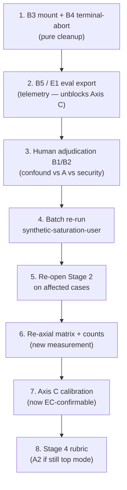

# GoalJudge Axis-B Remediation Strategy: Critical Evaluation & Sequencing

> **Status:** Research memo — June 5, 2026
> **Context:** Human analyst plans to remediate **Axis B (harness/environment confounds)** before
> proceeding to Stage 4 rubric design or Axis-C judge calibration. This document records a critical
> evaluation of that plan: trade-off reasoning, external grounding, repo-specific fix surfaces, and a
> recommended sequencing order.
>
> **Companion docs:**
> - Phase 3 taxonomy (Axis B definitions): [`goaljudge_phase3_axial_coding.md`](goaljudge_phase3_axial_coding.md) §4
> - Executable Stage-3 procedure: [`../walk-through/05_goaljudge_axial_coding_failure_taxonomy_walkthrough.md`](../walk-through/05_goaljudge_axial_coding_failure_taxonomy_walkthrough.md)
> - Session evidence: [`../reports/goaljudge_manual_walkthrough_gj001_gj022_session_report.md`](../reports/goaljudge_manual_walkthrough_gj001_gj022_session_report.md)
> - E1 telemetry requirement: session report §3.7; [`../plans/goaljudge_gcp_compatibility.plan.md`](../plans/goaljudge_gcp_compatibility.plan.md)

---

## TL;DR

**"Fix Axis B first" is the correct primary move**, but the framing *deterministic and easy* is partly
a trap.

| Claim | Verdict |
|---|---|
| B-first is logically required before trusting Axis-A counts | **Yes** — 18/22 cases carry ≥1 B code; walkthrough 05 forbids counting confounded runs toward saturation |
| B fixes are all deterministic and low-risk | **Partially** — B3/B4 are pure cleanup; B1/B2 touch the security model; B5 is telemetry engineering |
| Fixing B only cleans measurement | **No** — some fixes grant the agent new capabilities and change what Axis A measures |
| All B1 cases are confounds | **No** — blocked-command + no recovery may be Axis A (Harness-Bench: 24.6% tool/recovery mode) |

**Recommended order:** B3/B4 cleanup → B5/E1 export → human adjudication of B1/B2 → batch re-run →
re-open Stage 2 on affected cases → Axis C calibration.

---

## 1. The proposal under review

After Stage 3 axial coding, the analyst observed that **modal session "failure" is the sandbox
blocking a required command**, not poor agent reasoning (Phase 3 §6.2). The proposed response:

1. Fix Axis-B issues first (deterministic, code-level).
2. Re-run the saturation corpus under a clean harness posture.
3. Only then proceed to Stage 4 rubric (Axis A) and Stage 6 calibration (Axis C).

This memo evaluates that sequencing against repo evidence, methodology constraints, and 2025–2026
external practice.

---

## 2. Where the approach is strongly justified

### 2.1 Contamination makes Axis-A counts uninterpretable today

From the Phase 3 matrix:

- **18 of 22** rows carry ≥1 Axis-B code.
- **5** rows carry Axis-C drift.
- Walkthrough 05 anti-patterns explicitly forbid folding B into A and forbid counting confounded
  runs toward behavioral saturation.

Until B is reduced, any Axis-A frequency table (including the provisional A2 corrupt-success lead)
indicates *where to look*, not saturation. Phase 3 is already marked **PROVISIONAL / GATED** for this
reason.

### 2.2 External consensus is infrastructure-first

| Source | Finding | Implication |
|---|---|---|
| [Characterizing Faults in Agentic AI (arXiv 2603.06847)](https://arxiv.org/abs/2603.06847) | Grounded theory over 385 faults: infrastructure faults propagate into cognition; stabilize execution substrate first | Direct support for B-before-A remediation order; mirrors our A/B/C split |
| [Anthropic — Demystifying evals](https://www.anthropic.com/engineering/demystifying-evals-for-ai-agents) | Isolate every trial; distinguish task failures from eval/harness failures; revise harness before trusting scores | Validates B-first and the orthogonal-axis design |
| [Harness-Bench (arXiv 2605.27922)](https://arxiv.org/abs/2605.27922) | Make the harness a controlled experimental variable under fixed task conditions | Post-fix harness config must be documented as a variable |
| [Unified Agentic Eval Framework (arXiv 2602.03238)](https://arxiv.org/abs/2602.03238) | Report trajectory + environment state + resource usage; shared failure taxonomy must separate infra from cognition | Supports multi-axis reporting, not single-axis fold-in |

### 2.3 Determinism de-risks implementation (for the right subset)

B3 (mount/path), B4 (terminal escalation), and parts of B5 (telemetry wiring) are **pure code** with
no LLM in the loop. They fit the repo TDD pyramid:

- **L1/L2:** shell validator contracts, `classify_outcome` matrix, path boundary tests.
- **No live LLM in CI** for harness fixes.

This is a genuine advantage over Axis A (L3 mocked-LLM rubric evals) or Axis C (live judge +
gold-set calibration).

### 2.4 B remediation unblocks the entire downstream pipeline

Phase 3 §7 gates Stage 4 on:

- Registry-prompt batch re-run under `synthetic-saturation-user`
- **`eval.goal_judge` export (E1)**
- Axis-B environment corrections
- Human IAA κ ≥ 0.8

Axis C **cannot be confirmed** today: the session found **zero** `target=goal_judge` rows in
`evals.log` (session report §3.5). B5/E1 is the critical path for Axis C, not a nice-to-have.

---

## 3. Trade-offs and risks (the "easy fixes" trap)

### 3.1 "Fix" vs "control for" — sample starvation drives the choice

The axial matrix already **controls** for B via the `Counts A?` column. Strictly speaking, you do
not need to *fix* B to produce valid Axis-A counts — you need enough **unconfounded** cases.

The justification for fixing (rather than filtering) is **sample starvation**: with 18/22 contaminated,
filtering alone leaves almost no countable evidence. Fix enough B to recover a usable sample; do not
pursue B perfection before re-running.

### 3.2 Not all B fixes are measurement cleanup — some change behavior

[Anthropic — Quantifying infrastructure noise](https://www.anthropic.com/engineering/infrastructure-noise)
(June 2026, Terminal-Bench) distinguishes two regimes:

| Regime | Effect | Our mapping |
|---|---|---|
| **Below ~3× headroom** | Infra errors drop; success stays within noise (p = 0.40) — pure measurement cleanup | **B3** (mount ENOENT), **B4** (terminal abort before agent acts) |
| **Above ~3× headroom** | Success jumps ~4 pts — resources enable *new solution strategies* | **B1** (wider allowlist), **B4** (recovery after tool error) |

After B1/B4 fixes, post-fix Axis-A frequencies are **not comparable** to current provisional
tallies. Treat the re-run as a **new measurement**, not a correction of the old one.

### 3.3 B1/B2 are security boundaries, not free mechanical edits

Repo fix surfaces:

```python
# services/tools/shell.py
ALLOWED_COMMANDS = {"ls", "cat", "head", "tail", "grep", "find", "python", "wc"}
SHELL_METACHARACTERS = frozenset(";&|$`<>")
```

| Code | Naive "fix" | Actual risk |
|---|---|---|
| **B1** allowlist | Add `echo`, `printf`, `touch`, `python3` | Lower risk but still AGENTS.md Security Model layer 2 — requires explicit policy decision |
| **B2** metachar | Allow `;`, `>`, `\|` | **Shell-injection hole** — do not relax validator for eval convenience |

**Correct B2 remediation:** add a non-shell compute path (dedicated tool or documented agent policy
to use allowlisted `python` without metachars), not validator relaxation.

B4 touches `components/evaluator.py` `classify_outcome` — orchestration-adjacent domain logic;
classify as **⚠️ ask first** per AGENTS.md.

### 3.4 B1 may be miscoded — confound vs real constraint vs agent failure

The Axis-B decision rule: *"Could a perfectly-reasoning agent have succeeded in this environment?"*

That answer depends on **whether the constraint exists in production**:

- If `echo` is blocked in prod too → not a confound; a perfect agent uses `python`/`file_io`.
- Session report §3.2: agents "rarely try allowlisted `python` one-liners" (GJ-005) — that is **agent
  recovery failure**, not harness noise.

[Harness-Bench](https://arxiv.org/abs/2605.27922) classifies "blocked commands not followed by
effective recovery" as **Tool/recovery (24.6%)** — an **agent** failure mode, not infrastructure.

**Implication:** A slice of current "B1 volume" may belong on **Axis A**. Widening the allowlist to
erase it would hide a genuine agent weakness.

### 3.5 Fixing B forces Stage-2 re-open, not just re-count

Once B3/B4 are fixed and cases re-run:

- **† cases** (GJ-007, GJ-009) will exercise intended Axis-A targets for the first time.
- New open codes may emerge (criteria drift, EvalGen arXiv 2404.12272).

Budget for **re-open coding** on affected cases, not merely recomputing §6.1 frequencies. Taxonomy
*structure* (A1–A5, B1–B5, C1–C2) is firm; *per-case codes* are not.

### 3.6 B5 is the hidden critical path inside "Axis B"

B5 / **E1** (`eval_capture.record()` → Langfuse `eval.{target}`) is telemetry engineering, not a
one-line validator tweak. It gates:

- Walkthrough 04 EC checklist on GCP
- Axis-C confirmation (`per_criterion`, `graceful_failure`, `partial_fraction`)
- `scripts/export_goaljudge_corpus.py` join completeness

Do not let cheap B1–B3 edits crowd out B5.

---

## 4. Repo fix surfaces (Axis B → code mapping)

| B code | Symptom | Primary repo surface | Session backlog item |
|---|---|---|---|
| **B1** | `echo`/`printf`/`touch`/`python3` rejected | `services/tools/shell.py` `ALLOWED_COMMANDS` | §3.4 item 5 — document allowlist in agent guidance |
| **B2** | `;`, `>`, `2>/dev/null` rejected | `services/tools/shell.py` `SHELL_METACHARACTERS` | Do **not** relax — add compute workaround |
| **B3** | Host path outside `/workspace`; `ls /workspace` ENOENT | `services/tools/file_io.py` `WORKSPACE_DIR`; Cloud Run mount | §3.4 items 1, 6 — bare filename default; volume mount |
| **B4** | `Error:` tool output → terminal abort | `components/evaluator.py` `classify_outcome`; `orchestration/react_loop.py` ~L1117 | Classify tool validation errors as `tool_error`, not `terminal` |
| **B5** | No EC join; UI vs batch divergence | `services/eval_capture.py`; Langfuse export path | §3.7 E1.1–E1.3 |

---

## 5. Per-case remediation adjudication (GJ-001–GJ-022)

For each case with Axis-B presence, the recommended action before batch re-run:

| Case | B codes | Remediation class | Recommended action |
|---|---|---|---|
| GJ-001A | B3, B4 | **Cleanup-fix** | Default bare paths under `WORKSPACE_DIR`; soften B4 for validation errors |
| GJ-002 | B1, B2 | **Adjudicate** | Likely **recode partial to A** (recovery failure — agent had `python` path); do not widen metachar |
| GJ-003A | B3 | **Cleanup-fix** | Path defaulting / prompt uses `/workspace/...` |
| GJ-003B | — | *(no B)* | Already partial behavioral evidence |
| GJ-004B | B1 | **Adjudicate** | Agent recovered via `file_io` — B1 may be secondary; re-code after re-run |
| GJ-005 | B1 | **Adjudicate** | Strong A1 candidate; B1 is agent recovery failure if `python` was available |
| GJ-006A/B | B5 | **Telemetry + env** | Single posture: batch under `synthetic-saturation-user`; E1 export |
| GJ-007† | B2, B3 | **Cleanup-fix** | Mount `/workspace` for shell; metachar stays — re-run will finally test `fluent-evasion` |
| GJ-008 | — | *(C1 only)* | No B fix; needs E1 for Axis-C confirmation |
| GJ-009† | B1 | **Adjudicate** | Target `fluent-evasion` never exercised — cleanup B3/B1 context then re-run |
| GJ-010 | — | *(cleanest A2)* | **Gold reference** — minimal B; use as post-fix sanity check |
| GJ-011 | B1, B2 | **Mixed** | B2 blocks factorial shell path → cleanup via compute tool; partial A2 remains |
| GJ-012 | — | *(C1 only)* | Behavioral A2 clear; judge drift — E1 for C confirmation |
| GJ-013 | B1, B2 | **Mixed** | B blocks + C1 drift — fix env, then confirm C with EC row |
| GJ-014 | B1, B3 | **Cleanup-fix** | Path + allowlist context; terminal failure may be honest A4 |
| GJ-015 | B5 | **Telemetry + env** | Live search vs registry — env alignment, not shell fix |
| GJ-019 | B1 | **Adjudicate** | Graceful-honest A4; `exit` blocked — policy: is `exit` needed in prod? |
| GJ-020 | B4 | **Cleanup-fix** | Stop terminal escalation on recoverable tool errors |
| GJ-021 | B2, B4 | **Cleanup-fix** | B4 first; B2 blocks script execution — compute path |
| GJ-022 | — | *(C2 watch)* | Clean A4; no B — proceed to C calibration |

**Legend:**

- **Cleanup-fix** — removes noise; agent capability unchanged; safe to do first.
- **Adjudicate** — human decides confound vs real constraint vs Axis-A recovery failure before code change.
- **Telemetry + env** — B5/E1 and run-posture alignment, not validator edits.
- **Mixed** — cleanup + adjudication on the same case.

---

## 6. Recommended sequencing



| Step | Work | Acceptance signal |
|---|---|---|
| **1** | Fix B3 (`WORKSPACE_DIR` mount, bare-path default) + B4 (`tool_error` not `terminal` for validation failures) | GJ-001A, GJ-007, GJ-020/021 re-run without pre-emptive abort; L2 tests green |
| **2** | Implement E1.1–E1.3: `eval.{target}` on Langfuse trace | `target=goal_judge` rows visible on GCP batch runs; export script EC half populated |
| **3** | Per-case table §5 review; document allowlist in prompts/agent guidance; **do not** relax metachar | Written adjudication log; security sign-off on any allowlist expansion |
| **4** | Registry-prompt batch under `synthetic-saturation-user`; single env posture | `workflow_id`/`trace_id` joinable; GJ-010 remains aligned |
| **5** | Re-open-code † cases + any case whose first-failure event changes | New open codes logged; saturation gate re-evaluated |
| **6** | Rebuild §6 matrix; provisional counts with **reduced** B contamination | ≥N cases with `Counts A? = Yes`; A2 lead reconfirmed or revised |
| **7** | Axis C: confirm J2/J3 on EC `per_criterion` rows | GJ-012/013 drift reproducible or fixed in judge prompt |
| **8** | Stage 4 rubric for top Axis-A mode (candidate A2) | Binary check from Phase 3 §3 A2 encoded in `goal_judge_system_prompt.j2` |

---

## 7. What not to do

| Anti-pattern | Why |
|---|---|
| Relax `SHELL_METACHARACTERS` for eval convenience | Trades measurement for shell-injection risk |
| Widen allowlist before adjudicating B1 vs Axis A | Erases genuine recovery-failure signal |
| Treat post-fix counts as corrections of June 4 tallies | Different agent–environment system after capability-granting fixes |
| Skip B5 and proceed to Stage 4 rubric | Axis C unconfirmable; export half-empty; downgrade gate uncalibrated |
| Skip Stage-2 re-open after B fixes | † cases and new first-failure events invalidate per-case matrix |

---

## 8. External references (verified June 2026)

| # | Title | URL | Used for |
|---|---|---|---|
| E1 | Characterizing Faults in Agentic AI | https://arxiv.org/abs/2603.06847 | Infra-first remediation; multi-axis fault taxonomy |
| E2 | Anthropic — Demystifying evals for AI agents | https://www.anthropic.com/engineering/demystifying-evals-for-ai-agents | Harness revision before trusting scores; isolated trials |
| E3 | Anthropic — Quantifying infrastructure noise | https://www.anthropic.com/engineering/infrastructure-noise | Cleanup vs capability-granting infra fixes |
| E4 | Harness-Bench | https://arxiv.org/abs/2605.27922 | Harness as controlled variable; tool/recovery as agent mode |
| E5 | Unified Framework for LLM Agentic Capabilities Evaluation | https://arxiv.org/abs/2602.03238 | Trajectory + env state reporting; shared failure taxonomy |
| E6 | EvalGen (criteria drift) | https://arxiv.org/abs/2404.12272 | Re-open coding after harness changes |
| E7 | Hamel evals-FAQ / pipeline playbook | [`goaljudge_evaluation_pipeline_open_axial_coding_rubric.md`](goaljudge_evaluation_pipeline_open_axial_coding_rubric.md) | Error analysis before judge; confound discipline |

---

## 9. Decision record

| Decision | Rationale | Owner | Status |
|---|---|---|---|
| B remediation before Stage 4 | 18/22 contamination; counts uninterpretable | Analyst | **Approved** (this memo) |
| B3/B4 before B1/B2 | Pure cleanup; no security trade-off | Engineering | **Recommended** |
| Do not relax metachar validator | Security Model layer 2 | Engineering + security | **Recommended** |
| B5/E1 before Axis C work | Zero `goal_judge` EC rows in session | Engineering | **Recommended** |
| Re-open Stage 2 after B fixes | † cases + criteria drift | Analyst | **Required** |
| Post-fix counts = new measurement | Anthropic infra-noise regimes | Analyst | **Required** |

---

## 10. Open questions

1. **Production allowlist policy:** Is the current `ALLOWED_COMMANDS` set the intended prod constraint,
   or an eval artifact? Answer determines how many B1 cases recode to Axis A.
2. **Compute tool:** Should factorial/echo-equivalent tasks use a dedicated `compute` tool instead of
   shell relaxation?
3. **UI vs batch canonical posture:** After B5, is GCP-UI or local batch the authoritative saturation
   surface? Phase 3 gates on batch + `synthetic-saturation-user`.
4. **B4 scope:** Which `Error:` prefixes should remain `terminal` vs `tool_error`? Needs failure-mode
   matrix (L4) before changing `classify_outcome`.
