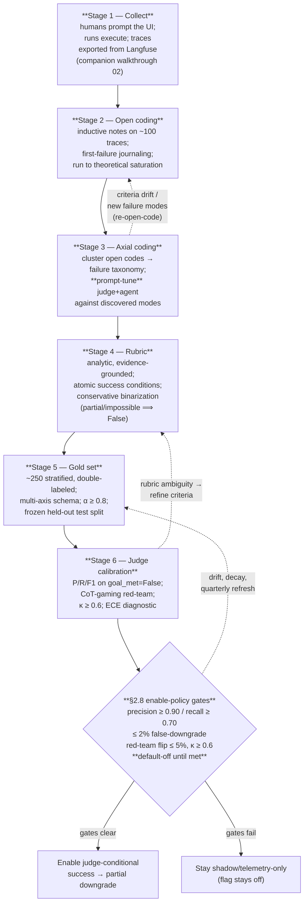

# The GoalJudge Evaluation Pipeline: From Traces to a Calibrated Judge via Open/Axial Coding, Rubrics, and a Gold Set

> **Purpose of this file.** An opinionated, research-backed **playbook for the whole evaluation pipeline** behind the binary `goal_met` judge that gates the `success → partial` downgrade in this repo's ReAct agent. It runs end-to-end: **collect traces → open coding → axial coding (+ prompt tuning, failure taxonomy) → rubric design → golden dataset → calibrated evaluator judge** — and terminates in exactly the §2.8 enable-policy gates already decided in [`fix2_goaljudge_rubric_feasibility_pyramid.md`](fix2_goaljudge_rubric_feasibility_pyramid.md).
>
> **This is a documentation artifact. It proposes no code changes.** It extends, and does not restate, the two foundations it sits on:
> - **Gold-set + rubric foundation:** [`docs/research/rubricgoldsetreseachforgoaljudge.md`](rubricgoldsetreseachforgoaljudge.md) — multi-axis label schema (`goal_met` / `graceful_failure` / `partial_fraction` / `failure_mode` / evidence spans), α ≥ 0.8, precision/recall/F1 on `goal_met=False`, ~250 stratified double-labeled items, dataset catalog (τ-bench, WebArena, TheAgentCompany, AgentBoard, AgentRewardBench). **Treated as the FOUNDATION — read it first.**
> - **Adoption-feasibility + gates:** [`docs/research/fix2_goaljudge_rubric_feasibility_pyramid.md`](fix2_goaljudge_rubric_feasibility_pyramid.md) §2.8 enable-policy (precision ≥ 0.90 / recall ≥ 0.70 on `goal_met=False`, ≤ 2 % false-downgrade, red-team flip ≤ 5 %, κ ≥ 0.6, ECE diagnostic-only, **default-off until met**).
>
> **Verdict fields currently emitted** ([`components/schemas.py`](../../components/schemas.py) `GoalVerdict`, verified June 2026): `goal_met`, `criteria_met`, `per_criterion[CriterionVerdict{criterion, met, evidence}]`, `rationale`, `graceful_failure`, `partial_fraction`, derived `unmet_conditions`. The downgrade gate reads **only** `goal_met` ([`fix2_goaljudge_option_b_implementation_review.md`](fix2_goaljudge_option_b_implementation_review.md) §3 Step 5).
>
> **Companion (intended, not yet written):** [`docs/walk-through/02_goaljudge_ui_langfuse_validation_walkthrough.md`](../walk-through/02_goaljudge_ui_langfuse_validation_walkthrough.md) — the operational "humans prompt the UI → runs execute → traces export from Langfuse" walkthrough that this playbook's Stage 1 hands off to.
>
> **Date:** 2026-06-02. **Style anchor:** the analytical, skeptical, heavily-cited tone of the two foundations above. Every external claim carries a URL; strong-consensus claims are distinguished from single-source ones.

---

## Table of contents

- [TL;DR](#tldr)
- [The pipeline at a glance](#the-pipeline-at-a-glance)
- [Stage 1 — Trace collection](#stage-1--trace-collection)
- [Stage 2 — Open coding (inductive, qualitative)](#stage-2--open-coding-inductive-qualitative)
- [Stage 3 — Axial coding + prompt tuning + failure taxonomy](#stage-3--axial-coding--prompt-tuning--failure-taxonomy)
- [Stage 4 — Rubric design](#stage-4--rubric-design)
- [Stage 5 — Golden dataset](#stage-5--golden-dataset)
- [Stage 6 — Evaluator judge calibration (terminates in §2.8 gates)](#stage-6--evaluator-judge-calibration-terminates-in-28-gates)
- [Failure-category starter taxonomy for `goal_met`](#failure-category-starter-taxonomy-for-goal_met)
- [IAA, metrics, size, and split discipline](#iaa-metrics-size-and-split-discipline)
- [How this plugs into the repo](#how-this-plugs-into-the-repo)
- [Caveats](#caveats)
- [References](#references)
- [Relationship to the two in-repo foundations](#relationship-to-the-two-in-repo-foundations)

---

## TL;DR

1. **Error analysis — not the judge — is the load-bearing step, and it is qualitative.** The strongest 2025–2026 practitioner consensus (Hamel Husain & Shreya Shankar's masterclass / "Field Guide" / evals-FAQ) is that you must *look at your data first*: hand-review ~100 traces, write open-ended notes (**open coding**), cluster them into a failure taxonomy (**axial coding**), and only *then* build a judge for your biggest, most frequent failure mode. "Error analysis is the step most people skip. It's also the most important. More important than the LLM judge" ([R1](#references), [R3](#references)). The judge is downstream of the taxonomy, not a substitute for it.
2. **Treat the open→axial→prompt-tuning loop as grounded theory over traces, run to *theoretical saturation*.** Open coding is explicitly "adapted from qualitative research methodologies" ([R2](#references)); stop when ~20 fresh traces add no new code (review ≥ 100 to start). Beware **criteria drift** — Shankar et al.'s finding that graders' criteria *change as they grade* and some criteria are *dependent on observed outputs*, not definable a priori ([R4 EvalGen, arXiv 2404.12272](#references)). This is why the rubric and the judge prompt must be *iterated against real traces*, not frozen up front.
3. **Make the rubric analytic (criterion-by-criterion), evidence-grounded, and binarized conservatively.** Analytic rubrics decompose into independent atomic criteria — preventing halo effects and criterion conflation, enabling per-criterion κ, and giving a prompt-tuning signal a holistic score cannot ([R5 Autorubric, arXiv 2603.00077](#references); [R6 Masood](#references)). The repo's `per_criterion[CriterionVerdict{criterion, met, evidence}]` schema is already analytic; the binarization rule (`partial`/`impossible ⟹ goal_met=False`, evidence required) is already encoded in `prompts/goal_judge_system_prompt.j2`.
4. **The gold set is the trust anchor: ~250 stratified, double-labeled items, α ≥ 0.8 on `goal_met`, dev/test split you never tune on.** ~250 validates 80 % human–judge agreement at 95 % CI; α ≥ 0.8 is the long-standing "reliable" bar (≥ 0.667 = tentative) ([R7 Krippendorff](#references), [R8](#references)). Report **precision/recall/F1 on the `goal_met=False` (downgrade-triggering) class**, not global accuracy, and treat **ECE diagnostically** (judge confidence is overconfident). All of this is the foundation doc's existing prescription — this playbook adds the upstream coding stages that *produce* the rubric the gold set labels against.
5. **CoT-gaming is a standing failure category *and* a red-team stratum, not an afterthought.** Trajectory-aware judging agrees with humans better (90 % vs 70 %, [R9 Agent-as-a-Judge, arXiv 2410.10934](#references)) but is gameable: manipulating only the agent's chain-of-thought inflates judge false-positive rates by up to 90 % ([R10 Gaming the Judge, arXiv 2601.14691](#references)). Seed it as a code in open coding (`fabricated-progress`), promote it to a taxonomy category, oversample it in the gold set, and gate on the red-team flip rate. The whole pipeline stays **default-off** until the §2.8 gates clear.

---

## The pipeline at a glance

The loop is **not** linear: criteria drift ([R4](#references)) and newly surfaced production failures push you back up the chain (re-open-code, re-cluster, re-tune the prompt, refresh the gold set). The forward arrow is the *first pass*; the dashed arrows are the steady state.

---

## Stage 1 — Trace collection

**What to do.** Humans enter prompts in the UI; the ReAct agent runs; full traces (input, every tool call + tool *output* + intermediate state, final answer, cost/step metadata) export from Langfuse. The operational mechanics are owned by the companion walkthrough ([`02_goaljudge_ui_langfuse_validation_walkthrough.md`](../walk-through/02_goaljudge_ui_langfuse_validation_walkthrough.md)); this playbook only states the *data contract* coding depends on.

**Best practice (cited).**
- **Traces are the prerequisite to everything.** "Before you can do evals, you need traces. Traces are logs of everything that happens in your AI application" ([R3](#references)). For a trajectory-aware judge, the trace must carry **tool inputs + outputs + intermediate state**, not just the final answer — this is the observable evidence the anti-gaming rule grounds against ([R10](#references); already enriched in `_summarize_evidence`, per [implementation review](fix2_goaljudge_option_b_implementation_review.md) §3 Step 2).
- **A cheap data viewer beats a vendor dashboard.** "Why a simple data viewer is your most important AI investment" — build a one-screen view so a domain expert can read a trace and annotate without context-switching ([R2](#references)). Langfuse's trace view + annotation queues fill this role (Stage 2).
- **Sampling for coding ≠ sampling for the gold set.** For open coding, pull a *representative* ~100 production traces (and intentionally include known-bad ones). For the gold set (Stage 5), *stratify and oversample* the `goal_met=False` and impossible strata. Keep these two samples conceptually distinct so the held-out test split is not contaminated by coding examples.

**Artifacts out:** a Langfuse dataset/export of raw traces; a flat table (one row per trace) with columns for `trace_id`, `task_input`, `final_answer`, an evidence digest, and an empty `open_code_note` column.

**Repo mapping.** Every LLM call already records via `eval_capture.record()` with `user_id` + `task_id` (AGENTS.md H5; `services/eval_capture.py`). That record stream *is* your trace substrate — Stage 2 annotates it. The judge's own verdict is itself recorded (`target`-tagged), so judge errors are themselves coded.

---

## Stage 2 — Open coding (inductive, qualitative)

**What to do.** A domain expert reads traces end-to-end and writes **brief, descriptive, open-ended notes** about anything wrong, surprising, or goal-relevant — *before* imposing any category scheme. This is inductive, grounded-theory-style coding (Strauss & Corbin; Charmaz) applied to agent traces.

**Best practice (cited).**
- **It is explicitly qualitative methodology.** Hamel's evals-FAQ: human annotators "review and write open-ended notes about traces … This process is akin to 'journaling' and is adapted from qualitative research methodologies" ([R2](#references)). The masterclass names the terms of art directly: "open coding is the writing of the notes … a thing well understood in the field … been used in the social sciences" ([R1](#references)).
- **First-failure discipline.** "Focus on noting the *first* failure observed in a trace, as upstream errors can cause downstream issues" ([R2](#references)) — a cascading tool error read as a goal failure is itself a (different) code.
- **Let codes emerge; resist your priors.** "Be disciplined and let the categories emerge from the data. If you come in with preconceived notions, you're going to … confirm your biases" ([R12](#references)). Do the **initial** open coding yourself; never delegate the first pass to an LLM ([R3](#references)).
- **Run to theoretical saturation.** "Keep iterating … until you reach theoretical saturation, meaning new traces do not seem to reveal new failure modes. As a rule of thumb, review at least 100 traces … if ~20 traces don't turn up a new category, you can stop" ([R2](#references)).

**Concrete artifacts out:** the `open_code_note` column populated for ≥ 100 traces; a running count of how many recent traces produced *no* new note type (the saturation signal).

**Repo mapping.** Langfuse's **`TEXT` score type** is purpose-built for this: its own docs describe it as "free-form … open-ended annotations like reviewer notes … **Often used for open coding before formalizing into quantifiable [scores] via axial coding**" ([R13 Langfuse scores](#references)). Attach a `TEXT` score named `open_code` to each trace via the UI or annotation queue. This keeps coding *in the same system* as the traces and the eventual judge scores.

---

## Stage 3 — Axial coding + prompt tuning + failure taxonomy

**What to do.** Cluster the open codes into a small set of **distinct, testable failure categories** (the taxonomy), then **iterate the agent and judge prompts** against the discovered modes — re-coding a fresh sample after each prompt change.

**Best practice (cited).**
- **Axial coding = grouping notes into a failure taxonomy.** "Categorize the open-ended notes into a 'failure taxonomy' … group similar failures into distinct categories. This is the most important step. At the end, count the number of failures in each category" ([R2](#references)). It is "like an open card sort … sorting them into piles, then giving those piles names" ([R12](#references)).
- **LLM-assisted clustering, human-validated.** Export the notes to CSV and prompt an LLM: "These are open codes for analysis of LLM logs. Please extract all the different open codes, then propose 5–6 categories you can create axial codes from" — but "always review and refine the clusters yourself … The LLM provides a starting point, not a final answer" ([R3](#references), [R12](#references)). Reject categories that are too broad to be actionable ([R1](#references): "capability limitations / misrepresentation … too broad … not actionable").
- **Each category must be testable.** A failure mode should be specific enough to write a binary pass/fail check for ("interrupts user mid-thought," not "bad UX") — that specificity is what makes it a rubric criterion later ([R3 Field Guide](#references)).
- **Count and prioritize; build the judge for the top mode.** Quantify category frequency and "build one LLM judge for your biggest issue" ([R3](#references)) — do not try to cover every mode at once.
- **Prompt tuning is part of this loop, and criteria drift is expected.** As you tune the judge/agent prompt and look at more outputs, your criteria *will* shift — Shankar et al.'s **criteria drift**: "users need criteria to grade outputs, but grading outputs helps users define criteria," and some criteria are "*dependent* on the specific LLM outputs observed (rather than … definable *a priori*)" ([R4 EvalGen, arXiv 2404.12272](#references)). Treat each prompt edit as a hypothesis and re-code a sample to confirm it moved the right category's count down without inflating another.
- **Automating the prompt→assertion loop has precedent.** SPADE synthesizes data-quality assertions by analyzing the *history of prompt edits* ("prompt deltas") — a developer adds an instruction whenever they spot a failure mode, so the prompt-edit history *encodes* the taxonomy ([R14 SPADE, arXiv 2401.03038, VLDB 2024](#references), deployed in LangSmith over 2000+ pipelines). The repo's own prompt-evolution (`prompts/goal_judge_system_prompt.j2` already grew evidence-grounding + impossible + partial rules across fixes) is exactly this pattern, done by hand.

**Concrete artifacts out:** a named, counted **failure taxonomy** (the [starter taxonomy below](#failure-category-starter-taxonomy-for-goal_met) seeds it); a changelog of judge/agent prompt edits, each tagged to the category it targets; per-edit before/after category counts on a re-coded sample.

**Repo mapping.** Each axial category becomes a categorical Langfuse **score config** ([R13](#references)) and a candidate `failure_mode` value on the gold-set schema (foundation doc's multi-axis schema). The prompt edits land in `prompts/*.j2` rendered via `PromptService.render_prompt()` (AGENTS.md H1 / AP-3 — never hardcode). Borrow vetted category vocabularies from MAST (14 failure modes, κ = 0.88) and TRAIL (graded reasoning/planning/execution taxonomy) catalogued in the foundation doc, rather than re-inventing.

---

## Stage 4 — Rubric design

**What to do.** Turn the stabilized taxonomy + success conditions into an **analytic, evidence-grounded rubric** with conservative binarization, encoded as the judge prompt.

**Best practice (cited).**
- **Analytic over holistic.** Analytic rubrics "decompose evaluation into independent criteria scored separately," conferring three advantages: "(1) per-criterion evaluation prevents criterion conflation and halo effects; (2) independent criterion scores enable reliability measurement via Cohen's κ … so practitioners can identify which criteria are unreliable; and (3) structured per-criterion verdicts … serve as optimization signals — a system that knows which criteria it fails can target those dimensions, whereas a holistic score provides no such decomposition" ([R5 Autorubric, arXiv 2603.00077](#references)). Masood: analytic rubrics enable "regression root-cause analysis that a simple pass/fail check cannot provide" ([R6](#references)). Holistic single scores also *increase* rater disagreement vs per-criterion scoring ([R5](#references)).
- **Decompose goals into atomic, evidence-paired success conditions.** Each criterion = one checkable condition + the observable evidence (tool output / state / span) that verifies it; `goal_met=True` iff all *required* atomic conditions are verified against observable state, **not** agent narration (foundation doc §C; [R10](#references) "verify reasoning claims against observable evidence").
- **Binarize conservatively for the gate.** Under a binary `goal_met` that gates a downgrade: partial completion ⟹ `False` (`partial_fraction` recorded as metadata only); correctly-reported-impossible ⟹ `False` + `graceful_failure=True`; hallucinated-impossible ⟹ `False` + `graceful_failure=False` (foundation doc §C; encoded today in `goal_judge_system_prompt.j2` rules 3–5).
- **Mitigate known judge biases in the rubric itself.** Position bias, self-preference, verbosity preference are documented LLM-judge failure modes; rubric tooling counters them with option shuffling, explicit `CANNOT_ASSESS`/`needs_review` verdicts, and length penalties ([R5](#references); [R15 LangChain/Galileo/Arize practitioner guidance](#references)). The repo's "be skeptical of fluent-but-evasive answers" rule is a verbosity-bias guard.
- **Co-construct the rubric with humans grading examples.** EvalGen's lesson: criteria and assertions should be *co-developed* by having humans grade a subset of outputs and selecting the rubric/assertion variant that best matches their grades ([R4](#references)) — i.e., the rubric is validated against Stage-5 labels, not authored in a vacuum.

**Concrete artifacts out:** the analytic rubric encoded in `prompts/goal_judge_system_prompt.j2` (criteria, evidence-grounding rule, binarization rules, JSON shape); a rubric *spec* mapping each criterion ↔ taxonomy category ↔ gold-set `failure_mode`.

**Repo mapping.** The rubric *is* the judge prompt; the `GoalVerdict` JSON shape (`per_criterion`, `evidence`, `graceful_failure`, `partial_fraction`) is the analytic-rubric output contract. The `.j2`/`routing_config.py` split (AGENTS.md: prose policy in templates, numeric thresholds in config) keeps human-authored rubric prose separate from tunable numbers.

---

## Stage 5 — Golden dataset

**What to do.** Build a **stratified, double-labeled gold set** usable to calibrate and validate the judge — the trust anchor. *This is the foundation doc's core contribution; this playbook does not duplicate it.* The additions here are (a) how the upstream coding stages *feed* the gold set and (b) contamination discipline for synthetic augmentation.

**Best practice (cited) — build ON the foundation, not over it.**
- **Schema, size, stratification, IAA, metrics:** exactly the foundation doc — multi-axis labels (`goal_met` / `graceful_failure` / `partial_fraction` / `failure_mode` / evidence spans), ~250 stratified double-labeled items, α ≥ 0.8 on `goal_met`, ~40 % representative / 30 % boundary / 20 % edge / 10 % impossible, oversample `goal_met=False`. See [`rubricgoldsetreseachforgoaljudge.md`](rubricgoldsetreseachforgoaljudge.md) §C and the [IAA section below](#iaa-metrics-size-and-split-discipline).
- **The taxonomy *defines the strata*.** Each Stage-3 failure category becomes a stratum to sample for; the gold set must contain enough of each `goal_met=False` category (especially `fabricated-progress`) to estimate per-category precision/recall.
- **Synthetic data augments scarce strata — generate *inputs*, ground in real constraints, verify coverage.** For rare strata (impossible tasks, fabricated-progress, partial completion) you will not have enough production traces. Hamel: synthetic data is "more effective than you think"; the key principles are **generate user inputs, not outputs**; **incorporate real system constraints**; **diversify across features/scenarios/personas**; and **verify the synthetic case actually triggers the intended scenario** ("a query intended to test 'no matches found'…") ([R3 Field Guide](#references), [R16 synthetic-data FAQ](#references)). Use a *structured dimensions* approach, not "give me test queries," to avoid generic, repetitive outputs ([R16](#references)).
- **Reuse public benchmark *schemas*, not their items, for the held-out test.** Borrow ground-truth *definitions* from τ-bench (deterministic end-state), TheAgentCompany (checkpoint partial-credit), WebArena (unachievable tasks), AgentBoard (subgoals), AgentRewardBench (expert success labels) — catalogued in the foundation doc — but author your **own fresh tasks** for the final calibration set to dodge contamination/decay (e.g., SWE-bench Verified's Feb-2026 deprecation; foundation doc Caveats).
- **Contamination firewall for synthetic augmentation.** Generate synthetic/augmented cases **only into the dev split**; keep the **held-out test split** built from independent, human-authored or freshly-collected production traces, double-labeled, and *never* exposed to prompt/rubric iteration. EvalGen's criteria-drift warning ([R4](#references)) is precisely why you must freeze a split you never tune on. Track provenance (`synthetic` vs `production`) as a label so you can report metrics on the production-only test subset.

**Concrete artifacts out:** a Langfuse **dataset** (`goaljudge_goldset_v1`) with multi-axis labels, a `split` field (`dev`/`test`), a `provenance` field (`production`/`synthetic`), and a `failure_mode` field; an IAA report (α on `goal_met`) gating the set's use; a frozen, hashed `test` split.

**Repo mapping.** Langfuse **datasets + dataset runs** are the substrate ([R13](#references), [R17 Langfuse experiments](#references)); the gold set is an **offline asset** under AGENTS.md ("never run live LLM in CI"). The judge runs over the dataset as an experiment, not in CI.

> **Stage 5 v1 plan + spec (2026-06-08):** [`goaljudge_stage5_goldset.plan.md`](../plans/goaljudge_stage5_goldset.plan.md)
> operationalizes this stage for the repo (schema, stratification, double-labeling + α-gate, contamination
> firewall), **gated on Stage 4 Confirmation** (the gold set labels against the *confirmed* A2 rubric).
> Canonical artifact: [`goaljudge_stage5_goldset_spec.md`](goaljudge_stage5_goldset_spec.md). The
> `failure_mode` multi-axis field landed on `GoalVerdict` (telemetry-only, default-None) as the schema
> handoff. The labeling instrument: [`goaljudge_stage5_goldset/`](goaljudge_stage5_goldset/README.md).

---

## Stage 6 — Evaluator judge calibration (terminates in §2.8 gates)

**What to do.** Run the judge over the frozen gold set, report the right metrics on the decision-triggering class, run the CoT-gaming red-team, and gate deployment on the §2.8 enable-policy.

**Best practice (cited).**
- **Report precision/recall/F1 on `goal_met=False`, not global accuracy.** On imbalanced data an "always-pass" judge scores ~90 % accuracy on a 10 %-fail set ([R15 Galtea/Arize](#references)); the downgrade fires on the `False` class, so that class's precision (bounds false downgrades) and recall (bounds missed corrupt-success) are the metrics that matter (foundation doc §C; [fix2 pyramid](fix2_goaljudge_rubric_feasibility_pyramid.md) §2.8).
- **κ/α first, ECE diagnostic-only.** Gate on κ ≥ 0.6 vs human labels as a *prerequisite* (the labels must be trustworthy before any P/R is meaningful). LLM-judge confidence is systematically overconfident and ECE is bin-sensitive, so report ECE diagnostically, never as a trusted probability ([R18 Overconfidence, arXiv 2508.06225](#references); [R19 How to Correctly Report, arXiv 2511.21140](#references)).
- **CoT-gaming red-team as a first-class, standing metric.** Inject fabricated-progress trajectories (CoT rewritten, actions/observations fixed) and measure the verdict-flip rate; trajectory-aware judges can see false-positive inflation up to 90 % ([R10 Gaming the Judge, arXiv 2601.14691](#references)). The §2.8 ceiling is flip ≤ 5 % (soft 10 %).
- **Validate the judge against humans *before* it gates anything; tune it to the action it drives.** "Even your evals need evals" ([R1](#references)); for an auto-block/downgrade action, false positives erode trust and false negatives ship regressions, so set the operating point to the asymmetric cost ([R15](#references)).
- **Held-out discipline + periodic re-calibration.** Do not iterate the prompt on the test split; refresh the gold set and re-check κ quarterly (alert if κ < 0.6) to catch drift/decay (foundation doc §C.6; [R15](#references)).

**Terminal gates — the §2.8 enable-policy (verbatim target, [fix2 pyramid](fix2_goaljudge_rubric_feasibility_pyramid.md) §2.8):**

| Gate | Threshold | Rationale |
|---|---|---|
| Precision on `goal_met=False` | **≥ 0.90** | ≤ 10 % of downgrades undeserved |
| False-downgrade rate (over clean successes) | **≤ 2 %** | stricter population-level bound on the new harm |
| Recall on `goal_met=False` | **≥ 0.70** | gate must catch enough corrupt-success to be worth enabling |
| CoT-gaming red-team verdict-flip | **≤ 5 %** (soft 10 %) | bounds gaming exposure ([R10](#references)) |
| κ vs human labels | **≥ 0.6** | labels trustworthy enough to gate on |
| ECE | reported, **not gated** | judge confidence overconfident ([R18](#references), [R19](#references)) |
| Flag posture until all met | **default-off** (shadow/telemetry) | `goal_judge_downgrade_enabled=False` |

**Concrete artifacts out:** a calibration report (per-class P/R/F1, κ, ECE, red-team flip rate, per-`failure_mode` breakdown); a go/no-go on each §2.8 gate; the flag stays off until all clear.

**Repo mapping.** Judge runs are Langfuse experiments scored against the gold-set dataset ([R17](#references)); the offline red-team is an L3 fixture pin (per [remediation plan](../plans/fix2_goaljudge_remediation_f1_f4.plan.md) §5.1: prompt-grounding-rule + digest-contradiction assertions in CI; live flip-rate stays `live_llm`, excluded from CI). The gate is the ≤ ~8-line orchestration wrapper reading only `goal_met`.

---

## Failure-category starter taxonomy for `goal_met`

These are **seed codes to start open coding** — *not* a closed scheme. Per [R2](#references)/[R12](#references), let real codes emerge and rename/split/merge these; they exist to bootstrap the first pass and to name the gold-set `goal_met=False` strata. Each maps to a verdict-field consequence.

| Seed code | Definition (what the trace shows) | Correct verdict | Why it matters / source anchor |
|---|---|---|---|
| `fabricated-progress` | Agent *narrates* success ("Done.", "Successfully retrieved…") with no supporting tool output/state. | `goal_met=False`, `graceful_failure=False` | The headline CoT-gaming mode; a dedicated red-team stratum ([R10 Gaming the Judge](#references)). The single most important code to seed. |
| `premature-impossible / N-A` | Agent declares the task impossible/"N/A" *without adequate exploration*. | `goal_met=False`; `graceful_failure=True` **only if** evidence of adequate exploration exists | WebArena-Verified over-credits premature "N/A" (foundation doc §B, §C.3); require exploration evidence before crediting graceful failure. |
| `partial-counted-as-full` | Agent solves part of a multi-part goal and presents it as complete. | `goal_met=False`, `partial_fraction` recorded | Partial must threshold to False for the gate (foundation doc §C; TheAgentCompany checkpoint model). |
| `right-answer-wrong-process` | Final answer is correct but the trajectory shows invalid/fabricated reasoning or a lucky guess. | `goal_met` per evidence; flag process in `failure_mode` | Output-only judging misses this; trajectory-aware judging catches it ([R9 Agent-as-a-Judge](#references)). |
| `tool-error-misread` | Agent misinterprets a tool error/empty result as success (or vice versa). | `goal_met=False` | First-failure coding ([R2](#references)): an upstream tool error read as goal success. |
| `fluent-evasion` | Polite non-answer ("I was unable to retrieve X, but based on what I have…") presented as resolution. | `goal_met=False` | Already a rubric guard in `goal_judge_system_prompt.j2`; verbosity/sycophancy bias ([R15](#references)). |
| `criteria-mismatch` | Agent satisfies *a* goal, but not the *user's* goal (misread intent / scope drift). | `goal_met=False` | Criteria drift / dependent criteria ([R4 EvalGen](#references)); often surfaces only when reading traces. |
| `goal-met-but-unsafe/wasteful` | Goal achieved via an unsafe, destructive, or wildly inefficient path. | `goal_met` per goal; flag in `failure_mode` | Outcome ≠ process quality; separate axis ([R9](#references), [R15](#references)). |

> **Counting matters more than completeness.** Prioritize the categories that *actually occur most* in your traces, not every conceivable failure ([R2](#references)). Build the judge for the top one first ([R3](#references)).

---

## IAA, metrics, size, and split discipline

(Consolidated; the foundation doc has the full treatment — this is the at-a-glance contract.)

- **Coefficient choice.** Cohen's κ for two fixed annotators (nominal); Krippendorff's α for ≥ 2 annotators / missing data / ordinal — α "generalizes to any number of raters, any measurement scale, and missing data" ([R8](#references)).
- **Thresholds (conventions, not laws).** α/κ ≥ **0.80** = reliable; **0.667–0.80** = tentative conclusions; **< 0.667** = revise guidelines/retrain ([R7 Krippendorff 2011](#references), [R8](#references), [R20 Appen](#references)). Set the bar *before* annotating and justify it by stakes ([R8](#references)); a consequential downgrade argues for the 0.8 end. The §2.8 *judge–human* gate is κ ≥ 0.6 (a deliberately looser bar for a subjective judging task, per [R8](#references) "for subjective tasks κ = 0.6 might represent excellent agreement").
- **Size.** ~200–300 items; ~**250** validates 80 % human–judge agreement at 95 % CI (binomial proportion); allocate extra to the higher-variance / trigger (`goal_met=False`) class ([R19](#references); foundation doc §C).
- **Metrics.** Raw agreement **and** κ; **precision/recall/F1 on `goal_met=False`**; ECE diagnostic-only ([R18](#references), [R19](#references)).
- **Split discipline.** Dev/test ~60/40; **never** iterate rubric/prompt on the test split; build the test split from independent, contamination-free (production or fresh, non-synthetic) items; refresh quarterly; alert on κ drop.

---

## How this plugs into the repo

| Pipeline element | Repo mechanism | Source/anchor |
|---|---|---|
| Trace substrate | `eval_capture.record()` with `user_id` + `task_id` on every LLM call; `target`-tagged so judge calls are themselves coded | AGENTS.md H5; `services/eval_capture.py` |
| Open-code notes | Langfuse `TEXT` scores ("often used for open coding before … axial coding") | [R13](#references) |
| Axial categories | Langfuse categorical score configs + annotation queues; gold-set `failure_mode` field | [R13](#references); foundation doc schema |
| Rubric | `prompts/goal_judge_system_prompt.j2` via `PromptService.render_prompt()` (never hardcode) | AGENTS.md H1 / AP-3 |
| Verdict contract | `GoalVerdict` analytic-rubric output (`per_criterion`/`evidence`/`graceful_failure`/`partial_fraction`) | `components/schemas.py` |
| Gold set | Langfuse datasets + dataset runs; **offline asset**, not CI | [R13](#references), [R17](#references); AGENTS.md "no live LLM in CI" |
| Calibration run | Langfuse experiment scoring judge vs gold set | [R17](#references) |
| Gate | ≤ ~8-line orchestration wrapper reading only `goal_met`, strictly `success → partial` | [implementation review](fix2_goaljudge_option_b_implementation_review.md) §3 |
| Enable gates | §2.8 enable-policy; flag default-off until met | [fix2 pyramid](fix2_goaljudge_rubric_feasibility_pyramid.md) §2.8 |

**TDD pyramid placement (AGENTS.md / `research/tdd_agentic_systems_prompt.md`).**
- **L1 (trust/):** pure schema/enum validity of the verdict + label schema (no I/O).
- **L2 (services/):** record/replay of `eval_capture`/Langfuse score writes; dataset CRUD; **mock providers, never live LLM**.
- **L3 (components/):** judge parse/clamp/redaction with a `FakeLLMService`; **offline CoT-gaming red-team pin** (prompt-grounding-rule + digest-contradiction assertions) per [remediation plan](../plans/fix2_goaljudge_remediation_f1_f4.plan.md) §5.1; rubric-quality evals `@pytest.mark.slow`.
- **L4 (orchestration/):** gate failure-mode matrix (false-downgrade guard, graceful-failure not double-penalised, `no_progress`-source never downgraded), failure-paths-first (TAP-4).
- **Anti-patterns to avoid:** TAP-1 (don't re-implement the rubric in the test), TAP-3 (assert structural verdict shape, not exact LLM prose — the gold set is the quality oracle), TAP-4 (write the `goal_met=False` rejection tests before acceptance tests).
- **The live flip-rate diagnostic stays `live_llm`/opt-in, excluded from CI.**

---

## Caveats

- **Strong-consensus vs single-source.** *Strong consensus:* open/axial-coding-before-judge ([R1](#references)–[R3](#references), [R12](#references)); analytic > holistic rubrics ([R5](#references), [R6](#references)); α ≥ 0.8 / 0.667 thresholds ([R7](#references), [R8](#references)); class-specific P/R over accuracy ([R15](#references), [R19](#references)). *Single-benchmark / newer:* the 90 % vs 70 % trajectory-vs-output gap rests largely on one benchmark (DevAI, [R9](#references)); the ≤ 90 % CoT-gaming FPR inflation is newly documented (Jan 2026, [R10](#references)) — large and well-isolated, but young. Treat exact figures as indicative.
- **Criteria drift is structural, not a bug to eliminate.** Some criteria are genuinely *dependent on observed outputs* ([R4](#references)); a frozen-forever rubric is a mistake. Budget for periodic re-coding and rubric refresh — but freeze the *test* split each cycle.
- **Contamination & decay.** Reused public-benchmark items may overstate capability (foundation doc Caveats; SWE-bench Verified deprecation). Keep synthetic augmentation in the dev split only; build the held-out test from fresh, human-authored/production items.
- **Judge-confidence miscalibration.** Do not trust the judge's self-reported probability; ECE is diagnostic-only ([R18](#references), [R19](#references)). Prefer κ/α and class-specific P/R.
- **This agent has no τ-bench-style inspectable end-state.** Goals are open-ended text, so the achievable design is *tool-output-grounded trajectory-aware*, not DB-state-matching — grounding mitigates but cannot fully eliminate gaming (foundation doc §1.5 gap; [R10](#references)).
- **Synthetic data can leak its generator's blind spots.** A red-team authored by the same team that wrote the rubric tests only anticipated attacks; independent annotators on the gold set are the real mitigation.

---

## References

| # | Title | URL | Used for |
|---|---|---|---|
| R1 | AI Evals Step-by-Step: Hamel Husain & Shreya Shankar Masterclass | https://www.aakashg.com/hamel-shreya-ai-evals-step-by-step/ | "Open coding"/"axial coding" as terms of art; "error analysis is the most important step"; "even your evals need evals." |
| R2 | Hamel Husain — "Why is error analysis so important in LLM evals, and how is it performed?" (evals-FAQ) | https://hamel.dev/blog/posts/evals-faq/why-is-error-analysis-so-important-in-llm-evals-and-how-is-it-performed.html | Open coding "adapted from qualitative research methodologies"; first-failure rule; axial coding → failure taxonomy; theoretical saturation (≥100 traces, ~20 with no new code). |
| R3 | Hamel Husain — "A Field Guide to Rapidly Improving AI Products" | https://hamel.dev/blog/posts/field-guide/ (O'Reilly mirror: https://www.oreilly.com/radar/a-field-guide-to-rapidly-improving-ai-products/, Apr 15 2025) | Traces prerequisite; cheap data viewer; do initial open coding yourself; first-pass LLM axial coding; "build one judge for your biggest issue"; synthetic-data principles. |
| R4 | Shankar, Zamfirescu-Pereira, Hartmann, Parameswaran, Arawjo — "Who Validates the Validators? Aligning LLM-Assisted Evaluation of LLM Outputs with Human Preferences" (EvalGen, UIST 2024) | https://arxiv.org/abs/2404.12272 (DOI 10.1145/3654777.3676450) | **Criteria drift**; criteria dependent on observed outputs; co-construct rubric/assertions by human grading of a subset. |
| R5 | Autorubric: A Unified Framework for Rubric-Based LLM Evaluation | https://arxiv.org/abs/2603.00077 | Analytic vs holistic; per-criterion κ; halo-effect/conflation prevention; optimization signal; bias mitigation (shuffling, `CANNOT_ASSESS`, length penalties). |
| R6 | Adnan Masood — "Rubric-Based Evaluations & LLM-as-a-Judge: Methodologies, Biases, and Empirical Validation" | https://medium.com/@adnanmasood/rubric-based-evals-llm-as-a-judge-methodologies-and-empirical-validation-in-domain-context-71936b989e80 | Analytic rubric as cornerstone of modern Eval Ops; regression root-cause analysis; pointwise vs pairwise. |
| R7 | Krippendorff — "Computing Krippendorff's Alpha-Reliability" (2011) | https://www.asc.upenn.edu/sites/default/files/2021-03/Computing%20Krippendorff%27s%20Alpha-Reliability.pdf | Primary source for α; reliability coefficient definition; α ≥ 0.8 / 0.667 conventions. |
| R8 | Brenndoerfer — "Cohen, Fleiss & Krippendorff: IAA Metrics & Implementation" | https://mbrenndoerfer.com/writing/inter-annotator-agreement-kappa-alpha-reliability | κ vs α choice; task-specific thresholds set before annotation; κ=0.6 can be excellent for subjective tasks; α generalizes across scales/raters/missing data. |
| R9 | Zhuge et al. — "Agent-as-a-Judge: Evaluate Agents with Agents" (ICML 2025) | https://arxiv.org/abs/2410.10934 | Trajectory-aware 90 % vs output-only 70 % human agreement; catches right-answer-wrong-process; gaming-exposed surface. |
| R10 | Khalifa et al. — "Gaming the Judge: Unfaithful Chain-of-Thought Can Undermine Agent Evaluation" (Jan 2026) | https://arxiv.org/abs/2601.14691 | CoT-manipulation FPR inflation ≤ 90 %; "verify reasoning claims against observable evidence"; red-team stratum + `fabricated-progress` code. |
| R11 | BITE — "Turning Bias into Bugs: Bandit-Guided Style Manipulation Attacks on LLM Judges" | https://arxiv.org/abs/2605.26156 | Style-only edits achieve >65 % attack success — output-only judging is not gaming-proof either; reinforces evidence-grounding. |
| R12 | "LLM Evals Lesson 2: Error Analysis" (course notes) | https://thingsithinkithink.blog/posts/2025/06-21-llm-evals-lesson-2-error-analysis/ | Open coding "let categories emerge / resist priors"; axial coding as open card sort → named piles; testable failure-mode definitions. |
| R13 | Langfuse docs — Scores Overview | https://langfuse.com/docs/evaluation/scores/overview | `TEXT` scores "often used for open coding before … axial coding"; BOOLEAN pass/fail; scores as universal eval object; LLM-as-judge on live/experiment traces. |
| R14 | Shankar et al. — "SPADE: Synthesizing Data Quality Assertions for LLM Pipelines" (VLDB 2024) | https://arxiv.org/abs/2401.03038 | Prompt-edit history ("prompt deltas") encodes the failure taxonomy; ILP-selected minimal assertion set; deployed in LangSmith (2000+ pipelines). |
| R15 | Practitioner LLM-judge-in-production guidance (Galtea 2026; Arize 2025; LangChain) | https://galtea.ai/blog/llm-evaluation-complete-guide ; https://arize.com/blog/how-to-build-llm-as-a-judge-evaluators-that-hold-up-in-production/ ; https://arize.com/blog/breaking-down-evalgen-who-validates-the-validators/ | Class-specific P/R over accuracy (always-pass scores 90 %); validate judge vs humans before gating; tune to the action; bias mitigation; `needs_review`. |
| R16 | Hamel Husain — "What is the best approach for generating synthetic data?" (evals-FAQ) | https://hamel.dev/blog/posts/evals-faq/what-is-the-best-approach-for-generating-synthetic-data.html | Structured *dimensions* approach beats "give me test queries"; generate inputs not outputs; verify scenario coverage. |
| R17 | Langfuse docs — Annotation Queues (+ datasets/experiments) | https://langfuse.com/docs/evaluation/evaluation-methods/annotation-queues | Domain-expert manual scoring workflow; score configs; align LLM-as-judge with human annotation; dataset-run experiments. |
| R18 | "Overconfidence in LLM-as-a-Judge: Diagnosis and Confidence-Driven Solution" | https://arxiv.org/abs/2508.06225 | LLM-judge overconfidence; ECE bin-sensitivity → use diagnostically, prefer κ/α + class P/R. |
| R19 | "How to Correctly Report LLM-as-a-Judge Evaluations" | https://arxiv.org/abs/2511.21140 | Calibration-set sizing as CI budget; asymmetric allocation to the higher-variance/trigger class; ~250 for 80 %@95 % CI. |
| R20 | Appen — "How Krippendorff's Alpha Improves Data Reliability" | https://www.appen.com/blog/krippendorffs-alpha | α ≥ 0.8 reliable / 0.67–0.8 tentative / < 0.67 unreliable; remediation (retrain, clarify guidelines). |

> arXiv IDs verified by web search June 2026: 2404.12272 (EvalGen), 2401.03038 (SPADE), 2603.00077 (Autorubric), 2410.10934 (Agent-as-a-Judge), 2601.14691 (Gaming the Judge), 2508.06225, 2511.21140. R9–R11, R18, R19 are also cited in the two in-repo foundations (consistent IDs).

---

## Relationship to the two in-repo foundations

This document is the **upstream half** of the pipeline the foundation docs describe the downstream half of.

- [`rubricgoldsetreseachforgoaljudge.md`](rubricgoldsetreseachforgoaljudge.md) answers *"what does a good gold set + rubric look like?"* (schema, size, IAA, dataset catalog, hybrid outcome-grounded trajectory-aware judging). **This playbook answers the prior question: "how do you discover the rubric and the failure taxonomy in the first place?"** — via open coding → axial coding → prompt tuning over real Langfuse traces. The two meet at Stage 4/5: the taxonomy this doc produces *names the strata and the `failure_mode` values* the foundation doc's gold set is built around.
- [`fix2_goaljudge_rubric_feasibility_pyramid.md`](fix2_goaljudge_rubric_feasibility_pyramid.md) §2.8 owns the **terminal gates**; this playbook's Stage 6 funnels into them verbatim and adds nothing that contradicts them. The flag stays **default-off** until those gates clear — the entire qualitative-coding → rubric → gold-set → calibration pipeline is the work required to *earn* flipping it on.
- No claim here contradicts the [option-B implementation review](fix2_goaljudge_option_b_implementation_review.md) or the [F1–F4 remediation plan](../plans/fix2_goaljudge_remediation_f1_f4.plan.md); the offline-red-team-pin decision (plan §4) is reused as the L3 CI anchor for the `fabricated-progress` stratum.
