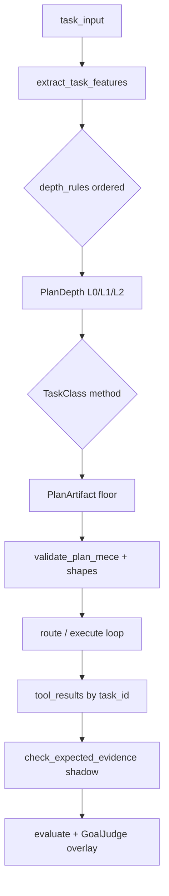

# L0/L1/L2 deterministic floor — ontology-based upgrade research

**Status:** research note — **2026-06-16**, recommendations revised **2026-06-17** (Tier 1 outcome evidence; see baseline blockquote + §7)
**Scope:** External research and internal recommendations for improving the current **L0/L1/L2 deterministic floor** (depth selection, branch extraction, success conditions) while keeping the floor **fully deterministic** — no LLM in routing or decomposition.
**Audience:** Planning pipeline, GoalJudge, and component-layer engineers.
**Related docs:**

- [AGENT_PLANNING_AND_TOOL_SELECTION.md](../Architectures/AGENT_PLANNING_AND_TOOL_SELECTION.md) — current floor ground truth
- [PLANNING_PIPELINE_SYSTEM_DIAGRAM.md](../Architectures/PLANNING_PIPELINE_SYSTEM_DIAGRAM.md) — route/eval topology
- [planning_pipeline_tiered_loops.design.md](../plans/planning_pipeline_tiered_loops.design.md) — tier/depth protocol registry
- [openmanus_comparison.md](openmanus_comparison.md) — negative control; replan/floor trade-offs
- [planning_floor_deterministic_options_tradeoff.md](planning_floor_deterministic_options_tradeoff.md) — **companion decision note**: this doc owns the conceptual *schema*; the companion owns the *decision* (option trade-off ledger + cost-benefit + measured baseline).
- [planning_floor_outcome_validation.tier1_results.md](planning_floor_outcome_validation.tier1_results.md) — **Tier 1 outcome evidence**: offline TaskUnderstanding-vs-depth-cap probe that revised the recommendations here (depth-axis prize bounded; evidence axis unmeasured).
- [planning_floor_baseline_walkthrough.md](planning_floor_baseline_walkthrough.md) — the 59-row multi-surface baseline + the Tier 1 cross-check table.
- [planning_floor_fresh_research_2026H1.md](planning_floor_fresh_research_2026H1.md) — **fresh 2026-H1 external scan** (benchmarked deterministic-routing-with-LLM-on-escalation, "don't plan per query", learned routers/verifiers as the priced ceiling) that re-confirmed the §7 priority.

Protocol IDs (L0/L1/L2, T0–T3, OBP, GTP) are defined in the design doc's §A Protocol Registry.

> **Measured baseline (added 2026-06-17).** The L0-collapse problem this note motivates is **already fixed** by Phase 0. A multi-surface offline corpus (59 rows, `scripts/diagnose_planning_floor.py`) scores **55/59 = 93.2% overall** (branches/conditions/mece/replan all 100%; depth **27/31 = 87.1%**) with **zero L0 collapse**; all 4 depth misses are one family — **L2→L1 under-promotion** on multi-marker prose (pre-Phase-0 was 14-of-17 collapsed to L0; post-fix live depth = 0.917). Read every "benefit" below against that already-strong floor, not the broken one. The option-by-option trade-off and cost-benefit weighing — including the honest "Option A is mostly re-notation" framing and the do-nothing baseline — live in the [companion decision note](planning_floor_deterministic_options_tradeoff.md).
>
> **Tier 1 outcome evidence (added 2026-06-17, [`planning_floor_outcome_validation.tier1_results.md`](planning_floor_outcome_validation.tier1_results.md)).** An offline TaskUnderstanding-vs-depth-cap probe (84 fast-tier calls, captured once) **empirically confirms the §3 "Depth ≠ evidence" / L2-under-promotion failure mode is real, but bounds its prize**: 3 of the 4 multi-marker prose traps stably (spread 0) return a 4-item success checklist while the floor budgets only 3 steps (L1) — so the floor under-budgets, demonstrated without an agent run. **Two caveats keep this corroborating, not causal:** (a) checklist length over-reads the step cap by a near-constant offset (every L0 task is "over cap" too — an acceptance-criteria count is not a planning-step budget), so the traps only stand out *relative to* their correctly-fired L1 peers; (b) the trap margin is one item — the width of ordinary L1 sample jitter (3 correctly-fired L1 rows straddled the cap across samples). **Net for the recommendations below:** the depth-rule fix (Phase A `multi-evidence` / `distinct_marker_count>=3 -> L2`) is now *evidence-backed but small and not outcome-proven*; the **evidence axis (Phase D) is the only un-measured, un-addressed capability** and therefore the higher-ROI first build. See revised §7 priority.

---

## 1. Executive summary

The shipped planning floor is a **two-stage lexical pipeline**:

| Stage | Module | Mechanism |
|-------|--------|-----------|
| **Depth (L0/L1/L2)** | `components/router.py` → `select_planning_depth()` | Additive complexity score + L1 rescue floors + L2 incident promotion |
| **Decomposition** | `components/plan_builder.py` → `_extract_branches()` | Regex priority stack: newlines → `(1)(2)` → sentence periods → comma/semicolon conjunctions |
| **Success conditions** | `components/plan_builder.py` → `derive_success_conditions()` | One condition per branch (cap 6) + generic tail |
| **Structure gate** | `components/plan_builder.py` → `validate_plan_mece()` | Contiguous step IDs, non-overlapping goals, non-empty conditions |

External research (2024–2026) converges on a pattern this codebase already half-implements: **Cognitive–Executive Separation (CES)** — probabilistic reasoning above, deterministic validation below. For L0/L1/L2, the highest-leverage upgrade is **not** a full knowledge graph or OWL reasoner. It is:

1. **Structured feature extraction** (Planning Ontology style) replacing a single additive score
2. **Verb/task-class taxonomy** (FrameNet/VerbNet inspired) replacing growing regex/marker lists
3. **HTN-lite decomposition methods** with evidence-typed success conditions
4. **SHACL-style plan shapes** extending `validate_plan_mece`
5. **Expected-vs-observed evidence checks** at evaluate time (symbolic validator pattern)

All of this stays in `components/`, L1-testable, shadow-deployable, and compatible with existing LLM plan / TaskUnderstanding overlays.

**Where to start (revised 2026-06-17 by the Tier 1 evidence).** Of the five, **#5 (evidence checks) is the recommended first build** — it is the only one that addresses an axis the current floor scores zero on, ships shadow-only, and was *not* the axis the Tier 1 probe found bounded. Items #1–#2 (the depth-routing rules) are now *evidence-backed* — Tier 1 confirmed the L2-under-promotion they would fix is real (3/4 prose traps under-budget) — but the prize is small and not outcome-proven, so they are a refactor-when-justified, not the first move. The full priority rationale and rollout order are in §7; the option-level cost-benefit is in the [companion decision note](planning_floor_deterministic_options_tradeoff.md).

---

## 2. Current implementation (ground truth)

### 2.1 Depth selection

`select_planning_depth(task_input, task_tool_results_count)` returns `(depth, reason)`.

**Hard short-circuit (non-negotiable):**

```python
if task_tool_results_count > 0:
    return "L0", "post-tool-synthesis"
```

Per-task scoping is load-bearing: the caller must filter `tool_results` by `task_id`. A thread-wide count breaks multi-turn UIs and saturation runs (see GJ-012 in [AGENT_PLANNING_AND_TOOL_SELECTION.md](../Architectures/AGENT_PLANNING_AND_TOOL_SELECTION.md)).

**Complexity scoring (when no per-task tool results yet):**

| Signal | +1 when |
|--------|---------|
| Word count (medium) | ≥ 35 words |
| Word count (long) | ≥ 80 words (stacks) |
| Multi-part vocabulary | `compare`, `trade-off`, `architecture`, `migration`, `refactor`, `roadmap`, `design` |
| Conjunctions / list markers | ` and `, ` then `, ` also `, `\n- `, `\n1.` |
| Multi-line shape | ≥ 2 newlines |
| Multi-question shape | ≥ 2 `?` |
| Explicit enumeration | ≥ 2 `(1)`…`(9)` matches |
| Comma-then-and | matches **only if** no multi-part marker fired |

**Thresholds:**

| Score / rule | Depth | Reason |
|--------------|-------|--------|
| ≥ 3 | L2 | `high-complexity-initial-task` |
| incident markers + word_count ≥ 25 | L2 | `incident-narrative` |
| ≥ 2 | L1 | `moderate-complexity-initial-task` |
| leading strong-intent verb | L1 | `strong-intent-verb` |
| word_count ≥ 25 | L1 | `long-task-floor` |
| sequenced multistep regex | L1 | `sequenced-multistep` |
| else | L0 | `simple-initial-task` |

**Step caps:** L0 = 1, L1 = 3, L2 = 5 (`build_plan_artifact`).

**Strong-intent verbs (curated):** `plan`, `design`, `refactor`, `audit`, `migrate`, `implement`, `build`, `investigate`, `debug`, `diagnose`, `optimize`, `redesign`, `trace`, `compare`.

**Incident markers:** `trace how`, `figure out`, `root cause`, `propagat`, `identify every`, `times out`, `sometimes`, `intermitt`, `race condition`.

Source: [`components/router.py`](../../components/router.py), [`docs/Architectures/AGENT_PLANNING_AND_TOOL_SELECTION.md`](../Architectures/AGENT_PLANNING_AND_TOOL_SELECTION.md).

### 2.2 Branch extraction

`_extract_branches(task_input)` splits in priority order:

1. Newlines and bullet/numbered list markers
2. Inline enumeration `(1) … (2) …` or `1. … 2. …`
3. Sentence-period boundaries (path-safe: skips `/workspace/f3.txt`, `v1.2.3`)
4. Comma/semicolon clauses with imperative conjunctions (`, and` / `, then`)

Output feeds `build_plan_artifact`, which slices branches to the depth cap and builds `PlanStep` rows.

Source: [`components/plan_builder.py`](../../components/plan_builder.py).

### 2.3 Success conditions

`derive_success_conditions(branches)`:

- One observable condition per extracted branch (all branches, not depth-truncated slice)
- Deduplicated, capped at 6 (`_MAX_BRANCH_CONDITIONS`)
- Appends generic tail: *"The final answer is internally consistent and directly responds to the request."*

The judge and keyword evaluator consume these when TaskUnderstanding is unavailable or in deterministic/shadow mode.

### 2.4 What consumes the floor

| Consumer | Uses floor for |
|----------|----------------|
| `route_node` | depth, plan artifact, success conditions, T3 eligibility |
| `synthesis_validator` | L1/L2: no open TODOs, answer length ≥ 8 words |
| `evaluate_task_outcome` | keyword overlap on success conditions |
| `GoalJudge` | overlay when enabled; CORRUPT-SUCCESS checks tool evidence |
| Replan on stale plan | **deterministic rebuild only** — no LLM re-plan on surprise |

---

## 3. Known failure modes

| Failure | Example | Root cause |
|---------|---------|------------|
| **L0 collapse** | Composite task on thread with prior tool results | Thread-wide `task_tool_results_count` (fixed for GJ-012; guard remains load-bearing) |
| **Intent vs breadth mismatch** | Short "Plan the Postgres migration." | Additive scorer under-scores; rescued by strong-intent-verb floor |
| **Long path, single action** | Create file with long absolute path | `long-task-floor` can over-promote to L1 |
| **Surface-form brittleness** | Paraphrased multi-step without conjunctions | Regex decomposition misses implicit subtasks |
| **L2 under-promotion** *(Tier-1 confirmed)* | "Audit the architecture, design a migration, refactor…" | Multi-marker prose caps at additive score 2 → L1; Tier 1 measured 3/4 such traps stably needing a 4-item checklist at an L1 cap of 3 |
| **Depth ≠ evidence** *(unmeasured — Phase D target)* | write + shell + live API | L1 budgets steps but conditions are branch text, not evidence types; Tier 1 did not probe this axis — it remains the open, unaddressed gap |
| **Replan narrows** | Surprising tool result | Stale replan uses floor only — safe/cheap, not adaptive |
| **Wrong verification tool** | `ls` presented as file read | Caught by GoalJudge CORRUPT-SUCCESS, not by floor |

Oracle for depth: `cache/goaljudge_eval/depth_strata_rich.jsonl` (11/11 want==fired after Phase 0).

---

## 4. External research landscape (deterministic only)

### 4.1 Cognitive–Executive Separation + SHACL validation

**Sources:** Enterprise KG/agent literature (Masood 2026); GraphGuard / SHACL guardrail stacks; Educative agentic-KG tutorial.

**Pattern:** An untrusted proposer (LLM) may only *propose*; a separate **engine process** validates proposals against ontology constraints (SHACL shapes) and executes only what passes. SHACL uses **closed-world assumption (CWA)** — checks what is present, not what might exist — ideal for deterministic gates.

**Transfer to this codebase:** `build_plan_artifact` / `validate_plan_mece` / `derive_success_conditions` is already a miniature CES engine. Upgrade = **versioned constraint shapes** over a small task/plan ontology, not "add an LLM to routing."

**Implementation options:** pySHACL + RDFLib, or lighter in-repo JSON-schema / rule-table if avoiding new dependencies.

### 4.2 HTN (Hierarchical Task Network) methods as ontology rules

**Sources:** HTN Tutorial (2024); structural complexity analysis (IJCAI 2024, arXiv 2401.14174); FrameCRL (NSF, robotics).

**Pattern:** Compound tasks decompose via **pre-defined methods** until primitive (executable) tasks. Soundness from method preconditions + task network structure, not from the LLM.

**Transfer:** L0/L1/L2 caps are a crude HTN depth budget. An ontology layer adds:

```
TaskClass → Method(decompose) → [SubtaskClass, ...]
SubtaskClass → min_depth, max_steps, required_evidence_type
```

HTN verification is tractable on **structured** networks (bounded depth, bounded branching) — matching caps L0=1, L1=3, L2=5.

### 4.3 Planning Ontology (PO) — feature-based routing

**Sources:** [Planning Ontology (CODS 2024)](https://ai4society.github.io/planning-ontology/); Discover Data 2025; [GitHub: ai4society/planning-ontology](https://github.com/ai4society/planning-ontology).

**Pattern:** Encode domain features and solver capabilities in OWL; use SPARQL / `hasHighRelevance` to select the best planner for a problem instance (IPC competition data).

**Transfer:** We already do "planner selection" for **model tier** and **planning depth**. PO's insight:

> Don't score raw text; extract **structured features**, then route by feature→capability rules.

### 4.4 FrameNet / VerbNet intent ontologies

**Sources:** FrameCRL (deterministic PDDL from FrameNet); FrameNet identification (ACL 2024/2025); ontology population for dialogue intents (RANLP 2021); VerbNet class hierarchies.

**Pattern:**

- **Deterministic stage:** dictionary / LU-tree lookup maps tokens → candidate frames or verb classes
- **Optional probabilistic stage:** LLM disambiguates — **excluded from the floor**

**Transfer:** `_STRONG_INTENT_VERBS` is a hand-maintained subset of VerbNet/FrameNet. FrameCRL result: frame-grounded decomposition beats raw LLM planning on reliability while staying deterministic at the symbolic layer.

### 4.5 Expected vs observed state verification

**Sources:** HVR — hierarchical planning + symbolic validator (MLR 2025); NeurIPS 2025 embodied planning with interactive validation; SAT-Graph API (maximal determinism after ID resolution).

**Pattern:** Decompose → emit **expected postconditions per subtask** → at evaluate, check tool_results against postconditions deterministically.

**Transfer:** Closes the gap between branch-text success conditions and GoalJudge CORRUPT-SUCCESS (wrong verification tool, narrated-but-unverified subtasks).

### 4.6 Neuro-symbolic verification (partial adoption)

**Sources:** NSVIF (2026) — instruction→constraint CSP; neuro-symbolic verifiers survey.

**Pattern:** Model instructions as constraints; verify output with logic checkers (Python/Z3) or semantic checkers.

**Transfer:** Adopt **constraint checking** half only. Do **not** use LLM for constraint extraction in the deterministic floor. Useful for Phase D evidence checker, not depth selection.

### 4.7 Parameterized complexity (design guardrail)

**Source:** Structural complexity of HTN planning (arXiv 2401.14174); FPT theory.

**Rule:** Keep the ontology rule engine **fixed-parameter tractable** — rules keyed on small parameters (`subtask_count_est ≤ 5`, `depth ≤ 2`, `|verb_classes| ≤ 3`) so evaluation stays O(n) on prompt length, <10ms, L1-testable.

---

## 5. Proposed mini-ontology (conceptual schema)

Versioned YAML/JSON in `components/` or `trust/` (pure data, no I/O):

```yaml
# task_planning_ontology_v1.yaml (conceptual — not yet implemented)
schema_version: 1

classes:
  TaskRequest:
    features: [subtask_count, verb_classes, markers, word_count, evidence_types]
  PlanDepth:
    enum: [L0, L1, L2]
  EvidenceType:
    enum: [file_mutation, shell_read, live_api, compare_synthesis, prose_only]

# Total order, first match wins (mirrors select_model branch ordering)
depth_rules:
  - id: post-tool-synthesis
    when: { task_tool_results_count: ">0" }
    then: { depth: L0, reason: post-tool-synthesis }

  - id: incident-diagnosis
    when: { markers: incident, word_count: ">=25" }
    then: { depth: L2, reason: incident-narrative }

  - id: multi-evidence-composite
    when: { evidence_types: ">=2", subtask_count: ">=2" }
    then: { depth: L1, reason: multi-tool-composite }

  - id: strong-intent-verb
    when: { leading_verb_class: [PLAN, INVESTIGATE, COMPARE] }
    then: { depth: L1, reason: strong-intent-verb }

# HTN-lite decomposition methods
methods:
  multi-tool-composite:
    decompose: split_by_branch_extractor  # default method today
    success_condition_templates:
      - "Observable {evidence_type} confirms: {branch_summary}"

# SHACL-style plan shapes (extends validate_plan_mece)
shapes:
  multi-tool-composite:
    require:
      - min_success_conditions: 2
      - distinct_evidence_types: 2
```

### 5.1 Proposed feature vector (all deterministic)

| Feature | Extraction |
|---------|------------|
| `subtask_count_est` | `_extract_branches` output length |
| `has_enumeration` | `(1)(2)` or list markers |
| `has_sequencing` | and-then / comma-and |
| `has_incident_markers` | existing incident set |
| `has_live_data_intent` | weather/stock/API/HTTP verbs |
| `has_file_mutation` | create/write/delete + path pattern |
| `has_verification_step` | read/list/cat/grep after write |
| `imperative_verb_class` | VerbNet/FrameNet lookup or curated map |
| `word_count`, `question_count` | existing |

### 5.2 HTN-lite task classes (priority ROI)

| TaskClass | Precondition signals | Min depth | Notes |
|-----------|---------------------|-----------|-------|
| `CompositeImperative` | ≥2 action verbs OR enumeration | L1 | GJ-012 class |
| `IncidentDiagnosis` | debug/trace/root-cause + length | L2 | Existing promotion |
| `LiveDataQuery` | current/today/live + API/weather/price | L1 | Evidence template |
| `FileThenVerify` | write + list/read/shell | L1 | Multi-tool |
| `CompareTradeoff` | compare/trade-off markers | L1 | Branch-per-entity |
| `SingleShotMutation` | one CREATE verb, subtask_count=1 | L0 | Fixes long-path over-promotion |
| `PostToolSynthesis` | task_tool_results_count > 0 | L0 | Rule 0 |

### 5.3 VerbNet-inspired verb classes (curated subset)

| Verb class | Example lemmas | Implied min depth | Evidence expectation |
|------------|----------------|-------------------|------------------------|
| CREATE | create, write, build, implement | L0–L1 | file/state mutation |
| INVESTIGATE | investigate, debug, diagnose, trace | L1–L2 | tool trace required |
| COMPARE | compare, contrast, evaluate | L1 | multi-branch synthesis |
| QUERY_LIVE | search (external), fetch, query + temporal | L1 | external API result |
| PLAN | plan, design, roadmap | L1 | decomposition expected |

Implementation tiers:

1. **Lightweight:** Expand curated `verb → TaskClass` map (VerbNet-inspired JSON in repo)
2. **Medium:** Frozen FrameNet/VerbNet LU index; lookup first token + head verbs per branch
3. **Heavy:** Full LU tree — only if phrasal verbs ("figure out", "track down") need coverage

---

## 6. Three-layer upgrade architecture

All layers remain pure functions in `components/` — no `langgraph`, no LLM, no I/O.

| Layer | Replaces / augments | Ontology role |
|-------|---------------------|---------------|
| **L0 router** | `select_planning_depth` additive score | `extract_task_features()` + ordered depth rules |
| **L1 plan_builder** | `_extract_branches` + `derive_success_conditions` | TaskClass → Method → step templates + evidence types |
| **L2 evaluate (optional)** | `evaluate_task_outcome` keyword overlap | `check_expected_evidence(plan, tool_results)` |



---

## 7. Recommended rollout (shadow-first)

Aligned with GoalJudge / TaskUnderstanding rollout (`deterministic → shadow → generated/consume`).

> **Priority — revised by the Tier 1 evidence (2026-06-17).** The phases below are written A→D as a *capability* progression, but the build order is **by ROI, not by letter** (this matches the [companion decision note](planning_floor_deterministic_options_tradeoff.md) §7). The Tier 1 probe changed two things:
>
> 1. **Phase D (evidence checker) is the recommended *first* build.** It is the only capability addressing an axis the floor scores **zero** on today (subtask → observable evidence type), it ships **shadow-only** (gates nothing — near-zero rollout risk), and it has a published soundness pattern (ChatHTN verifier-task / HVR §4.5). Tier 1 measured the *depth* axis and found the prize there is small and bounded; it said nothing about the evidence axis, which remains both unmeasured and unaddressed.
> 2. **Phase A's depth rule is now evidence-backed but demoted to a *refactor-when-justified*.** Tier 1 confirms the `multi-evidence` / `distinct_marker_count>=3 -> L2` rule would recover a real failure (3/4 traps under-budget), so it is no longer speculative — but the §1 caveats cap its payoff (corroborating, not causal; one-item margin against L1 jitter; ~80% of Phase A is behavior-neutral re-notation of `router.py` rules per the companion). Build it when regex-maintenance pain or a green-lit Tier 2 A/B justifies it, not first.
> 3. **Phase B/C fold in behind A** (verb classes feed A's feature extraction; HTN-lite methods are the heaviest lift for the least-measured benefit).
> 4. **Hard precondition for *any* depth-touching phase (A/B/C): grow the oracle from 11 to ~30–40 dimensioned rows first** — the multi-surface corpus (§ baseline) is the start of that, but parity testing a depth rule against 11 tuned rows is theater. Phase D (evidence, shadow-only) has no such precondition.
> 5. **Do-nothing on depth remains legitimate** — the floor is at 0.917 live / 87.1% offline-depth; the days may be better spent on the unbuilt T3 nodes or the open governance-trace gate.

### Phase A — Feature ontology (low risk)

1. Add `extract_task_features(task_input) -> TaskFeatures` (pure, Pydantic).
2. Re-express `select_planning_depth` as rules over features; keep legacy scorer as fallback until oracle parity on `depth_strata_rich.jsonl`.
3. Emit `eval.task_features` in shadow (record-only, like `would_downgrade`).

**Tests:** L1 parametrized matrix; failure-first — post-tool-synthesis always L0; no L0 collapse on L1/L2-intended rows.

### Phase B — Verb / task-class ontology

1. Ship frozen `verb_class_map.json` (VerbNet/FrameNet-derived, hand-pruned).
2. Replace growing substring marker lists with class-based triggers.
3. Add `evidence_type` per branch in success condition templates.

**Tests:** GJ-012 regression; long-path single-create stays L0.

### Phase C — HTN-lite decomposition methods

1. Define methods for top-N task classes (composite-imperative, incident, compare, live-query).
2. Keep `_extract_branches` as default method; override only on high-confidence class match.
3. Extend `validate_plan_mece` with shapes: e.g. multi-tool-composite requires ≥2 distinct evidence types in conditions.

**Tests:** MECE + shape rejection cases before acceptance cases (AP6).

### Phase D — Deterministic evidence checker (pre-GoalJudge)

1. `check_expected_evidence(plan, tool_results) -> EvidenceReport` pure function.
2. Shadow-only first; optional later input to `synthesis_validator` or partial outcome.

**Example rule:**

```
Subtask: "list its contents via shell"
ExpectedEvidence: { tool: shell|file_io, pattern: read|list, path_ref: f3.txt }
Observed: tool_results filtered by task_id
Verdict: met | unmet (deterministic)
```

---

## 8. Research-backed benefits

| Benefit | Mechanism | External precedent |
|---------|-----------|-------------------|
| **Explainable routing** | Rule id + matched features in rationale / telemetry | Planning Ontology SPARQL explanations |
| **Parity testing** | Same oracle rows, richer feature assertions | `depth_strata_rich.jsonl` discipline |
| **Evidence-aware floor** | Subtask → EvidenceType in success conditions | HVR symbolic validator; GoalJudge CORRUPT-SUCCESS |
| **Maintainability** | Add class/rule, not another regex edge case | SHACL shapes versioned alongside prompts |
| **LLM plan compatibility** | Ontology validates / floors LLM output | CES; `build_plan_artifact_llm` floor fallback |

---

## 9. Anti-patterns (do not adopt for the floor)

| Anti-pattern | Why |
|--------------|-----|
| Full OWL reasoner on every route | OWA entailment ≠ validation; materialization cost; CI flake risk |
| LLM for depth selection in the floor | Breaks reproducibility; violates L1 CI contract |
| Regex sprawl without taxonomy | Already at maintenance limit (`_STRONG_INTENT_VERBS`, incident markers, comma-then-and gating) |
| Ontology as vector DB substitute | Ontology wins auditable yes/no rules; vectors win fuzzy retrieval — different jobs |
| NSVIF-style LLM constraint extraction in floor | Use deterministic templates only; LLM belongs in GoalJudge overlay |

---

## 10. Competency questions (ontology acceptance bar)

Before implementing `task_planning_ontology_v1`, the schema must answer:

1. **Depth:** Given task T and per-task tool count k, what is the minimum planning depth and why?
2. **Decomposition:** How many subtasks does the floor commit to, and what is the split rationale?
3. **Evidence:** For each subtask, what observable evidence type is required before success?
4. **Synthesis:** When must depth collapse to L0 regardless of text complexity?
5. **Replan:** On stale plan, does the floor re-derive the same fingerprint for unchanged input?
6. **Regression:** For each row in `depth_strata_rich.jsonl`, which rule fired and which features matched?
7. **Corrupt-success:** For GJ multi-tool cases, do success conditions distinguish file / shell / API evidence?

---

## 11. References

### Internal

| Resource | Path |
|----------|------|
| Depth selection | [`components/router.py`](../../components/router.py) |
| Plan artifact / branches / conditions | [`components/plan_builder.py`](../../components/plan_builder.py) |
| Synthesis gates | [`components/synthesis_validator.py`](../../components/synthesis_validator.py) |
| GoalJudge rubric (CORRUPT-SUCCESS) | [`prompts/goal_judge_system_prompt.j2`](../../prompts/goal_judge_system_prompt.j2) |
| Depth oracle | [`cache/goaljudge_eval/depth_strata_rich.jsonl`](../../cache/goaljudge_eval/depth_strata_rich.jsonl) |
| Architecture diagram | [`docs/Architectures/PLANNING_PIPELINE_SYSTEM_DIAGRAM.md`](../Architectures/PLANNING_PIPELINE_SYSTEM_DIAGRAM.md) |

### External

| Topic | Reference |
|-------|-----------|
| Planning Ontology | [ai4society.github.io/planning-ontology](https://ai4society.github.io/planning-ontology/) |
| HTN planning tutorial | [hierarchical-task.net HTN Tutorial 2024](https://hierarchical-task.net/data/tutorials/HTN-Tutorial-2024-1on1.pdf) |
| HTN structural complexity | [arXiv 2401.14174](https://arxiv.org/html/2401.14174) |
| FrameCRL (FrameNet → PDDL) | [NSF PAR 10647561](https://par.nsf.gov/servlets/purl/10647561) |
| HVR (KG-RAG + symbolic validator) | [MLR Proceedings v267](https://proceedings.mlr.press/v267/petruzzellis25a.html) |
| SAT-Graph API (deterministic primitives) | [github.com/hmartim/sat-graph-api](https://github.com/hmartim/sat-graph-api) |
| SHACL as rules engine | [Kurt Cagle — OWL to SHACL](https://ontologist.substack.com/p/converting-from-owl-to-shacl-part) |
| Agentic KG (proposer-critic + SHACL) | [Educative — Agentic Knowledge Graph](https://www.educative.io/blog/how-to-build-an-agentic-knowledge-graph) |
| NSVIF (instruction-following verification) | [arXiv 2601.17789](https://arxiv.org/html/2601.17789v1) |
| Embodied neuro-symbolic planning | [NeurIPS 2025 Code-as-Policies poster](https://neurips.cc/virtual/2025/poster/117673) |
| **Deterministic graph routing, LLM-on-no-path (93% call cut)** *(2026 scan)* | [arXiv 2603.01548](https://arxiv.org/abs/2603.01548) |
| **Task-level vs per-query workflows (83% tokens / 0.6% loss)** *(2026 scan)* | [arXiv 2601.11147](https://arxiv.org/abs/2601.11147) (SCALE) |
| **Dual-signal router: semantic + structural meta-features** *(2026 scan; learned)* | [arXiv 2601.19793](https://arxiv.org/abs/2601.19793) (CASTER) |
| **Learned GNN plan verifier beats rule/LLM verifiers** *(2026 scan; Phase-D ceiling)* | [arXiv 2603.14730](https://arxiv.org/abs/2603.14730) (GNNVerifier) |
| **MAST failure taxonomy (decomposition 41.8% / verification 21.3%)** *(2026 scan)* | Cemri et al., NeurIPS 2025 |

---

## 12. Open decisions

| ID | Question | Default recommendation |
|----|----------|------------------------|
| OD-1 | Where does ontology data live — `components/` JSON vs `trust/` pure types? | Types in `trust/`, rule tables in `components/` or `config/` |
| OD-2 | New dependency (pySHACL) vs in-repo shape validator? | In-repo Pydantic shapes first; pySHACL only if RDF export needed |
| OD-3 | Phase D evidence checker — gate or shadow-only? | Shadow-only until GoalJudge calibration confirms lift |
| OD-4 | Verb map maintenance — manual vs FrameNet dump? | Manual curated v1; FrameNet dump v2 with human prune pass |

---

*This document captures research and recommendations only. No implementation is implied until a plan/issue references specific phases above.*
