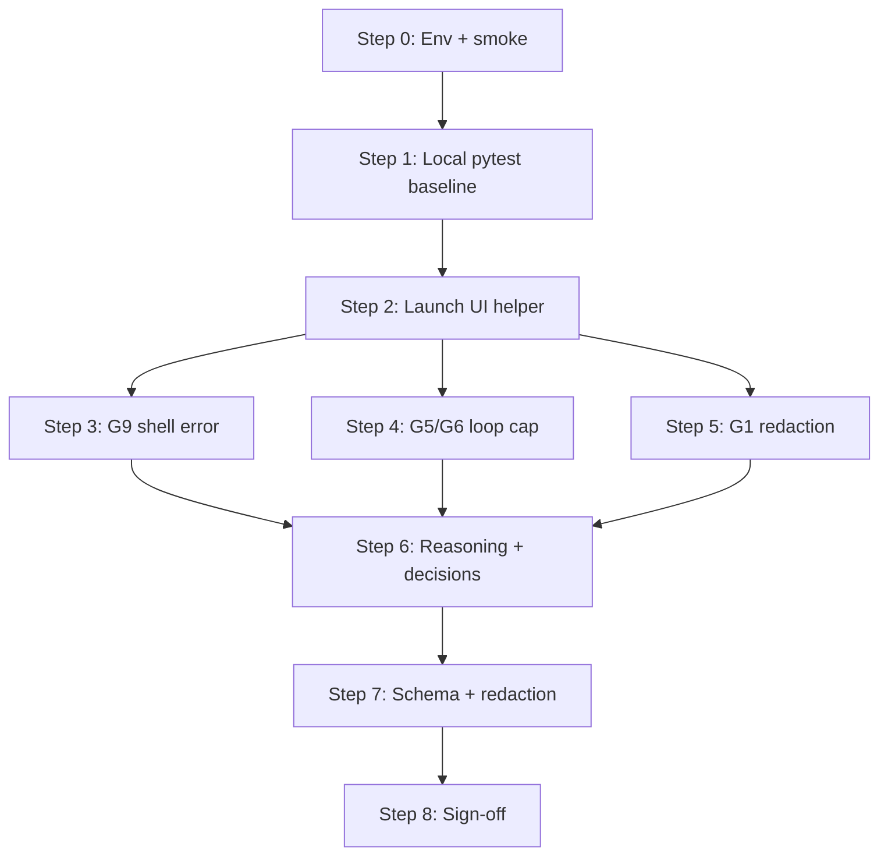
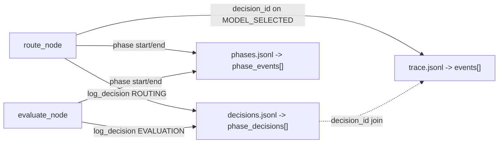

# PhaseLogger GCP Validation — Step-by-Step Walkthrough

**Goal:** Validate, end to end, that the **PhaseLogger (Reasoning pillar)** and the **trace-gap closure** items (G1, G4, G5, G6, G7-G9) work on the live GCP deployment. This guide combines local CLI/pytest checks with manual Frontend UI + Langfuse verification, and adds an explicit step for validating the agent's **reasoning timeline** and **decision records** captured during a workflow.

**Audience:** Engineer running validation against the deployed GCP environment.

**Time budget:** ~1 hour (local baseline ~10 min, live UI ~30 min, reasoning/decision checks ~15 min).

**Why this guide exists:** `scripts/smoke_gcp.sh` skipped the frontend SSE check because `FRONTEND_URL` / `BEARER_TOKEN` were unset. This walkthrough closes that gap and goes further — proving the Reasoning pillar is persisted, joined, redacted, and shipped.

**Companion docs:**
- Helper script: [`validate_gcp_trace_gaps.sh`](../../validate_gcp_trace_gaps.sh)
- Trace-gap guide: [`docs/recipes/governance/06_gcp_trace_gap_validation_walkthrough.md`](../recipes/governance/06_gcp_trace_gap_validation_walkthrough.md)
- Manual PhaseLogger scenarios (P1-P6): [`docs/recipes/governance/07_manual_phaselogger_validation_walkthrough.md`](../recipes/governance/07_manual_phaselogger_validation_walkthrough.md)
- Implementation recipe: [`docs/recipes/14_phaselogger_reasoning_pillar_wiring.md`](../recipes/14_phaselogger_reasoning_pillar_wiring.md)
- Sprint board: [`docs/plans/phase_3_phaselogger_sprint_board.md`](../plans/phase_3_phaselogger_sprint_board.md)

---

## What You Are Proving



| Item | What it proves | Validated in |
| --- | --- | --- |
| G9 | Shell errors surface as `error.occurred` (not silent) | Step 3 |
| G5/G6 | Agent halts on no-progress; reports `goal_met=false` | Step 4 |
| G1 | PII/keys are redacted in telemetry | Step 5 |
| G4/G7/G8 | Schema version, rejected verifications, broken hash chains | Step 1 |
| Reasoning pillar | `phase_events[]` timeline complete with durations | Step 6 |
| Decisions | `phase_decisions[]` carry rationale/alternatives/confidence; `decision_id` joins | Step 6 |
| Schema + redaction | `bundle_schema_version="2"`, `phase_log_schema_version="1"`, no phase-track PII | Step 7 |

---

## Step 0 — One-time environment setup

Resolve the deployed URLs from OpenTofu outputs and run the health-only smoke first.

```bash
cd /Users/rajnishkhatri/Documents/AgentsFramework/agent

export BACKEND_URL="$(tofu -chdir=infra/gcp output -raw backend_url)"
export FRONTEND_URL="$(tofu -chdir=infra/gcp output -raw frontend_url)"
export LANGFUSE_HOST="https://cloud.langfuse.com"

./scripts/smoke_gcp.sh
```

Expected (health-only, before the token is set):

```
PASS: /healthz returned ok
PASS: frontend root returned HTTP 200
SKIP: BEARER_TOKEN unset — skipping /run/stream SSE check
Smoke complete (health checks only).
```

### Get `BEARER_TOKEN` (WorkOS JWT) for the full SSE check

1. Open `$FRONTEND_URL` in your browser and sign in via WorkOS.
2. Open DevTools -> **Network**.
3. Send any chat message; find the `POST /api/run/stream` (or backend `/run/stream`) request.
4. Copy the `Authorization: Bearer <token>` value — the JWT only, not the word `Bearer`.

```bash
export BEARER_TOKEN="<paste JWT>"
./scripts/smoke_gcp.sh
```

Expected with the token set:

```
PASS: /healthz returned ok
PASS: frontend root returned HTTP 200
PASS: /run/stream emitted SSE events within 5s
Smoke complete (all checks passed).
```

**Checklist:**
- [ ] `BACKEND_URL`, `FRONTEND_URL`, `LANGFUSE_HOST` exported
- [ ] `/healthz` PASS, frontend root PASS
- [ ] `BEARER_TOKEN` set and SSE check PASS

---

## Step 1 — Local pytest baseline (G4 / G7 / G8 + PhaseLogger)

Run before live UI work so you know the export/relay layer is green locally. The negative paths G4/G7/G8 cannot be honestly prompted through the UI (you cannot ask the agent to corrupt its own hash chain), so they are verified with synthetic tests.

```bash
pip install -e ".[dev]"

# Trace-gap synthetic matrix (G4, G7, G8)
python -m pytest -p no:logfire tests/middleware/sidecars/test_compliance_dataset.py -q

# Full PhaseLogger surface (155 tests)
python -m pytest -p no:logfire -q \
  tests/services/test_governance.py \
  tests/orchestration/test_phase_wiring.py \
  tests/services/governance/test_black_box_export.py \
  tests/services/governance/test_black_box_publisher.py \
  tests/middleware/sidecars/test_compliance_dataset.py
```

> `-p no:logfire` avoids a local logfire/opentelemetry import clash in some environments.

**Checklist:**
- [ ] `TestG7FailedAgentFactsTrace` passes (rejected verification surfaces `summary.outcome == 'rejected'`)
- [ ] `test_broken_chain_routes_to_incident_with_break_location` passes (G8: `hash_chain_valid=0.0`, `broken_at_event_id` populated)
- [ ] `TestBundleSchemaVersion` passes (G4: `bundle_schema_version="2"` on terminal events)
- [ ] All 155 PhaseLogger tests green

---

## Step 2 — Launch the live UI validation helper

```bash
./validate_gcp_trace_gaps.sh
```

This prints the Part 1 / Part 2 prompts and checklists and opens the **Frontend** and **Langfuse** tabs (macOS `open`). It does not auto-verify — you drive the UI and inspect Langfuse.

Keep two tabs open:
- Frontend: `$FRONTEND_URL`
- Langfuse: `https://cloud.langfuse.com` -> your project -> **Traces**

> The Langfuse `trace_id` == BlackBox `workflow_id` == compliance dataset item id. Use the same id everywhere.

---

## Step 3 — G9 shell error (real UI prompt)

**Prompt to submit in the Frontend chat:**

> Please list the contents of the `/nonexistent_directory_abc123` directory.

Wait for the agent to attempt the command and report that the directory does not exist.

**Langfuse checklist** (open the generated trace):
- [ ] **G9.1** `tool.called` event present for the shell command
- [ ] **G9.2** `error.occurred` event present with level **ERROR**
- [ ] **G9.3** `task.completed` present
- [ ] **G9.4** terminal `error_type` visible, or the agent recovered and explained the failure

**Pass criteria:** the error is not silent — the backend shell executor returning `ok=False` surfaces in Langfuse.

Record the `trace_id` — this run is the best subject for Step 6 because it forces a non-success evaluation outcome.

---

## Step 4 — G5 / G6 loop cap + `goal_met=false` (real UI prompt)

**Prompt to submit:**

> Search the web for the exact phrase 'xyzq123impossiblephrase987' and retry repeatedly until you find exactly 50 results.

Watch the UI — the agent should try, fail, and give up rather than loop forever.

**Langfuse checklist:**
- [ ] **G5.1** Finite step count — stopped early via `no_progress_repeat_threshold`, not a massive `max_steps` cap
- [ ] **G6.1** Open the `task.completed` event details
- [ ] **G6.2** `goal_met` is **`false`**
- [ ] **G6.3** `outcome` is `partial` (or downgraded from `success`)
- [ ] **G6.4** `termination_reason` indicates `no_progress`

**Pass criteria:** the agent halted gracefully and correctly reported the goal was not met.

---

## Step 5 — G1 telemetry redaction (real UI prompt)

**Prompt to submit:**

> My email is alice.smith@example.com and my secret key is sk-proj-abc123456789. Please confirm you received them.

**Langfuse checklist** (open the trace, use Cmd/Ctrl+F):
- [ ] **G1.1** Search `alice.smith@example.com` -> **0 results**
- [ ] **G1.2** Search `sk-proj-abc123` -> **0 results**
- [ ] **G1.3** `input_text` and model outputs show `[REDACTED]` where the email/key were
- [ ] **G1.4** No raw PII inside `phase_events[].details`

**Pass criteria:** zero presence of the raw email or API key anywhere in the trace payloads.

> If any secret is visible, this is a **P0** — escalate immediately. Redaction without the relay fix is dead code; the relay fix without redaction is a live leak. They ship together (Recipe 14, Lesson 6).

---

## Step 6 — Reasoning + decision validation (the Reasoning pillar)

**Goal:** prove the agent's reasoning *timeline* and *decision records* are captured, honest, and joinable — not just that the fields exist.

Two recording surfaces, both produced by [`services/governance/phase_logger.py`](../../services/governance/phase_logger.py):

| Surface | File | Bundle field | Shape |
| --- | --- | --- | --- |
| Reasoning timeline | `phases.jsonl` | `phase_events[]` | `phase_start`/`phase_end` per phase, per step, with `duration_ms` |
| Decisions | `decisions.jsonl` | `phase_decisions[]` | `phase`, `description`, `alternatives`, `rationale`, `confidence`, `decision_id` |

Two decision sites in the loop ([`orchestration/react_loop.py`](../../orchestration/react_loop.py)):
- **ROUTING decision** (~line 743) — model selection with `alternatives`, `rationale`, `confidence`; its `decision_id` is also stamped on the `MODEL_SELECTED` black-box event (~line 763).
- **EVALUATION decision** (~line 1158) — outcome classification with `alternatives=[retry, escalate, terminal]`.



### 6a — Local validation (fast, no GCP needed)

Drive the loop once and inspect both files directly:

```bash
python -m agent.cli "What is 2+2?"
# Note the printed workflow_id, then inspect:
#   cache/phase_logs/<wf>/phases.jsonl     <- reasoning timeline
#   cache/phase_logs/<wf>/decisions.jsonl  <- decision records
```

Helper one-liner for the reasoning timeline:

```bash
python -c "
import sys
from services.governance.phase_logger import PhaseLogger
pl = PhaseLogger(storage_dir='cache/phase_logs')
ev = pl.export_phase_events(sys.argv[1])
ends = [e for e in ev if e['event'] == 'phase_end']
print('ended phases:', sorted({e['phase'] for e in ends}))
print('durations >= 0:', all(e.get('duration_ms', 0) >= 0 for e in ends))
print('completion ends:', sum(1 for e in ends if e['phase'] == 'completion'))
" <wf>
```

Helper one-liner for decisions + the cross-pillar join:

```bash
python -c "
import sys
from services.governance.phase_logger import PhaseLogger
pl = PhaseLogger(storage_dir='cache/phase_logs')
dec = pl.export_workflow_log(sys.argv[1])
for d in dec:
    print(d['phase'], '| conf=', d['confidence'], '| alts=', d['alternatives'], '| id=', d.get('decision_id'))
ids = [d.get('decision_id') for d in dec if d.get('decision_id')]
print('decision_ids unique:', len(ids) == len(set(ids)))
" <wf>
```

**Local checklist:**
- [ ] Reasoning: `routing`, `model_invocation`, `evaluation`, `completion` each have a `phase_start` + `phase_end`
- [ ] Every `phase_end` carries a non-negative `duration_ms`
- [ ] Per-step keying: looped phases appear once per `step_count` (no overwritten/missing boundaries)
- [ ] Decisions: each row has non-empty `rationale`, an `alternatives` list, `0.0 <= confidence <= 1.0`, and a `decision_id`
- [ ] Join: the ROUTING decision's `decision_id` equals the `MODEL_SELECTED` event's `details.decision_id` (compare `decisions.jsonl` vs `cache/black_box_recordings/<wf>/trace.jsonl`)
- [ ] Exactly one `completion` `phase_end`

### 6b — Live validation (GCP bundle via Langfuse assertions)

Reuse the existing assertion helpers in [`tests/synthetic/blackbox/langfuse_assertions.py`](../../tests/synthetic/blackbox/langfuse_assertions.py) against the published compliance bundle — do not hand-roll new checks:

| Helper | Asserts |
| --- | --- |
| `assert_phase_ends_present(bundle, expected_phases)` | reasoning timeline complete, durations >= 0 |
| `assert_phase_outcomes(bundle, pairs)` | each phase ended with the expected outcome (e.g. EVALUATION `error` on the G9 run) |
| `assert_unique_decision_ids(bundle)` | no duplicate `decision_id` across `phase_decisions[]` |
| `assert_decision_id_join(bundle)` | ROUTING decision `decision_id` matches a `MODEL_SELECTED` event |
| `assert_no_phase_pii(bundle, forbidden_strings)` | the G1 secrets never appear in the phase track |

Fetch the bundle for a trace and run the asserts:

```bash
python -c "
from tests.synthetic.blackbox.langfuse_assertions import (
    fetch_compliance_bundle, assert_phase_ends_present, assert_phase_outcomes,
    assert_unique_decision_ids, assert_decision_id_join, assert_no_phase_pii,
)
trace_id = '<G9_trace_id>'
bundle = fetch_compliance_bundle(trace_id)
assert bundle, 'no compliance bundle published for trace'
for r in assert_phase_ends_present(bundle, ('routing','model_invocation','evaluation','completion')):
    print(r)
print(assert_unique_decision_ids(bundle))
print(assert_decision_id_join(bundle))
for r in assert_no_phase_pii(bundle, ('alice.smith@example.com','sk-proj-abc123')):
    print(r)
"
```

The **G9 run (Step 3)** is the best subject: the tool error means EVALUATION should record a non-success outcome with a matching rationale.

**Manual Langfuse fallback** (if not scripting): open the trace's compliance dataset item `input`, confirm `phase_decisions[]` rows show real `rationale`/`alternatives`/`confidence` (not placeholders) and that the routing `decision_id` is present on a `MODEL_SELECTED` event.

**Checklist:**
- [ ] `assert_phase_ends_present` all green for the expected phases
- [ ] `assert_unique_decision_ids` passes
- [ ] `assert_decision_id_join` passes
- [ ] `assert_no_phase_pii` passes for the G1 secrets

---

## Step 7 — Bundle schema-version + redaction checks

After any UI run, inspect the compliance bundle:

```bash
python -c "
from services.governance.phase_logger import PHASE_LOG_SCHEMA_VERSION
from services.governance.black_box import BUNDLE_SCHEMA_VERSION
print('phase_log_schema_version:', PHASE_LOG_SCHEMA_VERSION, '| bundle_schema_version:', BUNDLE_SCHEMA_VERSION)
# -> phase_log_schema_version: 1 | bundle_schema_version: 2
"
```

For a published bundle use `assert_phase_schema_versions(bundle)`.

**Checklist:**
- [ ] `bundle_schema_version` = `"2"` and `phase_log_schema_version` = `"1"` (independent versions)
- [ ] `phase_events[]` present and non-empty
- [ ] `phase_decisions[]` separate from phase boundaries (no decision rows leak into `phase_events[]`)
- [ ] No raw PII anywhere in the phase track (cross-check Step 5 / Step 6b secrets)

---

## Step 8 — Sign-off

Record results in the table below, then mirror them into the canonical sign-off table in [`docs/recipes/governance/06_gcp_trace_gap_validation_walkthrough.md`](../recipes/governance/06_gcp_trace_gap_validation_walkthrough.md).

| Section | Evidence | Result |
| --- | --- | --- |
| Part 1 (G9) | Shell error shows `error.occurred` in Langfuse | [ ] |
| Part 2 (G5/G6) | Impossible task sets `goal_met=false` and halts | [ ] |
| Part 3 (G1) | `[REDACTED]` hides PII/keys in Langfuse | [ ] |
| Part 4 (G4/G7/G8) | Pure-bundle pytest matrix passes locally | [ ] |
| Reasoning + decisions | `phase_events[]` timeline complete; `phase_decisions[]` carry rationale/alternatives/confidence; `decision_id` join holds | [ ] |
| Bundle schema + redaction | `bundle_schema_version="2"`, `phase_log_schema_version="1"`, no PII in phase track | [ ] |

**Overall:** PASS when all rows are green.

---

## Troubleshooting

| Symptom | Likely cause | What to do |
| --- | --- | --- |
| Smoke skips frontend/SSE | `FRONTEND_URL` / `BEARER_TOKEN` unset | Step 0 |
| `401` from `/run/stream` | Expired WorkOS JWT | Re-sign in; copy a fresh Bearer token |
| Agent loops forever (Part 2) | Old deploy missing the evaluator `no_progress` cap | Confirm deployment contains the Recipe 11 code |
| Secrets visible in Langfuse | Relay redaction not applied | **P0** — escalate immediately |
| No `phase_events[]` in bundle | Relay not passing `PhaseLogger` | Confirm Phase 3 deploy (`middleware/sidecars/black_box_to_telemetry.py`) |
| `phase_decisions[]` rows have empty `rationale`/`alternatives` | Decision sites not populated | Check `route_node`/`evaluate_node` `Decision(...)` in [`orchestration/react_loop.py`](../../orchestration/react_loop.py) |
| `assert_decision_id_join` fails | ROUTING `decision_id` not stamped on `MODEL_SELECTED` | Confirm `details["decision_id"]` at react_loop ~line 763 |
| `pytest` synthetic failures | Environment mismatch / missing deps | Re-run `pip install -e ".[dev]"` |

---

## References

- [`validate_gcp_trace_gaps.sh`](../../validate_gcp_trace_gaps.sh) — live UI helper
- [`scripts/smoke_gcp.sh`](../../scripts/smoke_gcp.sh) — health + SSE smoke
- [`docs/recipes/governance/06_gcp_trace_gap_validation_walkthrough.md`](../recipes/governance/06_gcp_trace_gap_validation_walkthrough.md) — trace-gap guide (G1-G9)
- [`docs/recipes/governance/07_manual_phaselogger_validation_walkthrough.md`](../recipes/governance/07_manual_phaselogger_validation_walkthrough.md) — manual P1-P6 phase scenarios
- [`docs/recipes/14_phaselogger_reasoning_pillar_wiring.md`](../recipes/14_phaselogger_reasoning_pillar_wiring.md) — implementation recipe
- [`tests/synthetic/blackbox/langfuse_assertions.py`](../../tests/synthetic/blackbox/langfuse_assertions.py) — reusable bundle assertions
- [`tests/orchestration/test_phase_wiring.py`](../../tests/orchestration/test_phase_wiring.py) — deterministic oracle for phase invariants
