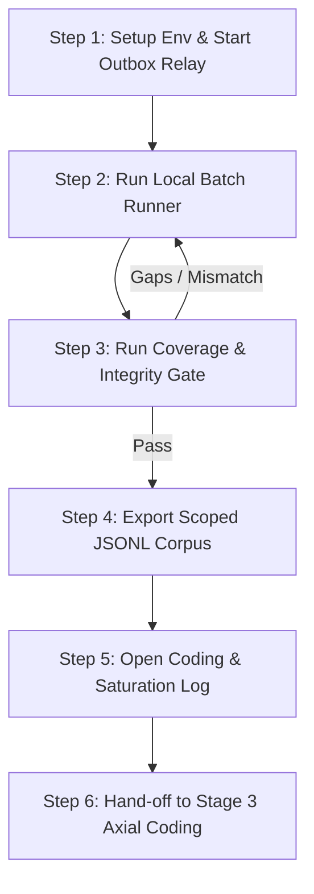

# GoalJudge Synthetic Saturation Corpus — Step-by-Step Walkthrough

**Goal:** Create a structured synthetic corpus sized for stratified coverage to saturation of the seeded taxonomy (~3-5 examples per failure code across 19 distinct codes, single coder). This walkthrough details how to run the synthetic prompt matrix, verify the coverage/integrity gate, export the joined telemetry corpus, and perform Phase 2b open coding as a hand-off to Stage 3 axial coding.

**Audience:** Engineer or researcher building the GoalJudge validation and calibration datasets.

**Time budget:** ~45 min (Step 1 setup ~5 min, Step 2 running batch runner ~15 min, Step 3 coverage verification ~10 min, Step 4 corpus export ~5 min, Step 5 open-coding audit ~10 min).

**Why this guide exists:** Eliciting rare or edge failure modes (such as database permission errors, system-level stubs, or CoT-gaming/hallucination) from normal user prompts is highly unpredictable. Following Shankar/Hamel's "generate inputs, not outputs" framework, this guide provides a repeatable programmatic path to elicit, verify, and export real agent failures to satisfy the **theoretical saturation** of the failure taxonomy.

**Prompt matrix (manual, case-by-case):** For every `GJ-*` prompt with deterministic trace IDs and LF/EC checklists (mirroring walkthrough 02's P1–P5 section), see [**04 — Synthetic prompt matrix manual walkthrough**](04_goaljudge_synthetic_prompt_matrix_manual_walkthrough.md). Regenerate that file after editing [`case_registry.py`](../../tests/fixtures/goaljudge/case_registry.py) with `python scripts/generate_goaljudge_manual_walkthrough.py`.

---

## The Workflow Pipeline



---

## Step 1 — Setup Environment & Start Outbox Relay

The batch runner executes the agent locally and writes events to the local SQLite database. To ensure these events are successfully transmitted to Langfuse, the outbox relay (sidecar) must be running.

1.  **Configure environment variables:**
    Ensure you have your developer keys and endpoint configured in your active terminal:
    ```bash
    export OPENAI_API_KEY="sk-..."
    export LANGFUSE_PUBLIC_KEY="pk-lf-..."
    export LANGFUSE_SECRET_KEY="sk-lf-..."
    export LANGFUSE_HOST="https://cloud.langfuse.com"
    ```

2.  **Start the Outbox Relay:**
    Open a **separate terminal window** and run the out-of-process relay sidecar:
    ```bash
    # From the repo root
    python -m middleware.sidecars
    ```
    This process will run forever, polling the local database every 1.0s and publishing events up to Langfuse. Keep this terminal open during the entire run.

---

## Step 2 — Run Local Batch Runner

The programmatic batch runner reads the live prompt matrix defined in `tests/fixtures/goaljudge/case_registry.py`, truncates the local `logs/evals.log` to isolate this batch run, and executes each case locally. 

Each case runs under:
*   A dedicated scoping `user_id`: `"synthetic-saturation-user"`.
*   A deterministic 32-hex trace/task/workflow ID computed via `uuid.uuid5(uuid.NAMESPACE_DNS, case_id).hex` (e.g. `GJ-001` always produces the same trace ID). This eliminates any risk of row pollution.

1.  **Run the complete batch:**
    ```bash
    python scripts/run_goaljudge_synthetic_batch.py
    ```
    *   The script will report the total count of live cases and prompt for confirmation.
    *   Confirm by typing `y`.
    *   To bypass confirmation (e.g. in headless automation), use `python scripts/run_goaljudge_synthetic_batch.py --yes`.

2.  **Run a specific case (for debugging or re-running):**
    If a single case fails or needs to be re-run, specify its case ID:
    ```bash
    python scripts/run_goaljudge_synthetic_batch.py --case GJ-001
    ```

---

## Step 3 — Run Coverage & Integrity Gate

Once execution completes and the outbox relay has flushed all observations to Langfuse, run the coverage and integrity gate script to verify the corpus.

```bash
python scripts/verify_goaljudge_coverage.py
```

This verification script performs two critical operations:
1.  **Integrity and Scoping Boundaries:** Checks `set(exported_trace_ids) == set(intended_case_ids)`. It asserts there are no orphan rows (cases that failed to run) and no foreign rows (runs from other users polluting the dataset).
2.  **Expected vs Observed Verdict Axes:** Compares expected axes (`goal_met`, `graceful_failure`, `partial_fraction`) with observed outcomes.
    *   *Critical Grounded-Theory Rule:* If there is a mismatch, the script records the mismatch as a **valuable empirical divergence** (data for potential J2/J3 judge failure or novel agent code candidates), **never re-rolls to force a match**.

If all criteria are met, the script exits with `0`. If under-saturation or row pollution is detected, it flags the issue and exits with `1`.

---

## Step 4 — Export Scoped JSONL Corpus

After passing the coverage gate, export the final joined telemetry corpus. This merges the Langfuse half (trajectory + outcome + `goal_met`) with the local `eval_capture` half (full verdict, rationale, per-criterion, `config_source`).

1.  **Export the corpus:**
    Run the export script filtered to our dedicated batch `user_id`:
    ```bash
    python scripts/export_goaljudge_corpus.py --user-id "synthetic-saturation-user"
    ```

2.  **Verify output artifact:**
    Confirm that the exported JSONL file has been successfully written and contains the unified schema:
    ```bash
    head -n 2 cache/goaljudge_eval/run.jsonl
    ```
    Ensure that each row contains the fields `provenance` (`"live"`), `stratum`, and `target_code`.

---

## Step 5 — Open Coding & Saturation Log

With the exported corpus in hand, a researcher annotates each trace to reach **theoretical saturation** of the taxonomy. 

### 5.1 Open Coding Protocol
1.  Open `cache/goaljudge_eval/run.jsonl`.
2.  Inspect the chronological trajectory and the final answer.
3.  Assign qualitative open codes (up to 3 per case) to the `open_codes` list, utilizing the **First-Failure Rule** to identify the primary root-cause code.
4.  Record any instances of Judge Criterion Conflation (J2) or Outcome Bias (J3) in the coding log.

### 5.2 Saturation Log Audit
Check the saturation log (added to the Phase 2b open-coding report). Saturation is mathematically reached when the **last ~20 annotated cases reveal no brand-new failure codes**. 

*   *If a new code emerges:* Update the dimension space mapping, author new prompts to cover the new code to saturation (≥ 3 examples), and re-run.
*   *If saturated:* Proceed to Step 6.

---

## Step 6 — Hand-off to Stage 3 Axial Coding

Once the corpus is verified and saturated, the raw qualitative phase is complete. The exported and annotated `run.jsonl` is handed off to Stage 3 (Axial Coding), where codes are clustered into a finalized, counted failure taxonomy config to drive Stage 4 Rubric Design.
