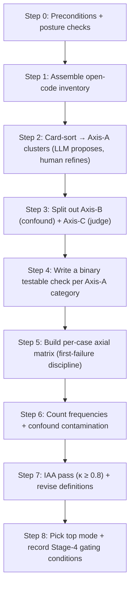

# GoalJudge Axial Coding & Failure Taxonomy — Manual Walkthrough

> **Companion to** [Phase 3 axial coding report](../research/goaljudge_phase3_axial_coding.md). This
> guide is the **executable procedure** that *produces* (or re-produces) that report. Where the report
> is the artifact, this is the recipe.

**Goal:** Run the **Stage 3 axial coding + failure taxonomy** exercise — cluster the Stage-2 open
codes into a small set of named, counted, *testable* categories across **three orthogonal axes**
(A agent-behavior · B harness/environment confound · C judge reliability), build the per-case axial
matrix, count frequencies, and pick the top failure mode to build the judge for.

**Audience & format:** A **human analyst working with an agentic code assistant** (Claude Code /
Cursor). This is deliberately a *paired* exercise. The cardinal rule from the
[pipeline playbook](../research/goaljudge_evaluation_pipeline_open_axial_coding_rubric.md) and from
Hamel/Shankar's error-analysis method: **the LLM proposes, the human disposes.** Never delegate the
first-pass judgment, the cluster names, or the saturation verdict to the model.

**Time budget:** ~3–4 hours for GJ-001–GJ-022 (setup ~20 min; steps 1–4 ~90 min; matrix + counts
~60 min; IAA pass ~30 min). Smoke path: cluster just A2 + build the GJ-010 matrix row (~30 min).

**Why this guide exists:** Walkthrough **04** runs the *prompts* and records *open codes* (Stage 2).
This guide takes those open codes and **clusters them into the failure taxonomy** (Stage 3) — the
"most important step" in error analysis, and the input to the Stage 4 rubric.

**Companion docs:**
- Phase 3 report (the artifact this fills in): [`goaljudge_phase3_axial_coding.md`](../research/goaljudge_phase3_axial_coding.md)
- 19-code codebook + first-failure rule: [`goaljudge_synthetic_dimension_space.md`](../research/goaljudge_synthetic_dimension_space.md)
- Stage-2 evidence (open codes per case): [`goaljudge_manual_walkthrough_gj001_gj022_session_report.md`](../reports/goaljudge_manual_walkthrough_gj001_gj022_session_report.md)
- Phase 2b saturation + 5-cluster seed: [`goaljudge_phase2b_open_coding.md`](../research/goaljudge_phase2b_open_coding.md)
- Pipeline method + references: [`goaljudge_evaluation_pipeline_open_axial_coding_rubric.md`](../research/goaljudge_evaluation_pipeline_open_axial_coding_rubric.md)
- Axis-B fix-first critical evaluation: [`goaljudge_axis_b_remediation_strategy.md`](../research/goaljudge_axis_b_remediation_strategy.md)

---

## What you are producing

| Output | Lands in |
|---|---|
| 3-axis taxonomy (A/B/C) with member codes | Phase 3 report §3–§5 |
| Binary testable check per Axis-A category | Phase 3 report §3 (Stage-4 rubric seeds) |
| Per-case axial matrix GJ-001–GJ-022 | Phase 3 report §6 |
| Provisional frequency + contamination map | Phase 3 report §6.1–§6.2 |
| κ (IAA) + revised definitions | Phase 3 report §2, §7 |
| Top-mode pick + gating conditions | Phase 3 report §6.3, §7 |

---

## Role split (read before Step 1)

| The **human analyst** owns | The **agent assistant** (Claude/Cursor) owns |
|---|---|
| Final **cluster names** and the accept/reject on every proposed grouping | **Exporting** the open-code notes to a CSV/table from the source docs |
| The **"is this the agent's fault or the harness's?"** decision (Axis A vs B) | **Proposing** 5–6 candidate clusters from the inventory ("here is a starting point") |
| The **"is this testable?"** gate on every category | **Drafting** per-case matrix rows by reading the session report |
| **IAA adjudication** and the κ-threshold call | **Computing** frequency counts and co-occurrence tallies from the matrix |
| The **top-mode** decision and **saturation/gating** verdict | **Drafting** category definitions + the testable-check wording for human edit |
| First-pass coding of any *new* trace (never delegated) | Surfacing *contradictions* between final-answer claims and tool evidence |

> **Anchor (playbook R3/R12):** "The LLM provides a starting point, not a final answer… always
> review and refine the clusters yourself." Do the **initial** open coding yourself; only *then* let
> the model cluster.

---

## Step 0 — Preconditions & posture checks

**Goal:** confirm you have clean inputs and know which environment the evidence came from.

**Analyst action:**
1. Confirm the three Stage-2 inputs exist and are current: the codebook, the Phase 2b saturation log,
   the GJ-001–GJ-022 session report.
2. Record the **environment posture** the evidence was collected under — this determines Axis-B
   contamination:
   - `curl -s "$BACKEND_URL/healthz" | jq '.goal_judge'` — expect `source: gcs:ops/goal_judge_config.json`
     when the file-backed judge posture is live (else `goal_met` is heuristic-only; flag it).
   - `gsutil cat gs://$GCS_FACTS_BUCKET/ops/goal_judge_config.json` — confirm `goal_judge_enabled`.
   - Note whether runs were **GCP-UI** (random `workflow_id`, WorkOS `user_id`, live SearXNG) or
     **local batch** (deterministic `trace_id`, `synthetic-saturation-user`, possibly stubbed search).
     This *is* Axis-B5 and gates every count.

**Prompt to the agent:**
> "Read `docs/reports/goaljudge_manual_walkthrough_gj001_gj022_session_report.md` and list, per case
> GJ-001–GJ-022: the environment (GCP-UI vs batch), the `workflow_id`/`trace_id`, whether a
> `goal_judge` eval_capture row exists, and the LF `goal_met` vs target. Output a table. Do not
> interpret yet — just extract."

**Acceptance check:** you have a 22-row environment table and know that **0** cases have a
`goal_judge` EC row (the E1 gap) — so Axis-C confirmation is pending.

---

## Step 1 — Assemble the open-code inventory

**Goal:** one deduplicated list of every open code observed, with its source.

**Analyst action:** decide the inventory's *scope* — it must include both the **19 codebook codes**
*and* the **emergent environment/judge codes** the session surfaced (`shell-allowlist-block`,
`shell-metachar-block`, `workspace-mount-missing`, `tool-error-to-terminal`, `lf-goal-met-drift`,
`lf-criteria-drift`, etc.). Those emergent codes are the whole reason Stage 3 needs Axes B and C.

**Prompt to the agent:**
> "From the codebook (`goaljudge_synthetic_dimension_space.md` §2–3), the Phase 2b saturation log,
> and the session report §5.2 (recurring tool-failure modes) + per-case `Coding` lines, produce one
> deduplicated CSV: `code, short_definition, source_doc, first_seen_case`. Include emergent env/judge
> codes, not just the 19 codebook codes. Flag any code that appears under more than one name."

**Acceptance check:** the CSV has the 17 agent-behavior codes + 2 judge codes + the ~6 emergent
env codes, no duplicates, each with a one-line definition. **You (human) read every row** — this is
your first-pass review; do not skip it.

---

## Step 2 — Card-sort into Axis-A clusters (LLM proposes, human refines)

**Goal:** group the **agent-behavior** codes into 5–6 named, *actionable* categories.

**Prompt to the agent:**
> "These are open codes from analysis of LLM agent traces. From the **agent-behavior codes only**
> (exclude environment-sandbox and judge codes for now), propose 5–6 axial categories. For each:
> a name, a one-line definition, and its member codes. Reject groupings that are too broad to write a
> pass/fail check for."

**Analyst action (the disposing):**
- Compare the proposal to the Phase 2b §4 seed (5 clusters) and the report's A1–A5. **Rename** to
  intent, not vibes. **Reject** any category you can't imagine a binary check for ("capability
  limitations" → reject; "presents partial work as complete" → keep).
- Confirm `partial-counted-as-full`, `subtask-dropped`, `fabricated-progress` land together — this
  is the **"corrupt success"** cluster (external anchor: [arXiv 2603.03116](https://arxiv.org/abs/2603.03116)).

**Acceptance check:** 5 named Axis-A categories; every agent-behavior code assigned to exactly one;
no orphan, no code in two clusters.

---

## Step 3 — Split out Axis-B (confound) and Axis-C (judge)

**Goal:** the analytically critical move — separate "the agent failed" from "the harness blocked the
agent" and "the judge misjudged."

**Analyst action — apply the decision rule to each *non*-behavioral code:**

> **Axis-B test:** *"Could a perfectly-reasoning agent have succeeded in this environment?"* If **no**
> (the required tool is allowlist-blocked, the path is outside the boundary, the orchestrator aborted
> on a non-fatal tool error), it is a **confound (B)**, not an agent failure.
>
> **Axis-C test:** *"Is the defect in the evaluator's verdict rather than the agent's behavior?"*
> (e.g. `goal_met=true` where the agent's own evidence says false) → **judge reliability (C)**.

Cluster B codes into testable confound categories (the report's B1–B5: allowlist-block,
metachar-block, path/mount-mismatch, tool-error-to-terminal, telemetry/env-split). Map C codes onto
the existing judge codes (`criterion-conflation` J2, `outcome-bias-on-graceful-failure` J3).

**Prompt to the agent:**
> "For each environment/judge code, apply this rule: [paste the Axis-B and Axis-C tests]. Output a
> table `code → axis (B/C) → proposed category → which Axis-A counts it contaminates`. Cite the
> session-report case(s) where each was observed."

**Acceptance check:** every emergent code sits on B or C with a contamination note. You now know,
per case, whether its Axis-A code is *trustworthy* or *sandbox-shaped*.

---

## Step 4 — Write a binary testable check per Axis-A category

**Goal:** turn each Axis-A category into the seed of a Stage-4 rubric criterion.

**Analyst action:** for each A1–A5, write **one** yes/no question answerable from observable trace
evidence (tool outputs/state), *not* from the agent's narration. Example (A2): *"Is every required
subtask verified by observable tool evidence, AND does the final answer's success claim match that
evidence?"* If you can't phrase it as a check, the category is too broad — go back to Step 2.

**Prompt to the agent:**
> "Draft a single binary pass/fail check for each Axis-A category, grounded in observable tool
> evidence rather than the agent's claims. Keep each to one sentence."

**Acceptance check:** 5 one-sentence checks; each is decidable from a trace without trusting the
final answer's prose (the anti-gaming property — [arXiv 2601.14691](https://arxiv.org/abs/2601.14691)).

---

## Step 5 — Build the per-case axial matrix (first-failure discipline)

**Goal:** code GJ-001–GJ-022 on all three axes.

**Analyst action — enforce first-failure discipline** (codebook §4.2): walk each trajectory Step 0 →
termination; the **first** deviation is the **primary** Axis-A code; cascades are secondary. Watch for
the trap where an Axis-B block (e.g. `shell-allowlist-block`) is the *real* first event and the
Axis-A target code never actually got exercised (GJ-007/GJ-009 — flag with the `†` convention).

**Prompt to the agent:**
> "For each case GJ-001–GJ-022, read its session-report section and draft a matrix row:
> `case, run, Axis-A primary, Axis-A secondary, Axis-B codes, Axis-C codes, LF goal_met vs target,
> counts-toward-A-saturation?`. Use the §5.3 eligibility verdict for the last column. Apply the
> first-failure rule: primary = first trajectory deviation. Do NOT invent codes not supported by the
> trace evidence in the report."

**Analyst action (verify, don't accept):** for ≥5 cases, open the session-report subsection and
confirm the drafted codes match the actual evidence. **Reject any code the agent inferred but the
trace doesn't show.** This is the load-bearing review — the matrix is only as good as this pass.

**Acceptance check:** 22+ rows (runs A/B split where present); every primary code traces to a
specific report subsection; `correct-complete` shown as a *target miss*, not a failure code.

---

## Step 6 — Count frequencies + confound contamination

**Goal:** provisional frequency tables that honestly flag their own contamination.

**Prompt to the agent:**
> "From the matrix: (1) tally Axis-A **primary** codes per category; (2) tally Axis-B confound
> frequency; (3) compute how many cases carry ≥1 Axis-B code; (4) list Axis-A↔Axis-B co-occurrences.
> Label every Axis-A count `provisional` and note which confound contaminates it."

**Analyst action:** sanity-check the arithmetic by hand for at least the top category. Confirm the
headline finding holds: **the modal "failure" is the sandbox blocking a required command**, not agent
reasoning (most cases carry an Axis-B code).

**Acceptance check:** frequency tables recomputable from the matrix; every Axis-A count carries a
`provisional` + contamination flag.

---

## Step 7 — IAA pass (κ ≥ 0.8) and revise definitions

**Goal:** prove the taxonomy is *consistently applicable* by someone other than its author.

**Analyst action:**
- Have a **second analyst** (or a **second model** as a stand-in, clearly noted as weaker evidence)
  independently re-code a ≥10-case sample using only the category definitions + testable checks —
  **not** seeing your matrix.
- Compute **Cohen's κ** on the Axis-A primary code. Target **κ ≥ 0.8** (MAST/2603.06847 bar). If
  κ < 0.8, the disagreements show you *which definitions are ambiguous* — revise those definitions
  and re-code. This is expected (criteria drift — [EvalGen, arXiv 2404.12272](https://arxiv.org/abs/2404.12272)).

**Prompt to the agent (as second coder, if used):**
> "Independently code these 10 cases on Axis-A using ONLY these definitions and checks: [paste].
> Do not read the existing matrix. Output `case → primary code` with a one-line justification."

**Acceptance check:** κ recorded in the report; any definition that caused a disagreement is revised;
re-code converges. (If a real second human isn't available, record κ-vs-model as *provisional* and
list "human IAA" as an open §7 gate.)

---

## Step 8 — Pick the top mode + record Stage-4 gating conditions

**Goal:** decide what the first judge/rubric should target, and what must clear before building it.

**Analyst action:**
- Pick the **biggest, cleanest-aligned** Axis-A category as the top mode (per playbook: "build one
  judge for your biggest issue first"). In this session that is **A2 corrupt-success**
  (`partial-counted-as-full`) — most primary cases + tightest target alignment (GJ-010/GJ-011).
- **Gate it.** Because counts are confound-contaminated and EC rows are missing, record the
  conditions that must clear before Stage 4 (report §7): registry-prompt batch re-run with
  `synthetic-saturation-user`, `eval.goal_judge` export (E1), Axis-B environment corrections, GCS
  posture confirmed, human IAA κ ≥ 0.8.

**Acceptance check:** the Phase 3 report's §6.3 (top mode) and §7 (gate) are filled and marked
**PROVISIONAL** until those conditions clear.

---

## Anti-patterns (do not do these)

| Anti-pattern | Why it corrupts Stage 3 |
|---|---|
| Letting the agent **invent counts** not grounded in trace evidence | Frequencies become fiction; Stage-4 priorities are wrong. The agent drafts; the human verifies against traces. |
| **Folding Axis-B confounds into Axis-A** clusters | "Sandbox blocked the agent" gets counted as "agent failed" — poisons every Stage-4 rubric criterion. |
| **Counting a confounded run** toward behavioral saturation | A `shell-allowlist-block` run never exercised the target behavior; it is not evidence for it. |
| **Freezing definitions before the IAA pass** | Ambiguous categories only surface under a second coder; freezing first bakes in the ambiguity. |
| Accepting **over-broad categories** ("capability limitations") | Not testable ⇒ not a rubric criterion ⇒ useless to Stage 4. |
| Delegating the **first-pass coding** or the **cluster names** to the model | Violates the playbook's core rule; the model confirms your priors instead of surfacing reality. |

---

## Sign-off checklist

- [ ] Environment posture recorded (GCS source, UI vs batch) — Axis-B5 scope known
- [ ] Open-code inventory deduplicated, human-reviewed
- [ ] 5 Axis-A categories named; every agent-behavior code assigned exactly once (no orphans)
- [ ] Axis-B and Axis-C codes split out via the explicit decision rule, with contamination notes
- [ ] One binary, evidence-grounded testable check per Axis-A category
- [ ] Per-case matrix GJ-001–GJ-022 built with first-failure discipline; ≥5 rows human-verified
- [ ] Provisional frequency + confound-contamination tables, recomputable from the matrix
- [ ] IAA pass run; κ recorded; ambiguous definitions revised (or human-IAA listed as open gate)
- [ ] Top mode picked (A2) and **gated** on the §7 conditions
- [ ] Phase 3 report updated and clearly marked **PROVISIONAL / GATED**
