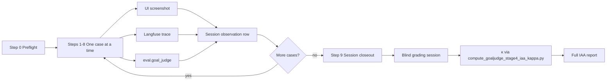

# GoalJudge Stage 4 A2 IAA — Case Walkthrough Procedure

> **Companion to** [Stage 4 IAA README](../IAA/goalJudge/README.md) and
> [A2 rubric spec §8](../research/goaljudge_stage4_a2_rubric_spec.md). This guide is the
> **executable procedure** for the observations-only session that precedes blind human grading.

**Goal:** Review all 8 IAA anchor cases one at a time — UI screenshot, Langfuse trace, and
`eval.goal_judge` observation when available — and record **factual observations only** (no
`a2_fail` / `goal_met` / `partial_fraction` verdicts). The session log feeds a later blind
grading pass and the full IAA results report.

**Audience & format:** A **human analyst working with an agentic assistant** (Cursor). Cardinal rule
(from [walkthrough 05](./05_goaljudge_axial_coding_failure_taxonomy_walkthrough.md)): **the human
disposes**; the agent proposes summaries and surfaces contradictions.

**Time budget:** ~15–20 min × 8 cases ≈ 2–2.5 hours, plus ~20 min preflight.

**Companion docs:**
- IAA instrument: [`goalJudge/README.md`](../IAA/goalJudge/README.md)
- A2 rubric + boundaries: [`goaljudge_stage4_a2_rubric_spec.md`](../research/goaljudge_stage4_a2_rubric_spec.md)
- Session log (this run): [`goaljudge_stage4_a2_iaa_walkthrough_session_2026-06-09.md`](../IAA/goalJudge/goaljudge_stage4_a2_iaa_walkthrough_session_2026-06-09.md)
- Full IAA report (after blind grade): [`goaljudge_stage4_a2_iaa_results.md`](../IAA/goalJudge/goaljudge_stage4_a2_iaa_results.md)
- κ script: [`scripts/compute_goaljudge_stage4_iaa_kappa.py`](../../scripts/compute_goaljudge_stage4_iaa_kappa.py)

---

## What you are producing



| Output | Lands in |
|---|---|
| Per-case observation blocks (8) | Session log |
| DOM render pre-classification | Session log §Preflight |
| Executive summary table | Session log §Closeout |
| Cross-case themes + handoff checklist | Session log §Closeout |
| Blind grader verdicts + κ | Grader sheet CSV → results report |

**Out of scope for this walkthrough:** filling `r1_*` / `r2_*` columns or opening the answer key.

---

## Role split

| The **human analyst** owns | The **agent assistant** owns |
|---|---|
| Claim-vs-evidence judgment in prose | Load screenshot + JSONL row for the case |
| Boundary calls (A2 vs A1/A3/A5) in **observations**, not verdicts | Summarize Langfuse tool trajectory from pasted/exported trace |
| Saturation / "ready for blind grade?" per case | Flag UI-vs-Langfuse divergence (render gap, C-axis drift) |
| Blind `a2_fail` / `goal_met` / `partial_fraction` later | Draft observation block → human edits → append to session log |

---

## Step 0 — Preflight (once)

**Goal:** pin artifacts, classify DOM render status, optionally pull eval traces.

**Batch anchor:** GCP run `gcp_2026-06-09` — all 8 IAA cases present in
[`cache/goaljudge_eval/ui_batch_gcp_2026-06-09.jsonl`](../../cache/goaljudge_eval/ui_batch_gcp_2026-06-09.jsonl).

| Input | Location |
|---|---|
| JSONL row per case | `cache/goaljudge_eval/ui_batch_gcp_2026-06-09.jsonl` |
| Screenshot | `cache/goaljudge_eval/ui_batch_screenshots_gcp_2026-06-09/{caseId}.png` |
| Trace ID map | [`tests/fixtures/goaljudge/langfuse_replay.py`](../../tests/fixtures/goaljudge/langfuse_replay.py) `TRACE_ID_TO_REGISTRY_ID` |
| Grader context (task/claim stub) | [`goaljudge_stage4_a2_iaa_grader_sheet.csv`](../IAA/goalJudge/goaljudge_stage4_a2_iaa_grader_sheet.csv) |
| A2 rubric + boundaries | [`goaljudge_stage4_a2_rubric_spec.md`](../research/goaljudge_stage4_a2_rubric_spec.md) §4, §8.3 |
| **Withhold** | [`goaljudge_stage4_a2_iaa_answer_key.csv`](../IAA/goalJudge/goaljudge_stage4_a2_iaa_answer_key.csv) |

**DOM render pre-classification** (run once):

```bash
python docs/skills/playwright-agentic-e2e/scripts/verify_run.py \
  --jsonl cache/goaljudge_eval/ui_batch_gcp_2026-06-09.jsonl \
  --expect-cases 22 --id-namespace dns
```

**Eval trace pull (optional):**

```bash
python scripts/export_goaljudge_shadow_replay.py \
  -o cache/goaljudge_eval/shadow_replay_gcp_2026-06-09.json
```

Requires `LANGFUSE_*` in repo-root `.env` or rows in `logs/evals.log`. Missing rows → note
`eval: unavailable` per case; do not block observation logging. Langfuse UI:
`https://cloud.langfuse.com` → trace by ID.

**Evidence hierarchy** (spec §8.3):

1. Langfuse trace (tool calls + final message) — **primary authority**
2. Playwright `response_text` only when DOM fully rendered
3. Status-feed-only UI → **inadmissible** for completion claims; still record what the screenshot *shows*

**Acceptance check:** session log §Preflight has the 8-row DOM table and trace_id pins; answer key
not opened.

---

## Steps 1–8 — Per-case procedure (repeat 8 times)

**Recommended order** (calibrate negative control first, then clear A2, then traps, then post-G3):

| Step | Case | Why this order |
|---|---|---|
| 1 | GJ-001B | Negative control — not A2 |
| 2 | GJ-008 | Clearest fabricated-progress A2 |
| 3 | GJ-010 | Partial-counted-as-full |
| 4 | GJ-012 | Wrong verification tool (ls vs contents) |
| 5 | GJ-019 | A3 trap — fail but not A2 |
| 6 | GJ-011 | G7 overlay; UI gap case |
| 7 | GJ-013 | Subtask dropped (script not run) |
| 8 | GJ-003B | G9 conditional else-branch |

### For each case — five sub-steps

**A. Case header** — record `case_id`, `trace_id`, `gate_eligible`, prompt from JSONL, link to screenshot.

**B. UI surface**

- Open `cache/goaljudge_eval/ui_batch_screenshots_gcp_2026-06-09/GJ-{id}.png`
- Record: `dom_render` = `full` | `status_feed_only` (from `verify_run.py` strip logic)
- Quote visible completion claim (if any) from screenshot / JSONL `response_text`
- If `status_feed_only`, mark UI as **inadmissible** for gate evidence

**C. Langfuse surface**

- Open trace by `trace_id` (Langfuse UI or pasted export)
- Record: tool call sequence, final assistant message, subtask checklist (N verified / N total),
  completion claim in final message (yes/no + quote)

**D. Eval surface** (if available)

- From shadow export or Langfuse `eval.goal_judge` observation:
  `goal_met`, `graceful_failure`, `partial_fraction`, `failure_mode` / member code if present
- Record **C-axis note**: does eval align with Langfuse evidence? (J2/J3 drift flag only)

**E. Observation synthesis** (no verdict columns)

Fixed template per case in session log:

```markdown
### GJ-XXX — {short title}

| Field | Value |
|---|---|
| trace_id | … |
| dom_render | full / status_feed_only |
| ui_admissible | yes / no |
| completion_claim | quote or "none" |
| subtasks_evidenced | e.g. 2/3 — list which |
| langfuse_final_answer | short quote |
| eval.goal_judge | present/absent; axes if present |
| claim_vs_evidence_gap | factual gap description |
| boundary_notes | A2 vs adjacent category seams observed |
| open_questions | items for blind graders |
```

**Do not** record `a2_fail`, `goal_met`, or `partial_fraction` in this session.

### Case-specific watch items

| Case | UI | Langfuse | Eval / notes |
|---|---|---|---|
| GJ-001B | Expect full render | Write + read both evidenced | Must **not** look like corrupt-success |
| GJ-008 | Full render likely | **Zero** health-check tool calls | C1 drift historically (`goal_met=true` vs target false) |
| GJ-010 | Full render | f1/f2 writes OK; Mars search weak | Claim says "all three complete" |
| GJ-012 | Full render | `ls` lists filename, not file contents | 2/3 subtasks pattern |
| GJ-019 | Partial/full | GCP run used `ls` workaround, not `exit 5` — **trace may differ from grader sheet stub** | A3 vs A2 boundary |
| GJ-011 | **Status-feed only** | Shell blocked; 10! in prose | UI inadmissible; Langfuse is authority |
| GJ-013 | Full render | Script written; execution delegated | "Completed" claim vs no run evidence |
| GJ-003B | Full render in latest batch | ENOENT handled; else-branch? | Reconcile with G9 else-branch rule |

**Prompt to the agent (per case):**

> "IAA walkthrough Case N: GJ-XXX. Load the JSONL row and screenshot path, help me inspect the
> Langfuse trace (I will paste or link), pull eval row from shadow export if present, and draft
> the observation block for my edit. Do not assign verdict columns."

---

## Step 9 — Session closeout

After all 8 cases:

1. **Executive table** — one row per case with `dom_render`, `ui_admissible`, `claim_vs_evidence_gap`
   (one line), `eval_available`.
2. **Cross-case themes** — UI gap, C1 drift, sheet-vs-trace staleness (mirror style of
   [`goaljudge_manual_walkthrough_gj001_gj022_session_report.md`](../reports/goaljudge_manual_walkthrough_gj001_gj022_session_report.md) §1).
3. **Handoff checklist** for blind grading:
   - [ ] Session log complete for 8/8
   - [ ] Graders given README + blank grader sheet only
   - [ ] Answer key still withheld
   - [ ] Langfuse links or exported snippets available for gap cases

---

## Later phases (not this walkthrough)

### Blind grading session

Two humans independently fill
[`goaljudge_stage4_a2_iaa_grader_sheet.csv`](../IAA/goalJudge/goaljudge_stage4_a2_iaa_grader_sheet.csv)
`r1_*` / `r2_*`. Use session observations as factual briefing only if they do not reveal expected
verdicts.

### κ + full IAA report

```bash
python scripts/compute_goaljudge_stage4_iaa_kappa.py \
  docs/IAA/goalJudge/goaljudge_stage4_a2_iaa_grader_sheet.csv
```

Roll up into `goaljudge_stage4_a2_iaa_results.md`: κ, Landis–Koch band, gate pass/fail (≥ 0.8),
per-case agreement matrix, then open answer key for grader-vs-registry divergences.
