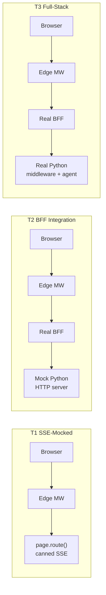

# Frontend E2E Test Suite

Three-tier Playwright testing architecture for the V3-Dev-Tier frontend.

Reference docs:

- [docs/PLAYWRIGHT_TESTING_ARCHITECTURE.md](../../docs/PLAYWRIGHT_TESTING_ARCHITECTURE.md) — full architecture & rationale
- [docs/FRONTEND_VALIDATION.md](../../docs/FRONTEND_VALIDATION.md) — manual QA checklist mapped to these specs
- [docs/STYLE_GUIDE_FRONTEND.md](../../docs/STYLE_GUIDE_FRONTEND.md) — F-R rules and FE-AP anti-patterns enforced
- [AGENTS.md](../../AGENTS.md) — repository-wide conventions

---

## Architecture at a Glance




| Tier | What runs real            | Mock cut-point                       | CI cadence               |
| ---- | ------------------------- | ------------------------------------ | ------------------------ |
| T1   | Browser + Edge middleware | `page.route("/api/run/stream")`      | Per-commit / PR          |
| T2   | Browser + Edge MW + BFF   | Node HTTP server on `localhost:8765` | Nightly                  |
| T3   | Everything                | Nothing                              | Release gate / on-demand |


---

## Quick Start

```bash
cd frontend
pnpm install
pnpm exec playwright install --with-deps   # one-time browser download
```

### T1 — per-commit (no backend, no auth)

```bash
pnpm test:e2e:t1
```

Runs all spec files except `e2e/integration/**` and `e2e/full-stack/**`. Uses
`page.route()` to mock the SSE stream and thread CRUD endpoints.

### T2 — BFF integration (mock middleware)

```bash
pnpm test:e2e:t2
```

Sets `MOCK_MIDDLEWARE=1` and `MIDDLEWARE_URL=http://localhost:8765`. The
Playwright config starts the Node HTTP mock server in
[fixtures/mock-middleware.ts](fixtures/mock-middleware.ts) alongside `pnpm dev`,
then runs only `e2e/integration/**`.

### T3 — full-stack against the real backend

```bash
export E2E_AUTHENTICATED=1
export E2E_USER_EMAIL=beta@example.com
export E2E_USER_PASSWORD=...        # or E2E_USER_OTP=...
export BASE_URL=http://localhost:3000
export MIDDLEWARE_URL=http://localhost:8000

pnpm test:e2e:t3
```

The `globalSetup` script signs in once via WorkOS AuthKit and saves the
session to `e2e/.auth/state.json`. All authenticated tests reuse it.

### Cross-browser matrix (release gate)

```bash
pnpm test:e2e:matrix
```

Runs `e2e/cross-browser/matrix.spec.ts` across all 5 projects:
`chromium-desktop`, `webkit-desktop`, `firefox-desktop`, `mobile-safari`
(iPhone 14), `ipad`. Use `--project=<name>` to limit.

### Headed / debug

```bash
pnpm test:e2e:headed
pnpm exec playwright test --debug e2e/composer.spec.ts
pnpm exec playwright show-report
```

---

## Directory Layout

```
e2e/
├── README.md                     ← this file
├── global-setup.ts               ← one-time WorkOS sign-in (T3 only)
├── smoke.spec.ts                 ← original SS1 happy path (T3)
├── fixtures/
│   ├── auth.fixture.ts           ← `authenticatedPage` fixture
│   ├── helpers.ts                ← composer(), sendMessage(), waitForResponse()
│   ├── prompts.ts                ← Appendix B prompt strings
│   ├── scenarios.ts              ← canned AG-UI event sequences
│   ├── sse-mock.ts               ← buildSSEStream / buildSSEBody / buildSSEHeaders
│   └── mock-middleware.ts        ← Node HTTP server for T2
├── security/                     ← T1 security & auto-reject anti-patterns
│   ├── csp.spec.ts               ← FE-AP-19, F-R6
│   ├── headers.spec.ts           ← HSTS, nosniff, frame-options
│   ├── iframe-sandbox.spec.ts    ← FE-AP-4 (sandbox="allow-scripts" only)
│   ├── jwt-storage.spec.ts       ← FE-AP-18 (no JWT in browser storage)
│   ├── trace-id.spec.ts          ← FE-AP-7 (no client-generated trace_id)
│   └── xss-surface.spec.ts       ← FE-AP-12 (no dangerouslySetInnerHTML)
├── integration/                  ← T2 BFF integration (gated MOCK_MIDDLEWARE=1)
│   ├── bff-stream-proxy.spec.ts
│   ├── bff-auth-flow.spec.ts
│   └── bff-thread-crud.spec.ts
├── full-stack/                   ← T3 real-backend specs (gated by auth)
│   ├── trust-badge.spec.ts       ← SS2.10
│   └── ttft-benchmark.spec.ts    ← SS2.14 (5-run p50 < 500ms)
├── cross-browser/
│   └── matrix.spec.ts            ← SS4 (browser/device combos)
└── (T1 feature specs at root level)
    ├── chat-shell.spec.ts        ← SS2.2
    ├── composer.spec.ts          ← SS2.3
    ├── streaming.spec.ts         ← SS2.4
    ├── run-controls.spec.ts      ← SS2.5
    ├── thread-sidebar.spec.ts    ← SS2.6
    ├── theme.spec.ts             ← SS2.7
    ├── tool-cards.spec.ts        ← SS2.8
    ├── generative-ui.spec.ts     ← SS2.9
    ├── observability.spec.ts     ← SS2.11
    ├── mobile-responsive.spec.ts ← SS2.12
    ├── accessibility.spec.ts     ← SS2.13 (axe-core)
    └── error-resilience.spec.ts  ← SS2.15
```

---

## Mocking Strategy

### T1: Browser-Level Mocks

Tests intercept outbound HTTP at the browser network layer with `page.route()`.
For SSE streams, a single `route.fulfill()` call delivers the full
`text/event-stream` body built from `buildSSEBody(events)`.

```typescript
import { buildSSEBody, buildSSEHeaders } from "./fixtures/sse-mock";
import { plainMarkdown } from "./fixtures/scenarios";

await page.route("**/api/run/stream", async (route) => {
  await route.fulfill({
    status: 200,
    headers: buildSSEHeaders(),
    body: buildSSEBody(plainMarkdown()),
  });
});
```

**Limitation**: Playwright's `route.fulfill()` does not natively chunk the
response, so token-by-token timing fidelity is artificial. T1 tests assert
structural properties (an event arrived, a button appeared) rather than
inter-event delays. Use T2 for true streaming behavior.

### T2: Network-Level Mock (Node HTTP Server)

The mock middleware in [fixtures/mock-middleware.ts](fixtures/mock-middleware.ts)
is a real `http.createServer` listening on `:8765`. Because the BFF runs in
the Next.js server process (separate from the Playwright runner), MSW would
not intercept its `fetch` calls — a real socket is required.

The server:

- Validates `Authorization: Bearer <token>` on every endpoint except `/healthz`
- Routes `POST /run/stream` through one of six scenario builders, selected by
matching keywords in the request body (e.g. "list files" → `toolCallSuccess`).
Override with `?scenario=<name>` query param.
- Sends `: ping\n\n` heartbeat comments every 5s during streaming (X4 contract)
- Returns `text/event-stream` with `x-trace-id` so trace_id provenance survives
the BFF `proxySSE` hop
- Handles `POST /run/cancel` (204), `GET /threads`, `POST /threads`,
`GET /threads/{id}`

Configurable via env:


| Env var                 | Default | Purpose                                      |
| ----------------------- | ------- | -------------------------------------------- |
| `MOCK_MIDDLEWARE_PORT`  | `8765`  | Listen port                                  |
| `MOCK_MIDDLEWARE_DELAY` | `50`    | Per-event SSE delay (ms)                     |
| `MOCK_MIDDLEWARE_FAIL`  | *empty* | Comma-separated paths that should return 500 |


### T3: Nothing Mocked

T3 specs require a running real backend (middleware + agent runtime). They
use the `authenticatedPage` fixture from `fixtures/auth.fixture.ts`, which
loads the WorkOS session saved by `global-setup.ts`.

---

## AG-UI Scenario Library

[fixtures/scenarios.ts](fixtures/scenarios.ts) exports six canned event sequences,
each mirroring one row of Appendix B in `docs/FRONTEND_VALIDATION.md`. Every
event carries `raw_event.trace_id` so trace_id provenance assertions work.


| Scenario           | Event flow                                                 | Exercises              |
| ------------------ | ---------------------------------------------------------- | ---------------------- |
| `plainMarkdown`    | `RUN_STARTED` → 5× `TEXT_MESSAGE_CONTENT` → `RUN_FINISHED` | SS2.4 streaming        |
| `toolCallSuccess`  | adds `TOOL_CALL_START`/`ARGS`/`END` + `TOOL_RESULT`        | SS2.8 tool cards       |
| `toolCallError`    | `TOOL_RESULT` with error then `RUN_ERROR`                  | SS2.8 errored card     |
| `longStream`       | 50× `TEXT_MESSAGE_CONTENT`                                 | SS2.5 stop/regenerate  |
| `runError`         | `RUN_STARTED` → `RUN_ERROR`                                | SS2.15 error path      |
| `generativePanel`  | `CUSTOM` event (`pyramid_panel`)                           | SS2.9 inline panel     |
| `generativeCanvas` | `CUSTOM` event (`sandboxed_canvas`)                        | SS2.9 sandboxed iframe |


All scenarios accept an `opts: { traceId?, runId?, threadId?, messageId? }` so
multi-message tests (e.g. autoscroll) can vary IDs across calls.

---

## Auth Strategy

WorkOS AuthKit is the auth provider. The frontend stores the session in an
HttpOnly cookie set by the Edge middleware. Tests never touch JWTs directly.


| Tier | Auth approach                                                                                                                                                      |
| ---- | ------------------------------------------------------------------------------------------------------------------------------------------------------------------ |
| T1   | Most specs `test.skip()` if the composer is not rendered (i.e. no session). Run unauthenticated to test public surfaces (security headers, CSP, signed-out state). |
| T2   | Same as T1 for unauthenticated specs; `bff-stream-proxy` uses `authenticatedPage`                                                                                  |
| T3   | All specs use `authenticatedPage`; `globalSetup` performs the WorkOS sign-in once and saves storage state                                                          |


To prepare a T3 run:

```bash
export E2E_AUTHENTICATED=1
export E2E_USER_EMAIL=beta@example.com
export E2E_USER_PASSWORD=secret
pnpm test:e2e:t3   # global-setup runs first, then specs
```

The storage state file lives at `e2e/.auth/state.json` (override with
`E2E_STORAGE_STATE`). It is git-ignored. Re-run with `E2E_AUTHENTICATED=1`
to refresh.

---

## CI/CD Integration


| Tier          | Trigger                  | Approx duration | Required env                                                         |
| ------------- | ------------------------ | --------------- | -------------------------------------------------------------------- |
| T1            | Per-commit / PR          | ~2 min          | none                                                                 |
| T2            | Nightly                  | ~5 min          | `MOCK_MIDDLEWARE=1`                                                  |
| T3            | Release gate / on-demand | ~15 min         | `E2E_AUTHENTICATED=1` + WorkOS creds + `BASE_URL` + `MIDDLEWARE_URL` |
| Cross-browser | Release gate             | ~20 min         | Same as T3                                                           |


Per the Agentic Testing Pyramid (`research/tdd_agentic_systems_prompt.md`),
E2E tests are Layer 4 (Behavioral Validation): on-demand only, never in
per-commit CI for tiers requiring a real backend. T1 is the exception: it
is fully deterministic and safe in per-commit CI.

---

## Adding a New Spec

1. **Choose a tier**:
  - No backend, deterministic? → T1, drop in `e2e/`
  - Need real Next.js BFF behavior but mockable backend? → T2, drop in `e2e/integration/`
  - Need real LLM / signed envelopes / actual TTFT? → T3, drop in `e2e/full-stack/`
2. **Pick fixtures**:
  - Authenticated path: `import { test, expect } from "./fixtures/auth.fixture"`
  - Send a message: `import { sendMessage } from "./fixtures/helpers"`
  - Mock a stream: `import { buildSSEBody, buildSSEHeaders } from "./fixtures/sse-mock"` plus a scenario from `scenarios.ts`
3. **Frame as a binary outcome**: every `test.describe()` and `test()` name
  should answer YES/NO (matches the `docs/FRONTEND_VALIDATION.md` checklist
   convention).
4. **Skip gracefully** when prerequisites are missing — use
  `test.skip(condition, "reason")` so unauthenticated CI runs do not crash.
5. **Cite the SS section** from `docs/FRONTEND_VALIDATION.md` in the file
  header so manual QA can cross-reference.

---

## Reports

After every run, Playwright produces:

- `playwright-report/index.html` — interactive HTML report
- `test-results/` — traces, screenshots, videos for failures

Open the report:

```bash
pnpm exec playwright show-report
```

Session reports for QA sign-off live in
`[docs/test-reports/](../../docs/test-reports/)`. One file per significant
testing session (release gate, nightly, ad-hoc validation). The template
sits at `docs/test-reports/TEMPLATE.md`.

---

## Troubleshooting

`**Cannot find module '@axe-core/playwright'**` — run `pnpm install`. The
package was added to `devDependencies`.

`**Browser not installed**` — run `pnpm exec playwright install --with-deps`.

**T1 specs all skip with "composer not rendered"** — expected when run
without auth. The frontend renders a sign-in CTA instead of the chat shell.
Run with `E2E_AUTHENTICATED=1` and storage state, OR mock the auth path,
OR rely on the security/headers specs which do not need the chat surface.

**T2 specs hang on startup** — the mock middleware needs port 8765 free.
Check `lsof -i :8765` and `MOCK_MIDDLEWARE_PORT` if your machine has a
conflict.

**T3 sign-in fails in `globalSetup`** — verify the WorkOS test user is
provisioned in your AuthKit project and the credentials in
`E2E_USER_EMAIL` / `E2E_USER_PASSWORD` are correct.